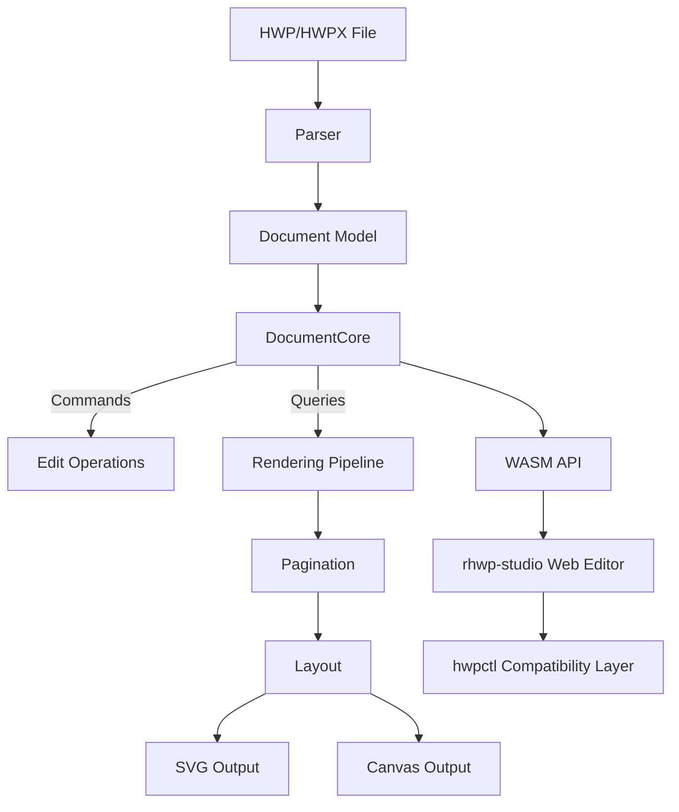

<p align="center">
  
</p>

<h1 align="center">rhwp</h1>

<p align="center">
  <strong>알(R), 모두의 한글</strong> — 알에서 시작하다<br/>
  <em>All HWP, Open for Everyone</em>
</p>

<p align="center">
  <a href="https://github.com/edwardkim/rhwp/actions/workflows/ci.yml"></a>
  <a href="https://edwardkim.github.io/rhwp/"></a>
  <a href="https://www.npmjs.com/package/@rhwp/core"></a>
  <a href="https://marketplace.visualstudio.com/items?itemName=edwardkim.rhwp-vscode"></a>
  <a href="https://opensource.org/licenses/MIT"></a>
  <a href="https://www.rust-lang.org/"></a>
  <a href="https://webassembly.org/"></a>
</p>

<p align="center">
  <a href="https://chromewebstore.google.com/detail/pgakpjflombjmehnebnbpnalhegaanag"></a>
  <a href="https://microsoftedge.microsoft.com/addons/detail/rhwp/nfkdfobhmanddlhdbclkpoanbccpigcn"></a>
  <a href="https://addons.mozilla.org/firefox/addon/rhwp-free-hwp-editor/"></a>
</p>

<p align="center">
  <strong>한국어</strong> | <a href="README_EN.md">English</a>
</p>

---

HWP/HWPX 파일과 지원되는 HML 문서를 **어디서든** 열어보세요. 무료, 설치 없이.

rhwp는 Rust + WebAssembly 기반의 오픈소스 HWP/HWPX 뷰어/에디터입니다. 닫힌 포맷의 벽을 깨고, 모든 사람, 모든 AI, 모든 플랫폼에서 한글 문서를 자유롭게 읽고 쓸 수 있게 합니다.

> **[온라인 데모](https://edwardkim.github.io/rhwp/)** | **[VS Code 확장](https://marketplace.visualstudio.com/items?itemName=edwardkim.rhwp-vscode)** | **[Open VSX](https://open-vsx.org/extension/edwardkim/rhwp-vscode)**

<p align="center">
  
</p>

## 로드맵

혼자 뼈대를 세우고, 함께 살을 붙이고, 모두의 것으로 완성한다.

현재는 **v0.8.6 — v1.0 조판 엔진 체계화**를 중심으로 작업하면서, 40명이 넘는 외부 기여자와
두 명의 공동 유지보수자(콜레보레이터)가 참여하는 **v2.0 협업 기반**도 함께 발전시키고 있습니다.
버전별 목표와 완료 기준, 함께 진행되는 작업, AI 활용 세부 로드맵의 위치는
[프로젝트 로드맵](ROADMAP.md)에서 설명합니다. rhwp 업스트림에 기여할 기능과 별도 다운스트림
프로젝트에서 구현할 제품의 경계도 같은 문서에서 확인할 수 있습니다.

## 현재 이정표

### v0.5.0 ~ v0.8.x — 뼈대 (현재)

> 역공학 완성, 읽기/쓰기 기반 구축

- HWP 5.0 / HWPX 파서, 문단·표·수식·이미지·차트 렌더링
- HML(HWPML 2.9/2.91) 가져오기: 본문·서식·표·사각형 글상자·지원 수식, loss-safe HML/HWP/HWPX 저장
- 페이지네이션 (다단 분할, 표 행 분할), 머리말/꼬리말/바탕쪽/각주
- SVG/PNG/PDF 내보내기 (CLI) + Canvas/CanvasKit 렌더링 (WASM/Web)
- 웹 에디터 + hwpctl 호환 API (30 Actions, Field API)
- 3,400+ Rust 테스트 + studio 단위/e2e/시각 회귀 CI

> HML은 실제 corpus로 확인된 HWPML 2.9/2.91 구조만 제한 지원합니다. 지원 범위의 수식은
> 가져와 편집할 수 있고, 보존 불가 요소가 없는 HML 원본은 preflight 검사 후 HML로 다시
> 저장할 수 있습니다. 그림·내장/외부 리소스 등 미지원 요소는 경고하고 손실 저장을 차단합니다.

#### 릴리즈 이력

사이클별 상세 변경 사항(기여자 목록 포함)은 [CHANGELOG.md](CHANGELOG.md)에 기록합니다.

## Features

### Parsing (파싱)
- HWP 5.0 binary format (OLE2 Compound File)
- HWPX (Open XML-based format)
- HML (HWPML 2.9/2.91) — 검증된 구조 제한 지원
- Sections, paragraphs, tables, textboxes, images, equations, charts
- Header/footer, master pages, footnotes/endnotes

### Rendering (렌더링)
- **Paragraph layout**: line spacing, indentation, alignment, tab stops
- **Tables**: cell merging, border styles (solid/double/triple/dotted), cell formula calculation
- **Multi-column layout** (2-column, 3-column, etc.)
- **Paragraph numbering/bullets**
- **Vertical text** (영문 눕힘/세움)
- **Header/footer** (odd/even page separation)
- **Master pages** (Both/Odd/Even, is_extension/overlap)
- **Object placement**: TopAndBottom, treat-as-char (TAC), in-front-of/behind text

### Equation (수식)
- Fractions (OVER), square roots (SQRT/ROOT), subscript/superscript
- Matrices: MATRIX, PMATRIX, BMATRIX, DMATRIX
- Cases, alignment (EQALIGN), stacking (PILE/LPILE/RPILE)
- Large operators: INT, DINT, TINT, OINT, SUM, PROD
- Relations (REL/BUILDREL), limits (lim), long division (LONGDIV)
- 15 text decorations, full Greek alphabet, 100+ math symbols

### Pagination (페이지 분할)
- Multi-column document column/page splitting
- Table row-level page splitting (PartialTable)
- shape_reserved handling for TopAndBottom objects
- vpos-based paragraph position correction

### Output (출력)
- SVG export (CLI, legacy + layer replay)
- PNG export (native Skia, `--features native-skia`)
- PDF export: SVG compatibility 기본(`--text-as-paths` 지원, 바이트 재현성), native Skia direct opt-in(`--features native-skia`, `--backend direct`)
- Canvas rendering (WASM/Web) + 명시 opt-in 문서 단위 Canvas2D/CanvasKit 자동 선택
- 저장: HWP 편집 저장, HWPX/HML 의미 보존 저장, HWPX → HWP 변환 경로
- Debug overlay (paragraph/table boundaries + indices + y-coordinates)

### Multi-Renderer Backends (멀티 렌더러 백엔드)
- 공통 paint IR: `PageRenderTree` → `PageLayerTree` (Rust `DocumentCore::build_page_layer_tree`, WASM `getPageLayerTree`) — `schemaVersion: 1`, 호환 변경은 additive 원칙
- 백엔드: legacy/layered SVG, Canvas2D, CanvasKit 직접 replay, native Skia PNG/direct PDF(`--features native-skia`)
- Studio, 브라우저 확장/embed, VS Code 뷰어의 기본 요청은 호환 경로인 Canvas2D입니다. Studio 계열에서 `?renderer=auto`를 명시하면 bounded document preflight가 완전하고 적격이며 필요한 문서 폰트를 준비할 수 있는 경우만 CanvasKit으로 고정합니다. 표준 선·도형 점선과 수평 글자 겹침, 탭 리더, 밑줄·취소선·강조점, 위치가 확정된 공백·탭·문단 끝·줄바꿈 부호, nominal glyph replay가 안전한 일반 `TextRun`의 세로쓰기·장평·음영·그림자·외곽선·양각·음각은 CanvasKit이 직접 재생합니다. 방향과 cluster advance 권한이 아직 없는 복합 shaping 문자, 옛한글·boxed-PUA와 장평 또는 paint effect의 조합, 세로·회전된 특수 시각 op, `[표]`, `[그림]` 같은 구조 조판 부호를 포함하는 `showControlCodes`, 판정·초기화·리소스 준비·런타임 실패는 해당 문서 revision 전체를 Canvas2D로 고정합니다. `?renderer=canvas2d`와 `?renderer=canvaskit`은 명시적 강제 선택입니다.
- Text IR v2: 폰트 blob 증명 기반 GlyphRun/GlyphOutline 사이드카 — 검증된 수평 nominal GlyphRun은 CanvasKit direct replay, 나머지는 `TextRun` 폴백 (호환 계약)
- direct PDF는 print profile과 CSS px→PDF point `72/96` 변환을 사용합니다. 손실되는 gradient/pattern/shadow/connector/image adjustment는 SVG backend 사용을 안내하며 실패하고, Raw SVG만 `--raster-dpi` 기반 bounded raster fallback을 사용합니다.
- 시각 회귀 CI: render-diff(Canvas 계열 + browser/compatibility PDF report), selected direct/compatibility PDF 2% hard gate, 4-backend 공통 replay-plane(배경→글뒤→본문→글앞) 계약

### Web Editor (웹 에디터)
- Text editing (insert, delete, undo/redo)
- Character/paragraph formatting dialogs
- Table creation, row/column insert/delete, cell formula
- hwpctl-compatible API layer (한컴 웹기안기 호환)

### hwpctl Compatibility (한컴 호환 레이어)
- 30 Actions: TableCreate, InsertText, CharShape, ParagraphShape, etc.
- ParameterSet/ParameterArray API
- Field API: GetFieldList, PutFieldText, GetFieldText
- Template data binding support

## npm 패키지 — 웹에서 바로 사용하기

### 에디터 임베드 (3줄)

웹 페이지에 HWP 에디터를 통째로 임베드합니다. 메뉴, 툴바, 서식, 표 편집 — 모든 기능을 그대로 사용할 수 있습니다.

```bash
npm install @rhwp/editor
```

```html
<div id="editor" style="width:100%; height:100vh;"></div>
<script type="module">
  import { createEditor } from '@rhwp/editor';
  const editor = await createEditor('#editor');
</script>
```

### HWP 뷰어/파서 (직접 API 호출)

WASM 기반 파서/렌더러를 직접 사용하여 HWP 파일을 SVG로 렌더링합니다.

```bash
npm install @rhwp/core
```

```javascript
import init, { HwpDocument } from '@rhwp/core';

globalThis.measureTextWidth = (font, text) => {
  const ctx = document.createElement('canvas').getContext('2d');
  ctx.font = font;
  return ctx.measureText(text).width;
};

await init({ module_or_path: '/rhwp_bg.wasm' });

const resp = await fetch('document.hwp');
const doc = new HwpDocument(new Uint8Array(await resp.arrayBuffer()));
document.getElementById('viewer').innerHTML = doc.renderPageSvg(0);
```

| 패키지 | 용도 | 설치 |
|--------|------|------|
| [@rhwp/editor](https://www.npmjs.com/package/@rhwp/editor) | 완전한 에디터 UI (iframe) | `npm i @rhwp/editor` |
| [@rhwp/core](https://www.npmjs.com/package/@rhwp/core) | WASM 파서/렌더러 (API) | `npm i @rhwp/core` |

## 설치 — 빌드 없이 CLI·MCP 쓰기

빌드 도구 없이 CLI(그리고 아래 MCP 서버)를 바로 쓰려면
[Releases](https://github.com/edwardkim/rhwp/releases/latest)에서 플랫폼 바이너리를
받으세요 — 매 릴리스에 linux x86_64 · macOS(x86_64/aarch64) · windows x86_64
4종과 무결성 검증용 `SHA256SUMS.txt` 가 첨부됩니다.

```bash
tar xzf rhwp-v*-linux-x86_64.tar.gz          # windows 는 zip 해제
sha256sum -c SHA256SUMS.txt --ignore-missing # 무결성 확인 (선택)
./rhwp/rhwp capabilities                     # 첫 확인 — 전 명령 기계 계약 자기서술
```

PATH 에 두면 아래 MCP 절의 `"command": "rhwp"` 가 그대로 동작합니다.

## Quick Start (소스 빌드)

처음 프로젝트에 참여하는 개발자는 [온보딩 가이드](mydocs/manual/onboarding_guide.md)를 먼저 읽어보세요. 프로젝트 아키텍처, 디버깅 도구, 개발 워크플로우를 한눈에 파악할 수 있습니다.

### Requirements
- Rust 1.93.1 (`rust-toolchain.toml` 기준)
- Docker (for WASM build)
- Node.js 18+ (for web editor)

### Native Build

```bash
cargo build                    # Development build
cargo build --release          # Release build
cargo test                     # Run tests (3,400+ tests)
```

### WASM Build

WASM 빌드는 Docker를 사용합니다. 플랫폼에 관계없이 동일한 `wasm-pack` + Rust 툴체인 환경을 보장하기 위함입니다.

```bash
cp .env.docker.example .env.docker   # 최초 1회: 환경변수 템플릿 복사
docker compose --env-file .env.docker run --rm wasm
```

빌드 결과물은 `pkg/` 디렉토리에 생성됩니다.

### Web Editor

```bash
cd rhwp-studio
npm install
npx vite --host 0.0.0.0 --port 7700
```

Open `http://localhost:7700` in your browser.

## AI 에이전트에서 쓰기 (MCP)

rhwp 는 MCP(Model Context Protocol) 서버를 내장한다 — 설정 한 줄이면 Claude Code 등
MCP 호스트가 HWP/HWPX 를 읽고·검색하고·채우고·변환한다:

```jsonc
// .mcp.json
{ "mcpServers": { "rhwp": { "command": "rhwp", "args": ["mcp-serve"] } } }
```

`rhwp` 실행 파일은 위 "설치" 절의 릴리스 바이너리면 충분하다 — 소스 빌드 없이
바로 동작한다.

첫 호출 3종 (조사 → 위치 → 채움):

```jsonc
hwp_info        { "path": "문서.hwp" }                       // 규모·형식 파악
hwp_search      { "path": "문서.hwp", "query": "위임전결" }   // 몇 쪽 어느 셀인지
hwp_fill_fields { "path": "서식.hwp", "data": {"성명":"홍길동"} }  // 누름틀 채움
```

대형 문서는 `hwp_open` → `hwp_doc_*` 세션 도구로 재파싱 없이 반복 조회·편집한다.
전체 도구 지도·오류 의미론은 [MCP 통합 가이드](mydocs/manual/mcp_integration_guide.md),
막히면 [에이전트 실패 사전](mydocs/manual/agent_troubleshooting_guide.md).
CLI 만 쓸 때의 입구는 `rhwp capabilities` 한 번이면 된다(전 명령 기계 계약 자기서술).

## CLI Usage

### SVG Export

```bash
rhwp export-svg sample.hwp                         # Export to output/
rhwp export-svg sample.hwp -o my_dir/              # Export to custom directory
rhwp export-svg sample.hwp -p 0                    # Export specific page (0-indexed)
rhwp export-svg sample.hwp --debug-overlay         # Debug overlay (paragraph/table boundaries)
```

### PNG / PDF Export

```bash
rhwp export-png sample.hwp -o out/                 # PNG (requires --features native-skia build)
rhwp export-pdf sample.hwp -o out.pdf              # PDF (byte-reproducible)
rhwp export-pdf sample.hwp --text-as-paths         # Text as vector paths (font-free)
```

### Document Inspection

```bash
rhwp dump sample.hwp                  # Full IR dump
rhwp dump sample.hwp -s 2 -p 45      # Section 2, paragraph 45 only
rhwp dump-pages sample.hwp -p 15     # Page 16 layout items
rhwp info sample.hwp                  # File info (size, version, sections, fonts)
```

### Debugging Workflow

1. `export-svg --debug-overlay` → Identify paragraphs/tables by `s{section}:pi={index} y={coord}`
2. `dump-pages -p N` → Check paragraph layout list and heights
3. `dump -s N -p M` → Inspect ParaShape, LINE_SEG, table properties

No code modification needed for the entire debugging process.

## Project Structure

```
src/
├── main.rs                    # CLI entry point
├── parser/                    # HWP/HWPX file parser
├── model/                     # HWP document model
├── document_core/             # Document core (CQRS: commands + queries)
│   ├── commands/              # Edit commands (text, formatting, tables)
│   ├── queries/               # Queries (rendering data, pagination)
│   └── table_calc/            # Table formula engine (SUM, AVG, PRODUCT, etc.)
├── renderer/                  # Rendering engine
│   ├── layout/                # Layout (paragraph, table, shapes, cells)
│   ├── pagination/            # Pagination engine
│   ├── equation/              # Equation parser/layout/renderer
│   ├── typeset.rs             # Typeset engine (main pagination)
│   ├── svg.rs                 # SVG output
│   ├── web_canvas.rs          # Canvas output
│   └── skia/                  # Native Skia PNG/PDF (--features native-skia)
├── paint/                     # PageLayerTree paint IR + replay planes
├── emf/                       # EMF parser + SVG converter
├── ooxml_chart/               # OOXML chart parser + SVG renderer
├── serializer/                # HWP/HWPX/HML serializer (save)
└── wasm_api.rs                # WASM bindings

rhwp-studio/                   # Web editor (TypeScript + Vite)
├── src/
│   ├── core/                  # Core (WASM bridge, types)
│   ├── engine/                # Input handlers
│   ├── hwpctl/                # hwpctl compatibility layer
│   ├── ui/                    # UI (menus, toolbars, dialogs)
│   └── view/                  # Views (ruler, status bar, canvas)
├── e2e/                       # E2E tests (Puppeteer + Chrome CDP)
│   └── helpers.mjs            # Test helpers (headless/host modes)

npm/editor/                    # @rhwp/editor (iframe embed package)
rhwp-chrome/ rhwp-firefox/     # Browser extensions (+ rhwp-safari, rhwp-vscode)
rhwp-shared/                   # Shared frontend modules
assets/fonts/                  # Canonical open-source font root

mydocs/                        # Project documentation (Korean)
├── orders/                    # Daily task tracking (archives/: past months)
├── plans/                     # Task plans (archives/: completed)
├── working/ report/           # Stage reports / final reports
├── pr/                        # External PR review records (archives/)
├── feedback/                  # Code review feedback
├── tech/ manual/              # Technical docs / guides
└── troubleshootings/          # Troubleshooting records

scripts/                       # Build & quality tools
├── metrics.sh                 # Code quality metrics collection
└── dashboard.html             # Quality dashboard with trend tracking
```

## AI 페어 프로그래밍으로 개발합니다

> **이것은 바이브 코딩이 아닙니다.** AI가 주는 코드를 읽지도 않고 수락하는 것이 아닙니다. 모든 계획은 검토되고, 모든 결과물은 검증되며, 모든 결정의 뒤에는 사람이 있습니다.

바이브 코딩 — AI 출력을 읽지 않고 수락하고, AI에게 아키텍처 결정을 맡기고, 이해하지 못하는 코드를 배포하는 것 — 은 함정입니다. 겉보기에는 동작하지만, 이해하지 못했기 때문에 문제가 생겨도 진단할 수 없는 코드가 만들어집니다.

이 프로젝트는 정반대의 접근을 취합니다. 사람 **작업지시자**가 방향, 품질, 아키텍처 결정의 완전한 소유권을 유지하고, AI는 혼자서는 불가능한 속도와 규모로 구현을 수행합니다. 핵심 차이: **사람은 절대 생각을 멈추지 않습니다.**

### 바이브 코딩 vs. AI 주도 개발

| | 바이브 코딩 | 이 프로젝트 |
|--|-----------|-----------|
| **사람의 역할** | AI 출력 수락 | 지시, 검토, 결정 |
| **계획** | 없음 — "그냥 만들어" | 계획서 작성 → 승인 → 실행 |
| **품질 관문** | 동작하길 바람 | 3,400+ 테스트 + Clippy + CI + 코드 리뷰 |
| **디버깅** | AI에게 AI 버그 수정 요청 | 사람이 진단, AI가 구현 |
| **아키텍처** | 우연히 형성 | 의도적 설계 (CQRS, 의존성 방향) |
| **문서** | 없음 | 10,000+개 파일의 프로세스 기록 |
| **결과물** | 취약, 유지보수 어려움 | 프로덕션 수준, 450K+ 라인 |

AI는 배율기입니다. 하지만 배율기는 기존 프로세스를 증폭시킵니다. 프로세스 없음 × AI = 빠른 혼돈. 좋은 프로세스 × AI = 비범한 결과물.

### 개발 프로세스

이 프로젝트는 **[Claude Code](https://claude.ai/code)** (Anthropic AI 코딩 에이전트)를 페어 프로그래밍 파트너로 사용하여 개발합니다. 전체 개발 과정이 투명하게 문서화되어 있습니다.

```
작업지시자 (사람)                    AI 페어 프로그래머 (Claude Code)
────────────────                    ─────────────────────────────
방향 설정, 우선순위 결정        →    분석, 계획, 구현
계획 검토, 승인                ←    구현 계획서 작성
도메인 피드백 제공              →    디버깅, 테스트, 반복
아키텍처 결정                  →    정밀하게 실행
품질 및 정확성 판단            ←    코드, 문서, 테스트 생성
```

`mydocs/` 디렉토리(10,000+개 파일, 영문 번역: `mydocs/eng/`)에 전체 개발 기록이 있습니다: 일일 작업 기록, 구현 계획서, 코드 리뷰 피드백, 기술 연구 문서, 트러블슈팅 기록.

> `mydocs/`는 코드에 대한 문서가 아닙니다 — **AI로 소프트웨어를 만드는 방법**에 대한 문서입니다. 오픈소스 방법론입니다.

**[Hyper-Waterfall 방법론](mydocs/manual/hyper_waterfall.md)** — 거시적 워터폴 + 미시적 애자일, AI가 이 둘을 동시에 가능하게 한다.

### Git 워크플로우

```
local/task{N}  ──커밋──커밋──┐
                              ├─→ local/devel merge (작업 단위)
                              ├─→ devel merge + push (검증 후)
                              ├─→ main merge + 태그 (릴리즈 시점, PR 기반)
```

| 브랜치 | 용도 |
|--------|------|
| `main` | 릴리즈 (태그: v0.8.0 등) |
| `devel` | 개발 통합 (원격 push 대상) |
| `local/devel` | devel 의 로컬 작업 브랜치 |
| `local/task{N}` | GitHub Issue 번호 기반 타스크 브랜치 |

### 타스크 관리

- **GitHub Issues**로 타스크 번호 자동 채번 — 중복 방지
- **GitHub Milestones**로 타스크 그룹화
- 마일스톤 표기: `M{버전}` (예: M100=v1.0.0, M05x=v0.5.x)
- 오늘할일: `mydocs/orders/yyyymmdd.md` — `M100 #1` 형식으로 참조
- 커밋 메시지: `Task #1: 내용` — `closes #1`로 Issue 자동 종료

### 타스크 진행 절차

1. `gh issue create` → GitHub Issue 등록 (마일스톤 지정)
2. `local/task{issue번호}` 브랜치 생성
3. 수행계획서 작성 → 승인 → 구현 → 테스트
4. devel merge → `closes #{번호}`

### 디버깅 프로토콜

1. `export-svg --debug-overlay` → 문단/표 식별
2. `dump-pages -p N` → 배치 목록과 높이
3. `dump -s N -p M` → ParaShape, LINE_SEG 상세

> `mydocs/`의 문서는 AI 기반 소프트웨어 개발의 교육 자료로 활용됩니다.

### 문서 생성 규칙

모든 문서는 **한국어**로 작성합니다.

```
mydocs/
├── orders/           # 오늘 할일 (yyyymmdd.md)
├── plans/            # 수행 계획서, 구현 계획서
│   └── archives/     # 완료된 계획서 보관
├── working/          # 단계별 완료 보고서
├── report/           # 기본 보고서
├── feedback/         # 코드 리뷰 피드백
├── tech/             # 기술 사항 정리 문서
├── manual/           # 매뉴얼, 가이드 문서
└── troubleshootings/ # 트러블슈팅 관련 문서
```

| 문서 유형 | 위치 | 파일명 규칙 |
|----------|------|------------|
| 오늘 할일 | `orders/` | `yyyymmdd.md` — 마일스톤(M100)+Issue(#1) 형식 |
| 수행 계획서 | `plans/` | Issue 번호 참조 |
| 완료 보고서 | `working/` | Issue 번호 참조 |
| 기술 문서 | `tech/` | 주제별 자유 명명 |

## Architecture



## HWPUNIT

- 1 inch = 7,200 HWPUNIT
- 1 inch = 25.4 mm
- 1 HWPUNIT ≈ 0.00353 mm

## Contributing

기여 환영합니다. 다음 핵심 사항을 먼저 확인해 주세요:

- **PR base 는 `devel`** 입니다 (`main` 아님). GitHub 기본 브랜치는 `main` 이지만 기여 PR 은 모두 `devel` 로 받습니다.
- **이슈 먼저 확인**: 동일 영역에 진행 중인 작업이 있는지 [열린 이슈](https://github.com/edwardkim/rhwp/issues) 와 [열린 PR](https://github.com/edwardkim/rhwp/pulls) 을 먼저 확인해 주세요. 중복 작업을 방지합니다.
- **Claude·Codex 재사용 기능**: 에이전트나 Skill을 새로 만들기 전 [capability 카탈로그](mydocs/manual/agent_capability_registry.md)에서 기존 기능과 Issue 기반 `CAP-<N>` 등록 규칙을 확인해 주세요.
- **이슈 close 는 메인테이너**: 작업 완료 후 PR 만 제출해 주세요. 이슈는 PR 머지 시 메인테이너가 close 합니다.
- **한컴 PDF 는 정답지가 아닙니다**: 한컴 도구 (편집기 / Viewer / 한컴독스), 버전 (2010 / 2020 / 2022), 출력 경로 (한컴 자체 / OS 인쇄) 별로 PDF 결과가 다릅니다. 자세한 내용과 환경별 비교 자료는 [한컴 PDF 환경 의존성 위키](https://github.com/edwardkim/rhwp/wiki/한컴-PDF-환경-의존성) 를 참고하세요.

상세한 기여 절차 (Fork → 브랜치 → 커밋 → PR) 는 [CONTRIBUTING.md](CONTRIBUTING.md) 를 참고하세요.

### 위키 자료 (Wiki)

기여자와 fork 사용자에게 도움이 되는 권위 자료를 [Wiki](https://github.com/edwardkim/rhwp/wiki) 에 정리하고 있습니다:

- [한컴 PDF 환경 의존성](https://github.com/edwardkim/rhwp/wiki/한컴-PDF-환경-의존성) — 한컴 도구 / 버전 / OS 별 PDF 차이 정황 및 PR 검증 시 참고 사항
- [HWP 5.0 Spec Errata](https://github.com/edwardkim/rhwp/wiki/HWP-5.0-Spec-Errata) — HWP 5.0 스펙 정오표
- [HWP LINE_SEG vpos 이해](https://github.com/edwardkim/rhwp/wiki/HWP-LINE_SEG-vpos-이해) — 줄 분할 vpos 이해
- [HWP Tab Leader Rendering](https://github.com/edwardkim/rhwp/wiki/HWP-Tab-Leader-Rendering) — Tab leader 렌더링
- [Export API 사용 가이드](https://github.com/edwardkim/rhwp/wiki/Export-API-사용-가이드) — exportHwp / exportHwpx API
- [HWPX2HWP Probe 추적 온보딩](https://github.com/edwardkim/rhwp/wiki/HWPX2HWP-Probe-%EC%B6%94%EC%A0%81-%EC%98%A8%EB%B3%B4%EB%94%A9) — HWPX→IR→HWP 저장 손상/한컴 호환성 probe 추적법
- [Cloudflared 로 rhwp-studio 외부 HTTPS 접근](https://github.com/edwardkim/rhwp/wiki/Cloudflared-로-rhwp-studio-외부-HTTPS-접근)
- [Hyper-Waterfall 문서 체계 가이드](https://github.com/edwardkim/rhwp/wiki/Hyper‐Waterfall-문서-체계-가이드)
- [Investigation PR 가이드](https://github.com/edwardkim/rhwp/wiki/Investigation-PR-가이드)
- [Legal FAQ](https://github.com/edwardkim/rhwp/wiki/Legal-FAQ)

## Notice

본 제품은 한글과컴퓨터의 한글 문서 파일(.hwp) 공개 문서를 참고하여 개발하였습니다.

## Trademark

"한글", "한컴", "HWP", "HWPX"는 주식회사 한글과컴퓨터의 등록 상표입니다.
본 프로젝트는 한글과컴퓨터와 제휴, 후원, 승인 관계가 없는 독립적인 오픈소스 프로젝트입니다.

"Hangul", "Hancom", "HWP", and "HWPX" are registered trademarks of Hancom Inc.
This project is an independent open-source project with no affiliation, sponsorship, or endorsement by Hancom Inc.

## License

[MIT License](LICENSE) — Copyright (c) 2025-2026 Edward Kim
