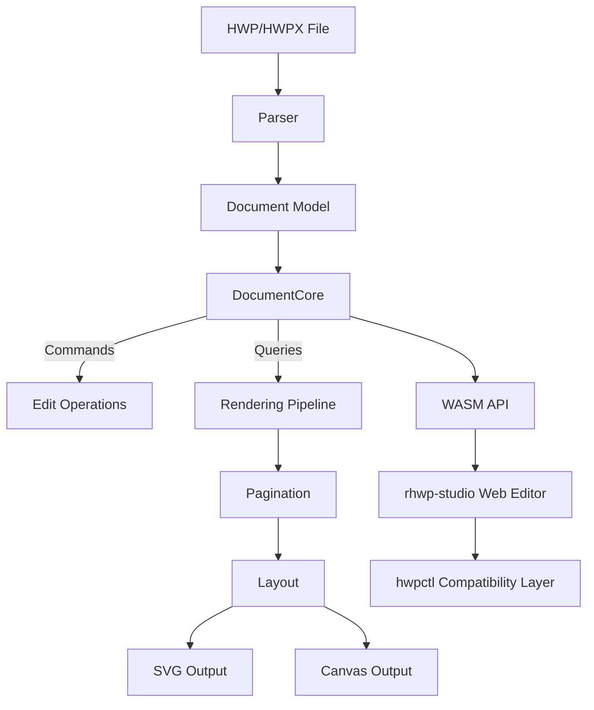

<p align="center">
  
</p>

<h1 align="center">rhwp</h1>

<p align="center">
  <strong>All HWP, Open for Everyone</strong><br/>
  <em>Open-source HWP document viewer & editor — Rust + WebAssembly</em>
</p>

<p align="center">
  <a href="https://github.com/edwardkim/rhwp/actions/workflows/ci.yml"></a>
  <a href="https://edwardkim.github.io/rhwp/"></a>
  <a href="https://www.npmjs.com/package/@rhwp/core"></a>
  <a href="https://marketplace.visualstudio.com/items?itemName=edwardkim.rhwp-vscode"></a>
  <a href="https://opensource.org/licenses/MIT"></a>
  <a href="https://www.rust-lang.org/"></a>
  <a href="https://webassembly.org/"></a>
</p>

<p align="center">
  <a href="https://chromewebstore.google.com/detail/pgakpjflombjmehnebnbpnalhegaanag"></a>
  <a href="https://microsoftedge.microsoft.com/addons/detail/rhwp/nfkdfobhmanddlhdbclkpoanbccpigcn"></a>
  <a href="https://addons.mozilla.org/firefox/addon/rhwp-free-hwp-editor/"></a>
</p>

<p align="center">
  <a href="README.md">한국어</a> | <strong>English</strong>
</p>

---

Open **HWP/HWPX files and supported HML documents anywhere**. Free, no installation required.

**HWP** is the dominant document format in South Korea — used by government agencies, schools, courts, and most organizations. Until now, there has been no viable open-source solution to read or edit these files.

rhwp changes that. Built with Rust and compiled to WebAssembly, it renders HWP documents directly in the browser with accuracy that matches (and sometimes exceeds) the proprietary viewer. The goal: break the walls of a closed format so that every person, every AI, and every platform can read and write Korean documents freely.

> **[Live Demo](https://edwardkim.github.io/rhwp/)** | **[VS Code Extension](https://marketplace.visualstudio.com/items?itemName=edwardkim.rhwp-vscode)** | **[Open VSX](https://open-vsx.org/extension/edwardkim/rhwp-vscode)**

<p align="center">
  
</p>

## Roadmap

Build the skeleton solo, grow the muscle together, complete it as a public good.

The project is currently **v0.8.6 — systematizing the v1.0 typesetting engine** while also
growing its v2.0 collaboration foundation with more than 40 external contributors and two
collaborators. The single [project roadmap](ROADMAP.md) explains what each version aims to achieve,
how overlapping work is tracked, how completion is judged, and where the detailed AI-agent roadmap
fits. It also defines which work belongs in the rhwp upstream and which product-specific work should
grow in downstream projects. It is maintained in Korean as the source of truth.

## Current Milestone

### v0.5.0 ~ v0.8.x — Foundation (current)

> Reverse-engineering complete, read/write foundation established

- HWP 5.0 / HWPX parser, rendering for paragraphs, tables, equations, images, charts
- HML (HWPML 2.9/2.91) import: text, formatting, tables, rectangle text boxes, and supported equations; loss-safe HML/HWP/HWPX save
- Pagination (multi-column split, table row split), headers/footers, master pages, footnotes
- SVG/PNG/PDF export (CLI) + Canvas/CanvasKit rendering (WASM/Web)
- Web editor + hwpctl-compatible API (30 Actions, Field API)
- 3,400+ Rust tests + studio unit/e2e/visual-regression CI

> HML support is limited to HWPML 2.9/2.91 structures verified by the current real-file corpus.
> Supported equations can be imported and edited; HML-origin documents can be saved back to HML
> after a preservation preflight. Pictures and embedded/external resources remain blocked from lossy save.

#### Release history

Per-cycle changes (including contributor credits) are recorded in [CHANGELOG_EN.md](CHANGELOG_EN.md).

## Features

### Parsing
- HWP 5.0 binary format (OLE2 Compound File)
- HWPX (Open XML-based format)
- HML (HWPML 2.9/2.91) — limited to corpus-verified structures
- Sections, paragraphs, tables, textboxes, images, equations, charts
- Header/footer, master pages, footnotes/endnotes

### Rendering
- **Paragraph layout**: line spacing, indentation, alignment, tab stops
- **Tables**: cell merging, border styles (solid/double/triple/dotted), cell formula calculation
- **Multi-column layout** (2-column, 3-column, etc.)
- **Paragraph numbering/bullets**
- **Vertical text**
- **Header/footer** (odd/even page separation)
- **Master pages** (Both/Odd/Even, is_extension/overlap)
- **Object placement**: TopAndBottom, treat-as-char (TAC), in-front-of/behind text
- **Image crop & border rendering**
- **OLE / Chart / EMF** native rendering (since v0.7.3)

### Equation
- Fractions (OVER), square roots (SQRT/ROOT), subscript/superscript
- Matrices: MATRIX, PMATRIX, BMATRIX, DMATRIX
- Cases, alignment (EQALIGN), stacking (PILE/LPILE/RPILE)
- Large operators: INT, DINT, TINT, OINT, SUM, PROD
- Relations (REL/BUILDREL), limits (lim), long division (LONGDIV)
- 15 text decorations, full Greek alphabet, 100+ math symbols

### Pagination
- Multi-column document column/page splitting
- Table row-level page splitting (PartialTable)
- shape_reserved handling for TopAndBottom objects
- vpos-based paragraph position correction

### Output
- SVG export (CLI, legacy + layer replay)
- PNG export (native Skia, `--features native-skia`)
- PDF export: SVG compatibility by default (`--text-as-paths`, byte-reproducible), native Skia direct opt-in (`--features native-skia`, `--backend direct`)
- Canvas rendering (WASM/Web) + opt-in document-scoped Canvas2D/CanvasKit auto selection
- Save: native HWP editing, semantics-preserving HWPX/HML save, HWPX → HWP conversion
- Debug overlay (paragraph/table boundaries + indices + y-coordinates)

### Multi-Renderer Backends
- Shared paint IR: `PageRenderTree` → `PageLayerTree` (Rust `DocumentCore::build_page_layer_tree`, WASM `getPageLayerTree`) — `schemaVersion: 1`, compatible changes stay additive
- Backends: legacy/layered SVG, Canvas2D, CanvasKit direct replay, native Skia PNG/direct PDF (`--features native-skia`)
- Studio, browser extension/embed, and VS Code viewer surfaces keep Canvas2D as the compatibility default. An explicit Studio-family `?renderer=auto` request pins only documents with a complete, eligible bounded preflight and available required fonts to CanvasKit. Paragraph/control marks and preflight, initialization, resource-preparation, or runtime failures pin the whole revision to Canvas2D. `?renderer=canvas2d` and `?renderer=canvaskit` remain explicit overrides.
- Text IR v2: font-blob-proof-gated GlyphRun/GlyphOutline sidecars — unproven cases always fall back to `TextRun` (compatibility contract)
- Visual regression CI: render-diff (Canvas family + report-only PDF diff), shared replay-plane ordering (background → behindText → flow → inFrontOfText) across all four backends
- Direct PDF uses the print profile and a CSS-px-to-PDF-point `72/96` transform. Lossy gradient/pattern/shadow/connector/image-adjustment payloads fail with guidance to use the SVG backend; only Raw SVG uses the bounded `--raster-dpi` fallback.
- Selected direct/compatibility PDF rasters are hard-gated at 2%; the broader browser/compatibility PDF comparison remains report-only.

### Web Editor
- Text editing (insert, delete, undo/redo)
- Character/paragraph formatting dialogs
- Table creation, row/column insert/delete, cell formula
- hwpctl-compatible API layer (Hancom WebGian compatible)

### hwpctl Compatibility
- 30 Actions: TableCreate, InsertText, CharShape, ParagraphShape, etc.
- ParameterSet/ParameterArray API
- Field API: GetFieldList, PutFieldText, GetFieldText
- Template data binding support

## npm Packages — Use in Your Web Project

### Embed a Full Editor (3 lines)

Embed the complete HWP editor in your web page — menus, toolbars, formatting, table editing, everything included.

```bash
npm install @rhwp/editor
```

```html
<div id="editor" style="width:100%; height:100vh;"></div>
<script type="module">
  import { createEditor } from '@rhwp/editor';
  const editor = await createEditor('#editor');
</script>
```

### HWP Viewer/Parser (Direct API)

Use the WASM-based parser/renderer directly to render HWP files as SVG.

```bash
npm install @rhwp/core
```

```javascript
import init, { HwpDocument } from '@rhwp/core';

globalThis.measureTextWidth = (font, text) => {
  const ctx = document.createElement('canvas').getContext('2d');
  ctx.font = font;
  return ctx.measureText(text).width;
};

await init({ module_or_path: '/rhwp_bg.wasm' });

const resp = await fetch('document.hwp');
const doc = new HwpDocument(new Uint8Array(await resp.arrayBuffer()));
document.getElementById('viewer').innerHTML = doc.renderPageSvg(0);
```

| Package | Purpose | Install |
|---------|---------|---------|
| [@rhwp/editor](https://www.npmjs.com/package/@rhwp/editor) | Full editor UI (iframe embed) | `npm i @rhwp/editor` |
| [@rhwp/core](https://www.npmjs.com/package/@rhwp/core) | WASM parser/renderer (API) | `npm i @rhwp/core` |

## Install — CLI & MCP without building

Grab a platform binary from [Releases](https://github.com/edwardkim/rhwp/releases/latest) —
every release ships linux x86_64, macOS (x86_64/aarch64) and windows x86_64 archives
plus `SHA256SUMS.txt` for integrity verification.

```bash
tar xzf rhwp-v*-linux-x86_64.tar.gz          # unzip on Windows
sha256sum -c SHA256SUMS.txt --ignore-missing # optional integrity check
./rhwp capabilities                          # first call — machine-readable self-description of every command
```

Put it on your PATH and the MCP snippet below works as-is.

## Use with AI Agents (MCP)

rhwp embeds an MCP (Model Context Protocol) server — one line of config lets
Claude Code and other MCP hosts read, search, fill and convert HWP/HWPX files:

```jsonc
// .mcp.json
{ "mcpServers": { "rhwp": { "command": "rhwp", "args": ["mcp-serve"] } } }
```

The `rhwp` executable from the Install section above is all you need — no
source build. Start with `hwp_info` → `hwp_search` → `hwp_fill_fields`; for
large documents use the `hwp_open` → `hwp_doc_*` session tools to query and
edit without re-parsing. Full tool map:
[MCP integration guide](mydocs/manual/mcp_integration_guide.md) (Korean).
CLI-only? `rhwp capabilities` is the single machine-readable entry point.

## Quick Start (Build from Source)

New contributors: start with the [onboarding guide](mydocs/eng/manual/onboarding_guide.md). It covers project architecture, debugging tools, and the development workflow at a glance.

### Requirements
- Rust 1.93.1 (pinned by `rust-toolchain.toml`)
- Docker (for WASM build)
- Node.js 18+ (for web editor)

### Native Build

```bash
cargo build                    # Development build
cargo build --release          # Release build
cargo test                     # Run tests (3,400+ tests)
```

### WASM Build

The WASM build uses Docker to guarantee an identical `wasm-pack` + Rust toolchain environment across every platform.

```bash
cp .env.docker.example .env.docker   # First time: copy env template
docker compose --env-file .env.docker run --rm wasm
```

Build output goes to `pkg/`.

### Web Editor

```bash
cd rhwp-studio
npm install
npx vite --host 0.0.0.0 --port 7700
```

Open `http://localhost:7700` in your browser.

## CLI Usage

### SVG Export

```bash
rhwp export-svg sample.hwp                         # Export to output/
rhwp export-svg sample.hwp -o my_dir/              # Export to custom directory
rhwp export-svg sample.hwp -p 0                    # Export specific page (0-indexed)
rhwp export-svg sample.hwp --debug-overlay         # Debug overlay (paragraph/table boundaries)
```

### PNG / PDF Export

```bash
rhwp export-png sample.hwp -o out/                 # PNG (requires --features native-skia build)
rhwp export-pdf sample.hwp -o out.pdf              # PDF (byte-reproducible)
rhwp export-pdf sample.hwp --text-as-paths         # Text as vector paths (font-free)
```

### Document Inspection

```bash
rhwp dump sample.hwp                  # Full IR dump
rhwp dump sample.hwp -s 2 -p 45      # Section 2, paragraph 45 only
rhwp dump-pages sample.hwp -p 15     # Page 16 layout items
rhwp info sample.hwp                  # File info (size, version, sections, fonts)
```

### Debugging Workflow

1. `export-svg --debug-overlay` → Identify paragraphs/tables by `s{section}:pi={index} y={coord}`
2. `dump-pages -p N` → Check paragraph layout list and heights
3. `dump -s N -p M` → Inspect ParaShape, LINE_SEG, table properties

No code modification needed for the entire debugging process.

## Project Structure

```
src/
├── main.rs                    # CLI entry point
├── parser/                    # HWP/HWPX file parser
├── model/                     # HWP document model
├── document_core/             # Document core (CQRS: commands + queries)
│   ├── commands/              # Edit commands (text, formatting, tables)
│   ├── queries/               # Queries (rendering data, pagination)
│   └── table_calc/            # Table formula engine (SUM, AVG, PRODUCT, etc.)
├── renderer/                  # Rendering engine
│   ├── layout/                # Layout (paragraph, table, shapes, cells)
│   ├── pagination/            # Pagination engine
│   ├── equation/              # Equation parser/layout/renderer
│   ├── typeset.rs             # Typeset engine (main pagination)
│   ├── svg.rs                 # SVG output
│   ├── web_canvas.rs          # Canvas output
│   └── skia/                  # Native Skia PNG/PDF (--features native-skia)
├── paint/                     # PageLayerTree paint IR + replay planes
├── emf/                       # EMF parser + SVG converter
├── ooxml_chart/               # OOXML chart parser + SVG renderer
├── serializer/                # HWP/HWPX/HML serializer (save)
└── wasm_api.rs                # WASM bindings

rhwp-studio/                   # Web editor (TypeScript + Vite)
├── src/
│   ├── core/                  # Core (WASM bridge, types)
│   ├── engine/                # Input handlers
│   ├── hwpctl/                # hwpctl compatibility layer
│   ├── ui/                    # UI (menus, toolbars, dialogs)
│   └── view/                  # Views (ruler, status bar, canvas)
├── e2e/                       # E2E tests (Puppeteer + Chrome CDP)
│   └── helpers.mjs            # Test helpers (headless/host modes)

rhwp-chrome/                   # Chrome / Edge extension
rhwp-firefox/                  # Firefox extension (MV3)
rhwp-safari/                   # Safari Web Extension
rhwp-shared/                   # Shared code between browser extensions

mydocs/                        # Project documentation (Korean)
├── orders/                    # Daily task tracking (archives/: past months)
├── plans/                     # Task plans (archives/: completed)
├── working/ report/           # Stage reports / final reports
├── pr/                        # External PR review records (archives/)
├── feedback/                  # Code review feedback
├── tech/ manual/              # Technical docs / guides
└── troubleshootings/          # Troubleshooting records
mydocs/eng/                    # English translations

scripts/                       # Build & quality tools
├── metrics.sh                 # Code quality metrics collection
└── dashboard.html             # Quality dashboard with trend tracking
```

## Built with AI Pair Programming

> **This is not vibe coding.** There is no "just accept what AI gives you." Every plan is reviewed. Every output is verified. Every decision has a human behind it.

Vibe coding — hitting accept without reading, letting AI make architectural decisions, shipping code you don't understand — is a trap. It produces code that *looks* right but breaks in ways you can't diagnose, because you never understood it in the first place.

This project takes the opposite approach. A human **task director** maintains full ownership of direction, quality, and architectural decisions, while AI handles implementation at a speed and scale that would be impossible alone. The key difference: **the human never stops thinking.**

### Vibe Coding vs. Directed AI Development

| | Vibe Coding | This Project |
|--|-------------|-------------|
| **Human role** | Accept AI output | Direct, review, decide |
| **Planning** | None — "just build it" | Written plan → approval → execution |
| **Quality gate** | Hope it works | 3,400+ tests + Clippy + CI + code review |
| **Debugging** | Ask AI to fix AI's bugs | Human diagnoses, AI implements fix |
| **Architecture** | Emergent (accidental) | Deliberate (CQRS, dependency direction) |
| **Documentation** | None | 10,000+ files of process records |
| **Outcome** | Fragile, hard to maintain | Production-grade, 450K+ lines |

AI is a force multiplier, but a multiplier amplifies whatever process you already have. No process × AI = fast chaos. Good process × AI = extraordinary output.

### The Development Process

This project is developed using **[Claude Code](https://claude.ai/code)** (Anthropic's AI coding agent) as a pair programming partner. The entire development process is transparently documented.

```
Task Director (Human)              AI Pair Programmer (Claude Code)
─────────────────────              ────────────────────────────────
Sets direction & priorities   →    Analyzes, plans, implements
Reviews & approves plans      ←    Writes implementation plans
Provides domain feedback      →    Debugs, tests, iterates
Makes architectural decisions →    Executes with precision
Judges quality & correctness  ←    Generates code, docs, tests
```

The `mydocs/` directory (10,000+ files, English translations in `mydocs/eng/`) contains the complete development record: daily task logs, implementation plans, code review feedback, technical research documents, and debugging records.

> `mydocs/` is not documentation about the code — it is documentation about **how to build software with AI**. It is an open-source methodology.

**[Hyper-Waterfall Methodology](mydocs/eng/manual/hyper_waterfall.md)** — macro-level waterfall + micro-level agile, both made possible at once by AI.

### Git Workflow

```
local/task{N}  ──commit──commit──┐
                                  ├─→ local/devel merge (per work unit)
                                  ├─→ devel merge + push (after verification)
                                  ├─→ main merge + tag (release time, PR-based)
```

| Branch | Purpose |
|--------|---------|
| `main` | Release (tags: v0.8.0 etc.) |
| `devel` | Development integration (remote push target) |
| `local/devel` | Local working branch of devel |
| `local/task{N}` | GitHub Issue-numbered task branch |

### Task Management

- **GitHub Issues** auto-number tasks — no duplicates
- **GitHub Milestones** group related tasks
- Milestone notation: `M{version}` (e.g. M100=v1.0.0, M05x=v0.5.x)
- Daily tasks: `mydocs/orders/yyyymmdd.md` — referenced as `M100 #1`
- Commit messages: `Task #1: <subject>` — `closes #1` auto-closes the issue

### Task Workflow

1. `gh issue create` → register a GitHub Issue (with a milestone)
2. Create `local/task{issue-number}` branch
3. Write an implementation plan → approval → implement → test
4. Merge to `devel` → `closes #{number}`

### Debugging Protocol

1. `export-svg --debug-overlay` → Identify paragraphs/tables
2. `dump-pages -p N` → Inspect the layout item list and heights
3. `dump -s N -p M` → Inspect ParaShape, LINE_SEG details

> The documents under `mydocs/` double as educational material for AI-driven software development.

### Documentation Rules

All project documents are written in **Korean** (with English translations under `mydocs/eng/`).

```
mydocs/
├── orders/           # Daily task logs (yyyymmdd.md)
├── plans/            # Task plans & implementation specs
│   └── archives/     # Archived completed plans
├── working/          # Step-by-step completion reports
├── report/           # Main reports
├── feedback/         # Code review feedback
├── tech/             # Technical documents
├── manual/           # Manuals and guides
└── troubleshootings/ # Troubleshooting records
```

| Document type | Location | Naming rule |
|---------------|----------|-------------|
| Daily task log | `orders/` | `yyyymmdd.md` — references milestone(M100) + issue(#1) |
| Task plan | `plans/` | References the issue number |
| Completion report | `working/` | References the issue number |
| Technical doc | `tech/` | Free-form by topic |

## Architecture



## HWPUNIT

- 1 inch = 7,200 HWPUNIT
- 1 inch = 25.4 mm
- 1 HWPUNIT ≈ 0.00353 mm

## Contributing

Contributions are welcome. Please note the following first:

- **Target branch for PRs is `devel`**, not `main`. Although the GitHub default branch is `main`, all contributor PRs go to `devel`.
- **Check first**: Look at [open issues](https://github.com/edwardkim/rhwp/issues) and [open PRs](https://github.com/edwardkim/rhwp/pulls) to avoid duplicating in-progress work.
- **Issue close is by maintainer**: Submit only the PR for completed work. The maintainer will close the issue when the PR is merged.
- **Hancom PDFs are not authoritative ground truth**: PDF output differs across Hancom tools (Editor / Viewer / Hancom Docs), versions (2010 / 2020 / 2022), and output paths (Hancom-native / OS print). See the [Hancom PDF Environment Dependency wiki](https://github.com/edwardkim/rhwp/wiki/한컴-PDF-환경-의존성) for environment-specific comparison data and PR review guidance.

For the full contribution flow (fork → branch → commit → PR), see [CONTRIBUTING.md](CONTRIBUTING.md).

Questions and ideas are welcome on [Discussions](https://github.com/edwardkim/rhwp/discussions).

### Wiki Resources

Authoritative resources useful to contributors and fork users are organized in the [Wiki](https://github.com/edwardkim/rhwp/wiki):

- [Hancom PDF Environment Dependency](https://github.com/edwardkim/rhwp/wiki/한컴-PDF-환경-의존성) — PDF differences across Hancom tools / versions / OS, and PR verification guidance
- [HWP 5.0 Spec Errata](https://github.com/edwardkim/rhwp/wiki/HWP-5.0-Spec-Errata) — HWP 5.0 spec errata
- [Understanding HWP LINE_SEG vpos](https://github.com/edwardkim/rhwp/wiki/HWP-LINE_SEG-vpos-이해)
- [HWP Tab Leader Rendering](https://github.com/edwardkim/rhwp/wiki/HWP-Tab-Leader-Rendering)
- [Export API Guide](https://github.com/edwardkim/rhwp/wiki/Export-API-사용-가이드) — exportHwp / exportHwpx APIs
- [Cloudflared for rhwp-studio external HTTPS access](https://github.com/edwardkim/rhwp/wiki/Cloudflared-로-rhwp-studio-외부-HTTPS-접근)
- [Hyper-Waterfall Document Guide](https://github.com/edwardkim/rhwp/wiki/Hyper‐Waterfall-문서-체계-가이드)
- [Investigation PR Guide](https://github.com/edwardkim/rhwp/wiki/Investigation-PR-가이드)
- [Legal FAQ](https://github.com/edwardkim/rhwp/wiki/Legal-FAQ)

## Notice

This product was developed with reference to the HWP (.hwp) file format specification published by Hancom Inc.

## Trademark

"Hangul", "Hancom", "HWP", and "HWPX" are registered trademarks of Hancom Inc.
This project is an independent open-source project with no affiliation, sponsorship, or endorsement by Hancom Inc.

## License

[MIT License](LICENSE) — Copyright (c) 2025-2026 Edward Kim
