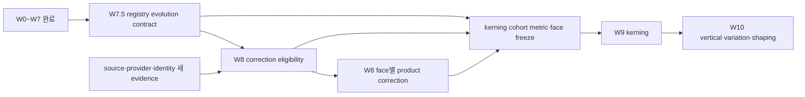

# 수행계획 — Task M100 #4960 W7 이후 폰트 로드맵 방향 수정

- **이슈**: [#4960](https://github.com/edwardkim/rhwp/issues/4960)
- **완료 선행 작업**: [#4939](https://github.com/edwardkim/rhwp/issues/4939) W0·W1,
  [#4961](https://github.com/edwardkim/rhwp/issues/4961) W2,
  [#4962](https://github.com/edwardkim/rhwp/issues/4962) W3·W4,
  [#4963](https://github.com/edwardkim/rhwp/issues/4963) W5,
  [#4964](https://github.com/edwardkim/rhwp/issues/4964) W6,
  [#4966](https://github.com/edwardkim/rhwp/issues/4966) W7
- **후행 tracker**: [#4967](https://github.com/edwardkim/rhwp/issues/4967) W8,
  [#4968](https://github.com/edwardkim/rhwp/issues/4968) W9,
  [#4969](https://github.com/edwardkim/rhwp/issues/4969) W10
- **브랜치**: `task_m100_4960_direction_revision`
- **작성일**: 2026-08-24 KST
- **통합 기준**: `upstream/devel@4e070c632dfc889f329be6a90ef2c1d35f8a7f12`
- **원격 상태**: #4960 OPEN, 담당자 `edwardkim`, milestone `v1.0.0`, W0~W7 완료
- **절차 상태**: Stage R1·R2 승인·커밋, Stage R3 정합성 감사 완료·결과 승인 대기

## 1. 결정과 목표

W0~W7의 방향과 산출물은 폐기하지 않는다. 현재 선택을 먼저 설명하고 실제 사용량을 계측한 뒤,
Oracle evidence와 데이터 계보를 확보하고 backend별 규칙을 canonical registry로 투영한 순서는 타당했다.

수정이 필요한 것은 W7 이후를 하나의 직선 경로로 본 부분이다. 최초 로드맵은 다음을 전제했다.

```text
W7 canonical projection
  → W8 face별 교정 반복 완료
  → W9 kerning
  → W10 vertical·variation·shaping
```

W5와 W7의 실제 결과는 이 전제를 그대로 적용할 수 없음을 보여준다.

1. W5의 17개 후보는 모두 disposition을 얻었지만, source·provider·문서 face 기능이 서로 다르다.
2. W7 schema 1.0은 현재 830개 active rule을 봉인한 read-only canonical authority다.
3. W8은 source가 새로 발견될 때 다시 열리는 장기 tracker이므로 전체 완료를 W9의 조건으로 삼을 수 없다.
4. W4의 exact rank는 민감도 변형에서 고정되지 않았으므로 순위 숫자가 곧 구현 순서가 아니다.

따라서 이번 작업의 목표는 W0~W7의 증거를 보존하면서 다음 세 경계를 명시하는 것이다.

- 실제 규칙 변경 전에 registry의 다음 판과 rule 생명주기를 정의하는 **W7.5 선행 게이트**
- Oracle 관찰 완료와 제품 교정 가능성을 구분하는 **W8 후보 자격 게이트**
- 장기 W8 전체가 아니라 관련 cohort의 metric·face 선택 동결을 사용하는 **W9 진입 게이트**

이번 작업은 로드맵·이슈 topology와 권위 문서의 방향을 수정하는 문서 작업이다. registry schema, metric,
fallback, paint, font asset 또는 renderer 동작을 변경하지 않는다.

## 2. Stage 0 감사 기준선

### 2.1 W0~W2 — 현재 동작을 설명하는 기반

| 단계 | 확보한 것 | 이번 판정 |
| --- | --- | --- |
| W0·W1 | 30 source boundary, 1,352 candidate, 1,507 ledger rule, unknown 44 | 역사 snapshot과 relation 분리를 보존 |
| W2 | layout·native·Canvas2D·CanvasKit Font Decision Trace | 변경 전후 선택 근거 대사의 공통 표면으로 재사용 |

W1에는 identity alias로 검증된 행이 0개였고, unknown을 비슷한 이름이나 vendor 추정으로 보충하지 않았다.
W8 이후에도 이 원칙을 유지하며, 새 evidence는 역사 W1 snapshot을 다시 쓰지 않고 별도 계보로 추가한다.

### 2.2 W3·W4 — 위험 순위의 의미와 한계

| 항목 | 결과 |
| --- | ---: |
| 실제 layout / coverage 문자 | 54,399,371 / 54,326,042 |
| exact·overlay·surrogate 성공 계열 | 52,264,310, 96.2049% |
| face-miss·char-miss·heuristic 위험 문자 | 2,061,732 |
| 위험 face | 351 |
| A+B queue | 17 face, base risk mass 81.0374% |
| 모든 민감도 변형에서 exact rank가 같은 face | 0 |

W4의 A/B band는 제품 영향의 우선 범위로 유지한다. exact rank는 조사 순서의 보조값이며, 순위가 높은
face를 evidence 준비도와 변경 가능성보다 먼저 구현하는 강제 순서로 사용하지 않는다.

fixed-context는 실제 frame geometry가 아니라 context proxy이고, stored LineSeg는 존재 lane이지 유효성
판정이 아니다. 개별 W8은 실제 frame slack·최초 줄 경계 divergence와 stored/fresh LineSeg 유효성을
별도 fixture에서 다시 판정한다.

### 2.3 W5 — Oracle queue 종료와 W8 후보를 구분

| disposition | 수 | rank | W8 처리 |
| --- | ---: | --- | --- |
| `complete-acceptance-ladder` | 3 | 1, 7, 8 | correction hypothesis 심사 가능 |
| `terminal-source-unavailable` | 10 | 2~6, 11, 12, 14, 15, 17 | source discovery 사건이 있을 때만 재개 |
| `terminal-protected-partial` | 3 | 9, 10, 13 | provider를 손상하지 않는 새 제어 방법이 생길 때만 재개 |
| `terminal-read-only-capability-mismatch` | 1 | 16 | localized document face·export subset 연결이 증명될 때만 재개 |

W5 정본의 `actionableRanks=[]`는 추가 Oracle 실행 대기열이 없다는 뜻이다. W8 제품 교정 후보가 0이라는
뜻으로 해석하지 않는다. rank 1 `문체부 바탕체`, rank 7 `KoPubWorld돋움체 Light`, rank 8
`KoPubWorld바탕체 Light`는 기존 profile을 재사용할 수 있지만, 다음 질문을 통과해야 실제 W8 자식 이슈가
된다.

- 현재 rhwp의 어느 decision plane이 어떤 문자·문맥에서 잘못됐는가?
- 변경 후 portable default와 backend별 opt-in 결과는 각각 무엇이어야 하는가?
- exact profile과 missing profile 중 무엇을 목표로 하고 무엇을 비교군으로 둘 것인가?
- source provenance·license·배포·backend 조달 조건이 실제 구현 가능한가?
- target 개선과 비대상 회귀를 어떤 fixture와 누적 advance로 판정할 것인가?

### 2.4 W6·W7 — 변경 전 구조의 성과와 새 선행 조건

W6는 기존 600 metric entry를 historical generated 595개와 measured/manual overlay 5개로 분리했다.
fully source-exact로 승격할 수 있는 기존 항목은 0개이며, 원본이 없는 항목을 재생성하거나 exact로
과장하지 않는다.

W7은 830개 active rule을 canonical registry로 이행하고 Rust 2종·Studio 3종 projection을 만들었다.
그러나 schema 1.0의 수량·상태·W1/W6 evidence는 의도적으로 봉인됐다. schema 1.0 JSON을 직접 고치거나
hash만 다시 계산해서 제품 규칙을 변경하는 것은 지원 절차가 아니다.

따라서 최초 원인 계보 보고서의 “W7 뒤 새 규칙 하나를 원장에 기록하고 산출물을 갱신할 수 있다”는 문장은
다음 schema 판의 승인과 이행을 전제로 하는 표현으로 정정해야 한다.

## 3. 수정할 의존성 구조



이 그림에서 `W8P → KF`는 W8 tracker 전체 완료를 뜻하지 않는다. kerning cohort에 실제로 영향을 주는
완료된 face correction이나 “해당 cohort에는 교정 없음” disposition만 동결하면 된다. 다른 face의 source
discovery와 W8 작업은 W9와 병행할 수 있다.

## 4. W7.5 신규 선행 이슈 계약

W7.5는 W8 첫 face에 종속되지 않는 일회성 infrastructure 이슈로 분리한다. 제안 제목은 다음과 같다.

```text
[font][W7.5] canonical registry 규칙 생명주기와 evidence delta 계약
```

### 4.1 포함할 설계 질문

- 기존 830개 active rule을 의미 변화 없이 다음 schema 판으로 이행할 수 있는가?
- 규칙 추가, 의미 수정, retirement를 삭제나 W1 snapshot 재작성 없이 표현할 수 있는가?
- 기존 `ruleId`를 유지할 수정과 새 rule·successor link가 필요한 변경을 어떻게 구분하는가?
- 새 evidence가 historical W1/W5/W6 authority와 어떤 parent/digest로 연결되는가?
- 한 decision plane의 변경이 필요한 backend projection만 바꿨음을 어떻게 증명하는가?

### 4.2 최소 계약 후보

- `active`, `retired`와 후속 rule 참조를 포함한 명시적 lifecycle
- registry schema version·migration manifest·parent semantic hash
- 변경 사유, evidence issue/profile/digest와 승인 상태
- pre/post selection tuple, metric entry와 generated projection semantic delta
- inactive rule을 runtime projection에서 제외하되 trace·감사에서는 보존하는 규칙
- generator·validator의 red → green migration test

정확한 schema version과 field 이름은 W7.5 수행계획에서 확정한다. 이 계획은 schema 1.0을 미리
느슨하게 만들거나 제품 규칙을 변경하지 않는다.

## 5. W8 tracker 수정 계약

### 5.1 세 개 lane

W8은 하나의 대기열이 아니라 다음 lane을 구분한다.

1. **evidence-reopen lane**: source, provider 제어, localized identity 같은 재개 조건을 기다린다.
2. **correction-qualification lane**: W4 band와 W5 profile을 실제 제품 delta 가설로 변환한다.
3. **product-correction lane**: W7.5 이후 face 하나·decision plane 하나·PR 하나로 변경한다.

source discovery만 필요한 face에 제품 구현 이슈를 미리 만들지 않는다. 새 evidence가 생기면 W5의 기존
disposition과 입력 hash를 대사하고 필요한 state만 제한 재실행한다.

### 5.2 자식 이슈 생성 조건 수정

기존 조건에 다음을 추가한다.

- `correctionHypothesis`: 현재 동작, 기대 동작과 첫 divergence
- `targetDecisionPlane`: layout-name, layout-metric, paint 또는 supply 중 정확히 하나
- `portablePolicy`: portable default와 설치 exact-font opt-in 경계
- `registryChange`: 유지 rule, 신규 rule, retirement와 evidence delta
- `affectedCohort`: 실제 문자량, 장평·자간, fixed frame geometry와 LineSeg lane
- `backendDisposition`: native, WASM, Canvas2D와 CanvasKit의 적용·비대상·미지원 이유
- `redistributionDisposition`: source bytes와 파생 metric·webfont의 사용 가능 범위

W4 순위와 W5 profile만 있고 현재 rhwp의 오류와 목표 동작을 설명하지 못하면 조사 완료이지 W8 구현
준비 완료가 아니다.

### 5.3 첫 pilot 후보

첫 process canary로 rank 8 `KoPubWorld바탕체 Light`의 qualification을 우선 검토한다.

- complete acceptance ladder와 제3자 Hyper-V three-state 재현이 있다.
- exact와 fallback의 U+AC00 advance가 약 4.3% 다르다.
- 공개 source와 Canvas2D·CanvasKit 공급 경로를 교차검증할 수 있다.
- subst-only와 none-related가 같은 fallback projection으로 수렴한 근거가 있다.

이는 risk rank를 재정렬하거나 rank 1보다 사용자 영향이 크다고 주장하는 결정이 아니다. 새 registry
변경 절차, metric·paint·supply 분리와 누적 advance gate를 가장 재현 가능하게 검증할 수 있는 pilot
후보다. qualification에서 현 rhwp 오류나 안전한 portable 목표를 증명하지 못하면 변경 없이 종료한다.

rank 1 `문체부 바탕체`는 영향 우선 후보로 유지하되, source provenance와 portable/backend 공급 정책을
먼저 확정한다. rank 7은 rank 8 pilot 결과가 같은 family에 일반화되는지 추정하지 않고 별도 face로
다시 심사한다.

## 6. W9·W10 의존성 수정

### 6.1 W9 kerning

W9 진입 조건을 “W8 전체 완료”에서 다음으로 바꾼다.

- W7.5 registry evolution contract 완료
- W3에서 확인한 kerning cohort와 대표 공개 controlled fixture 고정
- 해당 cohort가 사용하는 metric face와 진행 중 W8 변경의 겹침 여부 대사
- 겹치는 face는 correction 완료 또는 no-change disposition까지 동결
- kerning off 문서의 기존 출력 기준선과 backend capability 준비

이 조건이면 source 발견을 기다리는 다른 W8 face와 독립적으로 W9를 진행할 수 있다. fallback·metric
변경과 pair positioning 변경은 같은 PR에 넣지 않는다.

### 6.2 W10 vertical·variation·shaping

W10은 W9의 shaping·capability 경계와 provenance schema를 선행 조건으로 유지한다. 다만 모든 W8 face의
완료를 요구하지 않고, 대상 script·vertical·variation fixture가 사용하는 face 집합의 metric·identity가
동결됐는지 판정한다. 지원하지 않는 table·script·axis는 버전 분기가 아니라 feature detection으로
fail-closed한다.

## 7. 문서와 GitHub 변경 범위

### 7.1 로컬 문서

계획 승인 뒤 다음 문서를 최소 범위로 현행화한다.

| 문서 | 수정 내용 |
| --- | --- |
| `mydocs/report/font_metrics_fallback_causal_lineage_20260816.md` | W7 이후 단일 경로를 W7.5·W8 lane·W9 cohort gate로 정정 |
| `mydocs/report/task_m100_4966_report.md` | merge 완료 상태·canonical front matter와 W7.5 인계 경계 정정 |
| `mydocs/tech/font_fallback_strategy.md` | schema 1.0 read-only와 다음 판 승인 전 직접 수정 금지 명시 |
| `mydocs/working/task_m100_4960_direction_revision_stage1.md` | 방향 수정 근거·변경 대조·검증 결과 기록 |

역사 W1~W6 JSON과 완료 보고서의 당시 수치·hash는 재생성하거나 현재 상태로 덮어쓰지 않는다.

### 7.2 GitHub topology

별도 원격 mutation 승인 뒤 `gh`로 다음을 수행한다.

- #4960: “단일 임계 경로”를 수정 의존성 graph로 바꾸고 W7.5 checklist를 삽입한다.
- 신규 W7.5 이슈: 중복 검색 후 등록하고 #4960 sub-issue로 연결한다.
- #4967: 세 lane, qualification 필드, 현재 disposition과 첫 pilot 후보를 반영한다.
- #4968: W8 전체가 아니라 kerning cohort 동결을 선행 조건으로 명시한다.
- #4969: 대상 face 집합 동결과 W9 shaping 경계를 선행 조건으로 명시한다.
- 각 이슈에 변경 이유와 이 계획·W5/W7 근거를 설명하는 maintainer comment를 한 번만 게시한다.

기존 완료 체크·이슈 관계·댓글을 삭제하지 않고 본문을 보존적으로 수정한다. 게시 뒤 REST API로 checkbox,
sub-issue, 한글, 선두 BOM, `??` 치환과 literal `\\n` 부재를 검증한다.

## 8. 단계별 수행과 승인 게이트

### Stage R1 — 방향 계약 문서화

1. 원인 계보 보고서의 W7~W10 경로와 우선순위를 수정한다.
2. W7 최종 보고서의 생명주기 metadata와 W7.5 인계를 현행화한다.
3. canonical font fallback 전략에 schema 변경 금지선을 짧게 반영한다.
4. 변경 전후 의존성과 W5 disposition 해석을 stage 보고서에 기록한다.

**종료 게이트**: 메인테이너가 W7.5·W8 lane·W9 cohort gate를 승인해야 GitHub topology 변경으로
넘어간다.

### Stage R2 — GitHub 이슈 topology 수정

1. 같은 목적의 열린·닫힌 이슈와 PR을 `gh search`로 다시 확인한다.
2. W7.5 이슈를 등록하고 assignee·milestone·기존 label taxonomy를 적용한다.
3. #4960과 #4967~#4969 본문을 승인된 계약과 일치시킨다.
4. sub-issue 관계와 maintainer comment를 게시하고 API로 원문을 검증한다.

**원격 게이트**: 이슈 생성·본문 수정·댓글·metadata는 각각 이 계획 승인과 별도의 명시적 원격 mutation
승인을 받은 뒤 수행한다.

### Stage R3 — 정합성 감사와 PR 준비

1. 로컬 문서와 GitHub 본문의 checklist·선행·후행 관계를 대사한다.
2. W0~W7 완료 상태, W7.5 미착수, W8~W10 미착수 상태가 사실과 일치하는지 확인한다.
3. 변경 Markdown 링크·metadata·diff와 필수 format gate를 검증한다.
4. stage 보고서에 최종 issue URL·본문 hash·검증 결과를 기록한다.
5. 커밋, remote push와 PR 생성은 각각 별도 승인을 받는다.

**종료 게이트**: 이 작업은 로드맵 정정만 완료한다. W7.5 계획·구현, W8 pilot qualification, W9 또는
W10 착수를 자동 승인하지 않는다.

## 9. 검증 계획

### 9.1 문서

```bash
python3 scripts/check_markdown_links.py \
  mydocs/plans/task_m100_4960.md \
  mydocs/report/font_metrics_fallback_causal_lineage_20260816.md \
  mydocs/report/task_m100_4966_report.md \
  mydocs/tech/font_fallback_strategy.md \
  mydocs/working/task_m100_4960_direction_revision_stage1.md

python3 scripts/check_document_metadata.py
git diff --check
```

metadata 전체 검사가 이번 변경과 무관한 기존 오류를 보고하면 변경 파일별 결과와 기존 오류를 분리해
기록하며, 사용자 변경을 임의로 정리하지 않는다.

### 9.2 제품 0-delta

이번 범위는 Markdown과 GitHub tracker뿐이므로 제품 build·renderer visual sweep·private corpus 재계측은
기본 gate가 아니다. source, registry JSON, generated projection, metric data 또는 fixture가 diff에
포함되면 범위 이탈로 중단한다.

모든 commit·push 직전 저장소 공통 필수 gate는 그대로 실행한다.

```bash
cargo fmt --all
cargo fmt --all -- --check
```

### 9.3 GitHub 적용 검증

- #4960에 W0~W7 완료와 W7.5·W8~W10 미완료가 정확히 표시되는가
- W7.5가 #4960 sub-issue이며 #4967보다 선행하는가
- #4967의 17개 disposition과 rank 1·7·8 상태가 W5 정본과 일치하는가
- #4968이 W8 전체 완료가 아니라 kerning cohort 동결을 요구하는가
- #4969가 W9와 대상 face 집합의 안정화를 요구하는가
- comment와 본문에 private corpus identity, host path와 font bytes가 없는가

## 10. 보호 불변식

- W0~W7의 완료 판정, merge commit, 수치와 historical hash를 다시 쓰지 않는다.
- W4 band를 보존하고 exact rank를 제품 심각도나 강제 구현 순서로 승격하지 않는다.
- W5 `actionableRanks=[]`를 W8 후보 0으로도, 17개 모두 구현 가능으로도 해석하지 않는다.
- exact, missing, document substitution, successor, metric surrogate와 paint substitute를 혼합하지 않는다.
- layout metric과 paint face의 독립성을 유지한다.
- Canvas2D availability, webfont plan과 CanvasKit SFNT capability를 별도 상태로 유지한다.
- W7 schema 1.0 registry와 generated projection을 이번 작업에서 수정하지 않는다.
- private corpus 원본·본문·식별 목록·절대 경로를 문서나 GitHub에 게시하지 않는다.
- W8 blocked face를 source 추정이나 반복 계측으로 억지로 actionable하게 만들지 않는다.
- W9는 fallback·metric 변경과 같은 PR에 섞지 않는다.

## 11. 중단 조건

- W5 profile hash나 queue disposition이 현재 tracked 정본과 일치하지 않음
- W7 registry가 이미 다른 이슈에서 다음 schema 판으로 이행됐거나 동시 작업 중임
- 신규 W7.5와 같은 목적의 열린 이슈·PR이 발견됨
- #4960·#4967~#4969의 원격 본문이 계획 이후 collaborator에 의해 의미상 변경됨
- 방향 수정 diff에 source·registry·generated projection·metric·font asset 변경이 포함됨
- rank 1·7·8 중 하나를 qualification 없이 곧바로 구현 대상으로 확정해야만 계획이 성립함
- W9 진입 조건이 특정 face의 미확정 source 발견을 무기한 기다리도록 되돌아감

중단 조건이 발생하면 해당 단계의 원인과 새 기준 SHA를 보고하고 계획 변경 승인을 받는다.

## 12. 완료 조건

- #4960의 W7 이후 구조가 W7.5, W8 lane과 W9 cohort gate를 설명한다.
- W7.5의 역할과 W8의 역할이 schema infrastructure와 face product change로 분리된다.
- W5의 17개 disposition이 재실행 없이 올바르게 라우팅된다.
- W8 자식 이슈 생성 조건에 correction hypothesis와 decision plane이 포함된다.
- W9가 장기 W8 tracker 전체 완료에 종속되지 않으면서 겹치는 metric 변경은 동결한다.
- W10의 선행 조건이 W9 shaping 경계와 대상 face 집합 안정화로 명시된다.
- local canonical 문서와 GitHub issue topology가 같은 의존성을 표현한다.
- 제품 source·registry·metric·fallback·renderer output 변경이 0이다.
- 변경 파일의 링크·metadata·format·diff gate가 통과한다.
- 후속 W7.5와 W8 pilot은 별도 이슈·계획·승인 없이는 시작하지 않는다.

## 13. 계획 self-review

- **목적 검사**: 구현을 서두르지 않고 W0~W7 결과가 바꾼 전제를 로드맵에 반영한다.
- **계보 검사**: W4 ranking, W5 disposition과 W7 read-only authority를 서로 다른 의미로 보존한다.
- **우선순위 검사**: 사용자 영향 band와 process canary 선택을 구분한다.
- **CQRS 검사**: 조사·진단 산출물과 제품 selection command 변경을 같은 단계에 섞지 않는다.
- **SOLID 검사**: registry lifecycle, face correction, kerning과 고급 shaping의 변경 이유를 분리한다.
- **회귀 검사**: 역사 snapshot과 제품 source는 불변이며 문서·tracker 정합성만 바꾼다.
- **운영 검사**: 로컬 문서, GitHub mutation, commit, push와 PR을 별도 승인 게이트로 둔다.
- **재현성 검사**: 모든 수치와 candidate disposition은 tracked 정본의 path·hash로 다시 확인할 수 있다.

## 14. 다음 승인 요청

이 계획의 승인 범위는 Stage R1의 로컬 문서 현행화까지다. 승인만으로 다음 행위를 허용하지 않는다.

- GitHub W7.5 이슈 생성 또는 #4960·#4967~#4969 수정
- registry 다음 schema 판 설계·구현
- rank 8 또는 다른 face의 W8 qualification·제품 변경
- private corpus·Hyper-V Oracle 재실행
- commit, remote push, PR 생성 또는 merge
