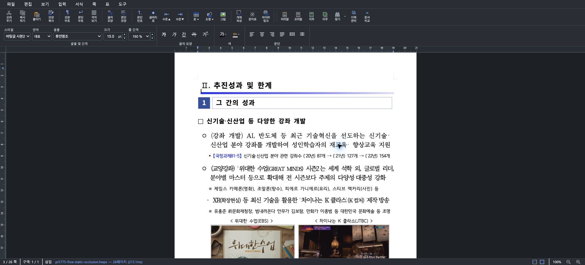
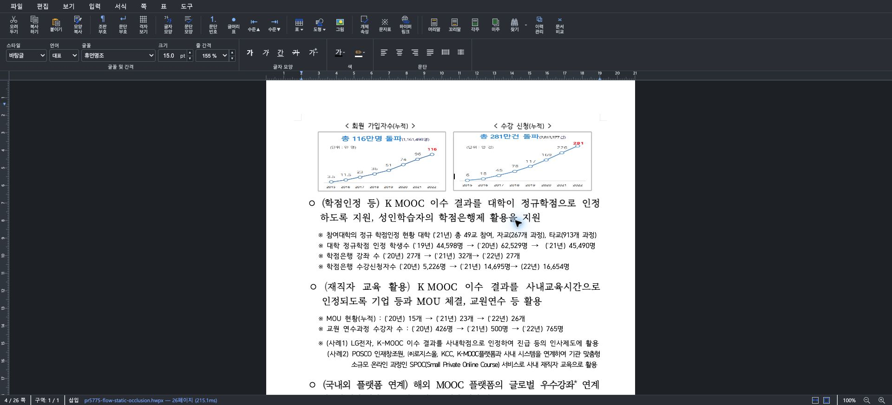
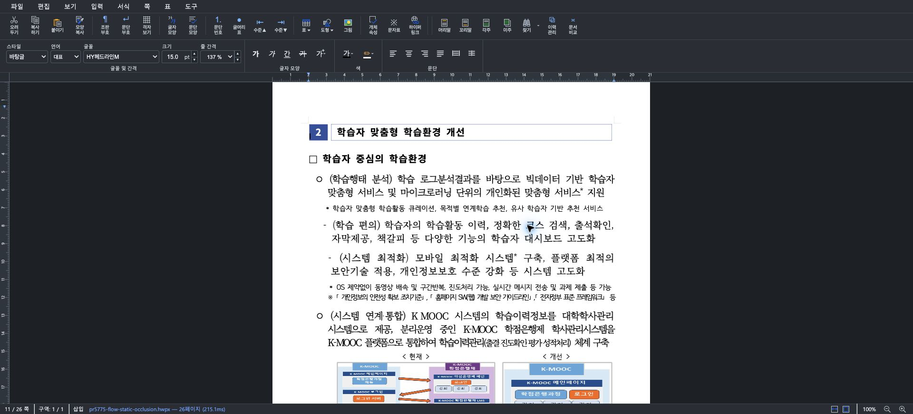

# PR #5775 - studio에서 불투명 flow 채우기에 가려진 그림 렌더를 보정한다

## 라우팅과 대상

- 원 PR: [#5775](https://github.com/edwardkim/rhwp/pull/5775)
- 관련 이슈: [#5763](https://github.com/edwardkim/rhwp/issues/5763)
- 기여자: `planet6897` (first-time GitHub contributor)
- 원 source head: `985486789de91a9901a3e29659c7fb0b4133a25f`
- source branch: `fix/5763-studio-flow-image-occluded`
- 검토 통합 후보: 최신 `upstream/devel` `d5f0f8dc` 위에 원 source head를 적용한 `c6ee88afe`

외부 기여 PR 기본 경로와 `local_validation.md`, `visual_fixture_evidence.md`를 적용했다. 원
source head는 최신 `devel`에 clean merge 가능했고, 기능 변경에 대한 기존 CI는 모두 성공했다.

## 변경 검토

- Rust `FlowStaticOcclusion`은 불투명 flow 채우기가 그림보다 나중에 그려지는 경우만 감지해
  native overlay JSON의 `flowStaticOccluded`로 전달한다.
- Studio `PageRenderer`는 이 값이 참인 쪽에서만 static/flow 이미지 plane 분리를 피하여 원래
  paint 순서로 Canvas에 렌더한다.
- 이전 WASM payload에 새 필드가 없으면 기존 분리 경로를 유지한다.
- 회귀 범위는 겹침, 비겹침, 투명 또는 미채움, 채우기 이후의 그림 및 다른 plane을 다룬다.

## 로컬 검증

다음 검증을 모두 성공으로 확인했다.

```text
node scripts/rust-test-suite-manifest.mjs --prepare
node scripts/rust-test-suite-manifest.mjs --check
node scripts/rust-unit-test-tiers.mjs --check
node scripts/run-rust-test.mjs issue_5763_flow_static_occlusion -- --cargo-profile release-test --target-dir target/pr-review
cargo test --locked --profile release-test --target-dir target/pr-review --lib paint::replay_order
node scripts/run-rust-test.mjs issue_938 -- --cargo-profile release-test --target-dir target/pr-review
npm --prefix rhwp-studio run build
npm --prefix rhwp-studio test
CARGO_TARGET_DIR=target/pr-review scripts/wasm-pack-locked.sh --target web --out-dir pkg --no-opt
```

## 실제 HWPX 시각 검증

로컬 Studio에서 원본 HWPX를 직접 열어 대상 그림을 확인했다. 문서 3, 4, 11쪽은 해당 그림이
정상적으로 표시되며 흰 불투명 채우기 상자로 가려지지 않았다. 이 세 쪽은 DOM flow-image overlay가
없어 Canvas paint 순서로 렌더된 것을 함께 확인했다.







비교 문서 6쪽은 `flow-images-7` overlay와 이미지 2개를 유지했다. 따라서 보정이 필요한 페이지에만
plane 분리를 해제하고, 기존 flow-image 분리 경로는 보존함을 확인했다.

## 판정

**승인.** `2026-08-21 KST`에 원 source head를 승인했다. 이 검토 기록과 시각 증빙을 같은 source
branch에 trailing docs-only commit으로 추가한다. 새 head의 CI와 mergeability를 다시 확인한 뒤 merge
단계로 진행한다.
