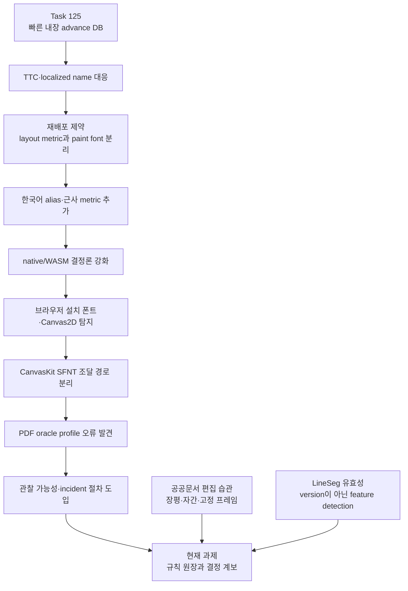
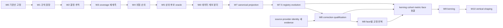

# 폰트 메트릭·fallback 원인 계보 및 보호 불변식

- 상태: 선행 로컬 POC 조사 완료, Issue #4939의 근거 문서
- Issue: [#4939](https://github.com/edwardkim/rhwp/issues/4939)
- 조사일: 2026-08-16
- 기준 브랜치: `local/poc-font-layout-habits-20260816`
- 기준 HEAD: `44125461187c158073daf5b6b317b08042e7332a`
- 장기 정책 authority: [CJK 폰트 폴백 전략](../tech/font_fallback_strategy.md)
- 사고 진단 절차 authority: [폰트 incident 대응 절차](../manual/font_incident_response.md)

> 2026-08-24 현행화: W0~W7 완료 결과를 반영해 W7 이후의 단일 임계 경로를 registry evolution,
> face별 correction qualification과 kerning cohort 동결 게이트로 수정했다. 2026-08-16의 역사·수치와
> FI-01~FI-14는 변경하지 않는다.

## 1. 결론

현재 rhwp의 폰트 메트릭 DB와 fallback은 한 번에 설계된 단일 체계가 아니다. 다음 요구가
시간순으로 겹치면서 성장했다.

1. 브라우저 왕복을 제거하는 빠르고 결정론적인 글자폭 측정
2. 재배포할 수 없는 원본 폰트를 오픈 폰트로 그리는 법적·배포 제약
3. HWP의 한국어·영문·localized face 이름을 실제 metric face에 연결하는 호환성
4. Canvas2D, CanvasKit, native/SVG가 서로 다른 폰트 조달 능력을 갖는 백엔드 차이
5. 한컴 버전·설치 폰트에 따라 달라지는 PDF oracle을 잘못 섞지 않는 검증 절차

각 결정은 당시 문제에는 합리적이었다. 그러나 결과적으로 **레이아웃 메트릭**, **paint face**,
**브라우저의 설치 폰트**, **CanvasKit에 넘길 SFNT bytes**, **PDF oracle profile**이 서로 다른
위치에서 독립적으로 선택되고, 이름 alias와 대체 관계도 Rust와 TypeScript에 중복되었다.

따라서 개선의 첫 단계는 테이블을 합치거나 fallback을 교체하는 일이 아니다. 먼저 모든 규칙을
근거와 관계 유형이 있는 원장으로 만들고, 한 글자의 최종 결정이 어느 경로를 통과했는지 설명할
수 있어야 한다. layout face와 paint face는 의도적으로 다를 수 있다. 통일해야 할 것은 선택 결과가
아니라 **선택의 계보와 진단 가능성**이다.

## 2. 범위와 판정 원칙

이 보고서는 다음을 수행한다.

- 폰트 메트릭·alias·fallback이 추가되거나 철회된 이유를 시간순으로 복원한다.
- 현재 구현에서 이미 호환성 계약이 된 동작을 보호 불변식으로 선언한다.
- 최근 10k POC 계측에서 확인된 편집 습관을 개선 우선순위에 연결한다.
- 구현 전에 필요한 계측·원장·oracle profile과 단계별 진입 게이트를 정의한다.

이 보고서는 다음을 수행하지 않는다.

- 현재 metric alias, substitution table, 웹폰트 catalog를 변경하지 않는다.
- 로컬 설치 폰트를 기본 레이아웃의 새 authority로 만들지 않는다.
- 비슷한 이름이나 시각적 유사성만으로 폰트 identity를 확정하지 않는다.
- HWPX 버전 또는 한컴 build 번호만으로 정책을 분기하지 않는다.
- 이 보고서 자체를 Issue #4939의 수행 계획서나 구현 완료 보고서로 대체하지 않는다.

판정은 버전 탐지가 아니라 기능 탐지를 따른다. 예를 들어 HWPX의 LineSeg는 버전 번호가 아니라
문단 안의 존재 여부와 유효성을 판정한다. 폰트도 마찬가지로 이름, 열거 결과, raw probe, SFNT
bytes, glyph coverage, backend capability를 현재 상태에서 확인한다.

## 3. 인과 흐름



이 흐름에서 중요한 전환은 2026-04-07이다. 라이선스 때문에 원본 폰트 bytes를 배포할 수 없게
되자 원본에 가까운 메트릭으로 레이아웃을 유지하면서 오픈 폰트로 paint하는 구조가 의도적으로
생겼다. 이후의 문제를 단순히 “metric과 paint가 서로 다르다”로 진단하면 이 설계 이유를 잃는다.

## 4. 원인 계보

### 4.1 2026-03-27 — 내장 advance DB의 출발점

[Task 125 계획](../plans/archives/task_125.md)과
[완료 기록](../working/archives/task_125_step1234_done.md)은 초기 목적을 분명히 한다.
당시 문제는 글자마다 WASM에서 JavaScript Canvas `measureText()`로 왕복하는 비용, 대표 글자
`가`에 의존한 추정, native·서버·offline에서 동일하게 측정할 수 없는 구조였다. webhwp의 HFT
metric module을 참고해 로컬 `ttfs/windows`의 599개 TTF를 입력으로 601 face를 파싱했고,
582 variant·386 family를 내장했다.

이 DB의 출발 목적은 **semantic font registry**나 **fallback compatibility database**가 아니라
빠르고 결정론적인 advance cache였다. 이 차이를 잊으면 생성 데이터에 identity, 라이선스,
backend 조달 정책까지 억지로 싣게 된다.

### 4.2 2026-03-28~29 — TTC와 이름이 단순 family 문자열이 아님을 확인

- [`8349e6c9a`](https://github.com/edwardkim/rhwp/commit/8349e6c9a): Batang·Gulim metric 추가
- [`b45502df6`](https://github.com/edwardkim/rhwp/commit/b45502df6): TTC의 첫 face만 읽던 가정을 폐기하고 전 face 파싱
- [`105b42e6c`](https://github.com/edwardkim/rhwp/commit/105b42e6c): BatangChe·GulimChe·Dotum 등 별도 face와 alias 보강

TTC 하나에는 여러 face가 있고, `바탕`, `바탕체`, `Batang`, `BatangChe`는 문자열 유사성만으로
합칠 수 없다. 이 시점부터 face index와 localized/full/PostScript name을 보존하지 않는 생성
스키마의 한계가 누적되기 시작했다.

### 4.3 2026-04-07 — 라이선스가 layout과 paint를 분리

[Task #67 계획](../plans/archives/task_m100_67.md)과
[구현 계획](../plans/archives/task_m100_67_impl.md)에 따라 MS·한컴 WOFF2를 배포 bundle에서
제거하고 오픈 폰트 대체와 OS 폰트 탐지를 도입했다.

- [`fb8616881`](https://github.com/edwardkim/rhwp/commit/fb8616881): 오픈 폰트와 fallback mapping
- [`e6b788e57`](https://github.com/edwardkim/rhwp/commit/e6b788e57): Canvas OS 폰트 감지와 조건부 로딩
- [`7d6ea699a`](https://github.com/edwardkim/rhwp/commit/7d6ea699a): 오픈 대체 폰트 metric 추가

원본 bytes는 배포하지 않되 원래 조판의 advance는 최대한 유지해야 했으므로, layout metric과
paint font가 달라지는 것은 결함이 아니라 합법적 배포를 위한 설계가 되었다. 다만 양쪽 catalog의
동기화는 수동으로 남았다.

### 4.4 2026-04-23 — 정규명과 metric 이름 사이의 두 번째 alias 층

[Issue #259 보고서](../report/archives/task_m100_259_report.md)의 `samples/text-align.hwp`에서는
style resolver가 만든 한국어 정규명과 metric DB의 영문 이름이 연결되지 않아 `HY중고딕` 텍스트가
겹쳤다. [`cf5710d60`](https://github.com/edwardkim/rhwp/commit/cf5710d60)은 style alias 뒤에
metric alias 층을 추가했고, 정확한 DB entry가 없는 본한글·본명조에는 오픈 폰트 근사를 넣었다.

이 결정은 실용적이지만 서로 다른 관계를 한 `match`에 담았다. 현재 같은 함수에는 identity alias,
정규명 변환, metric surrogate, 근사 fallback이 함께 존재한다.

### 4.5 2026-05-13 — 장기 paint/glyph 모델은 생겼지만 기본 layout authority는 아님

[`08af19b64`](https://github.com/edwardkim/rhwp/commit/08af19b64)은 optional GlyphRun sidecar와
`FontFaceResource`, `ShapeKey` 계열을 도입했다. 현재 [paint font 모델](../../src/paint/font.rs)은
digest, source, portability, face index, localized name, weight·width·italic, variation,
OpenType feature, shaping engine과 fallback policy를 표현할 수 있다.

그러나 도입 당시 non-goal은 기본 TextRun을 모두 GlyphRun으로 바꾸는 것, 모든 backend에 glyph
replay를 강제하는 것, 모든 font blob을 추출하는 것이었다. 그러므로 이 모델은 미래 registry의 좋은
구성 요소지만 현재 layout metric DB를 즉시 대체하는 authority로 볼 수 없다.

### 4.6 2026-05-23 — 환경 의존 측정보다 native/WASM 결정론을 선택

[Issue #977 최종 보고서](archives/task_m100_977_v3_report.md)와
[`a8e1f1d43`](https://github.com/edwardkim/rhwp/commit/a8e1f1d43)은 미등록 폰트에서 WASM만
브라우저 `measureText('가')`를 사용해 native와 탭 정렬이 달라지는 문제를 고쳤다. 해결은
브라우저의 현재 fallback 폭을 신뢰하는 대신 native와 같은 내장 heuristic을 쓰는 것이었다.

여기서 **portable default layout은 실행 환경의 설치 폰트에 의존하지 않는다**는 계약이 생겼다.

### 4.7 2026-06-02 — layout 보존과 paint 충실도를 의도적으로 분리

[Issue #1224 측정](../tech/investigations/issue-1224/font_fidelity_measurement_1224.md)은 글자 advance가
맞아도 fallback glyph가 약 43% 무겁게 보이는 문제를 찾았다.
[`dbf8aa877`](https://github.com/edwardkim/rhwp/commit/dbf8aa877)은 paint fallback을
Noto Sans KR ExtraLight로 바꾸되 layout metric을 byte-identical하게 유지했다.

따라서 “선택된 paint face가 layout metric face와 다르면 버그”라는 규칙은 성립하지 않는다.
정확한 규칙은 “둘이 다른 이유와 영향이 추적 가능해야 한다”이다.

### 4.8 2026-06-21 — 브라우저 동의·탐지·display-time resolver의 분화

[Task #1328 계획](../plans/task_m100_1328_impl.md)과
[`ef828502e`](https://github.com/edwardkim/rhwp/commit/ef828502e)는 Local Font Access 동의 UX,
OS 폰트 감지, display-time font chain을 도입했다. 원본 문서의 font name은 보존하고, Canvas font
setter에서 실제 표시 chain을 해소한다.

이로써 Rust layout resolver와 Studio display resolver가 별도 권위로 성장했다. 이 분리는 backend
현실을 반영하지만 동일 alias·fallback 의미가 여러 테이블에 복제되는 원인이 됐다.

### 4.9 2026-07-11 — family 문자열만으로 local face를 식별할 수 없음

[Task #2217 계획](../plans/task_m100_2217.md)과
[Stage 1 기록](../working/task_m100_2217_stage1.md)은 HWP의 localized face와 브라우저가 반환하는
영문 family가 달라 exact match를 놓치는 문제를 다뤘다. snapshot v2는 family, full name,
PostScript name, style을 보존하고 `FontData.blob()`으로 CanvasKit용 bytes를 세션 안에서 확보한다.

이 작업은 두 사실을 확정했다.

1. family string 하나는 face identity가 아니다.
2. Canvas2D에서 CSS 이름으로 그릴 수 있는 것과 CanvasKit에 SFNT bytes를 전달할 수 있는 것은
   다른 capability다.

### 4.10 2026-07-18~20 — 비슷한 이름을 identity로 본 오판의 교정

[`41d7abf78`](https://github.com/edwardkim/rhwp/commit/41d7abf78)은 TTF name table과 PDF 증거로
`한컴돋움/한컴바탕`의 실체가 HCR 계열이 아니라 `Haansoft Dotum/Batang`임을 확인해 metric을
바르게 연결했다.

이어 [`1727cfc20`](https://github.com/edwardkim/rhwp/commit/1727cfc20)은 한양·휴먼 이름을 HY
face에 연결하던 가정이 ASCII 폭을 11~26% 과대평가한다는 controlled ladder 결과에 따라 HFT
substitution을 제거하고 다섯 face의 실측 ASCII profile을 추가했다.

여기서 얻은 규칙은 명확하다. 브랜드, 접두어, 후계 관계, 시각적 유사성은 identity 증거가 아니다.
또한 “정확한 원본에서 생성한 metric”과 “제어 실험으로 보정한 measured profile”은 데이터 계보가
다르므로 같은 생성 산출물 안에서도 구분돼야 한다.

### 4.11 2026-07-19~31 — CanvasKit은 별도 폰트 공급 계획이 필요

[`f0c5a5f72`](https://github.com/edwardkim/rhwp/commit/f0c5a5f72)와
[`c7be19d7d`](https://github.com/edwardkim/rhwp/commit/c7be19d7d)는 CanvasKit 선택과 text replay를
확장했다. CanvasKit은 CSS fallback이 아니라 사용할 face의 SFNT bytes와 Typeface가 필요하다.
따라서 Canvas2D의 “이 이름으로 paint 성공”을 CanvasKit의 “정확한 face 사용 가능”으로 승격할 수
없다.

### 4.12 2026-08-05 — native/WASM layout 패리티를 실제로 고정

[Issue #4046 보고서](task_m100_4046_report.md)와
[`88c68492b`](https://github.com/edwardkim/rhwp/commit/88c68492b)은 WASM 전용 측정기를 제거하고
양쪽을 `EmbeddedTextMeasurer`로 통일했다. 전수 코퍼스의 렌더 가능 9,948건, 75,500쪽 이상에서
SVG byte divergence가 0건이었다.

이 결과는 이후 metric·fallback 작업이 지켜야 할 가장 강한 회귀 계약 중 하나다.

### 4.13 2026-08-08 — 우연처럼 보이던 조회 순서가 호환성 계약이 됨

[Task #4168 계획](../plans/task_m100_4168.md)과
[`751796949`](https://github.com/edwardkim/rhwp/commit/751796949)은 600-entry 선형 탐색을
`OnceLock` O(1) index로 바꾸면서도 legacy의 첫 matching entry, bold fallback, italic 무시 순서를
전수 등가 테스트로 보존했다.

따라서 데이터 정렬이나 dedupe를 “정리”하는 것만으로도 결과가 바뀔 수 있다. 현재 순서는 명시적으로
교체하기 전까지 보호 대상이다.

### 4.14 2026-08-13 — 07-10에 시작된 잘못된 PDF profile을 최종 철회

[`a4fbea951`](https://github.com/edwardkim/rhwp/commit/a4fbea951)은 controlled Hancom/PDF ladder를
근거로 HCR 문서의 Latin이 Haansoft metric을 쓴다고 추론했다. 이후
[`69bb0813d`](https://github.com/edwardkim/rhwp/commit/69bb0813d)는 PDF 실측 ASCII 표를 넣었고,
10k page count는 변하지 않았다.

그러나 [`4b11f7e0c`](https://github.com/edwardkim/rhwp/commit/4b11f7e0c)는 PDF 정규화와 환경
provenance 오류를 찾아 override를 철회했다. 같은 폭이어야 할 숫자에도 서로 다른 실측값이 나온
것은 측정 방법의 noise를 드러냈고, HCR 원본 `hmtx`가 올바른 authority임을 확인했다.

이 사건은 두 게이트가 부족함을 보여준다.

- page count가 같다는 사실만으로 glyph advance가 맞다고 판정할 수 없다.
- 정확한 폰트가 설치된 PDF와 missing-font PDF를 같은 oracle profile로 섞을 수 없다.

### 4.15 2026-08-15 — mismatch를 숨기지 않고 관찰 가능하게 함

[`93805ebb0`](https://github.com/edwardkim/rhwp/commit/93805ebb0)은 외부 소비자가 내장 metric과
브라우저 paint의 차이를 진단할 수 있도록 opt-in `data-metric-font` 주석을 추가했다. layout은
바꾸지 않았다. 이는 행동 변경 전에 decision trace를 노출하는 선례다.

### 4.16 2026-08-15 — KoPub·정부상징 PDF가 oracle profile의 중요성을 확정

[Task #4739 계획](../plans/task_m100_4739.md)과
[정부상징 후계 matrix](../tech/investigations/issue-4739/task_m100_4739_government_font_successor_matrix.md)는
다음 PDF를 분리해 비교했다.

- 한컴 2010, KoPub 미설치: 389쪽, 실제 PDF glyph는 Haansoft Batang
- 한컴 2010, KoPub 설치: 388쪽
- 한컴 2020, KoPub 설치: 383쪽

KoPub 설치 profile의 glyph는 원본 KoPub font와 일치했고, 미설치 profile은 막연한 기본 serif가
아니라 Haansoft Batang을 사용했다. 정부상징 legacy face, 현재 배포되는 ROKG successor, 문서의
`substFont`, portable fallback도 서로 다른 관계로 분리했다.

[`72952055b`](https://github.com/edwardkim/rhwp/commit/72952055b)는 첫 Canvas paint가 정확한 local
face를 쓰도록 하고 KoPub serif 분류를 고쳤지만, Rust layout metric을 전역으로 바꾸지 않았다.
oracle에는 입력 hash, 한컴 버전, PDF producer, 설치 폰트 목록과 font hash가 필요하다는 결론이
여기서 확정됐다.

### 4.17 2026-08-15 — 공급 catalog 확대는 metric compatibility 판정이 아님

[10k 웹폰트 조사](survey_korea_downloads_font_jsdelivr_20260815.md)를 바탕으로
[`9b37250a8`](https://github.com/edwardkim/rhwp/commit/9b37250a8)과
[`d5c59b01e`](https://github.com/edwardkim/rhwp/commit/d5c59b01e)는 문서별 조건부 웹폰트 공급을
확대했다. 이 catalog가 답하는 질문은 “합법적으로 bytes를 공급할 수 있는가”이다. “원본과 조판
metric이 호환되는가”나 “identity alias인가”를 답하지 않는다.

### 4.18 2026-08-15~16 — 열거 성공, CSS paint, SFNT 조달은 서로 다른 상태

[Task #4741 계획](../plans/task_m100_4741.md)과
[조사 기록](../tech/investigations/issue-4741/README.md)은 Local Font Access API 성공이 설치 face의
완전 열거를 보장하지 않는다는 문제를 다뤘다. [`4cf8a5898`](https://github.com/edwardkim/rhwp/commit/4cf8a5898)은
열거와 raw Canvas probe를 결합하고 `exact-enumerated`, `exact-probed`, `alias-only`,
`style-collapsed`, `fallback-only`, `ambiguous` 상태를 구분했다.

`exact-probed`는 Canvas2D에서 그 이름을 쓸 수 있다는 뜻일 뿐 CanvasKit용 SFNT를 얻었다는 뜻이
아니다. [`007780f18`](https://github.com/edwardkim/rhwp/commit/007780f18)은 CanvasKit KoPub에 실제
원본 SFNT가 필요함을 다시 확인했다. 현행 7축 진단 matrix는
[폰트 incident 대응 절차](../manual/font_incident_response.md)가 authority다.

## 5. 현재 구현의 분산된 결정 경로

```text
문서 FontFace/CharShape
  ├─ Rust style_resolver: 7개 언어군 이름·subst·장평·자간·kerning 보존
  │    └─ TextStyle 변환: 언어별 face·장평·자간 전달, kerning은 현재 누락
  │         └─ EmbeddedTextMeasurer
  │              ├─ 전용/수동 보정
  │              ├─ resolve_metric_alias
  │              ├─ 600-entry FONT_METRICS
  │              └─ 글자별 miss heuristic
  └─ Studio display resolver
       ├─ Local Font Access 열거
       ├─ raw Canvas/FontFace probe
       ├─ SUBST_TABLES와 system fallback
       ├─ 조건부 webfont FONT_LIST
       ├─ Canvas2D CSS chain
       └─ CanvasKit SFNT/Typeface plan
```

현재 [metric schema](../../src/renderer/font_metrics_data.rs)는 name, bold, italic, em,
일부 Unicode range의 advance와 4×6×3 Hangul 압축값만 보존한다. 600 entry, 401 unique name이며
파일은 약 2.27MB다. [generator](../../src/tools/font_metric_gen.rs)는 `head`, `cmap`, `hmtx`,
`hhea`, `maxp`, `name`을 읽고 Hangul 압축의 max/average error를 계산하지만 생성 schema에는
오차를 남기지 않는다.

현재 schema나 생성 manifest에 없는 정보는 다음과 같다.

- 입력 파일 digest, face index, 라이선스와 provenance
- localized family, typographic family, full name, PostScript name 전체
- OS/2 weight·width class와 variable axis
- vertical metrics, GPOS/kern, shaping feature
- exact source metric과 measured/manual overlay의 관계 유형
- 적용할 oracle profile, backend와 검증 근거

저장소에 추적된 metric source TTF는 현재 `ttfs/opensource`의 NotoSansKR ExtraLight·Regular 두
파일뿐이다. DB 대부분을 재생성한 원본은 라이선스 제약 때문에 저장소에 없으므로, 무심코 generator를
다시 실행하는 것은 재현 가능한 갱신이 아니다.

또한 [ResolvedCharStyle](../../src/renderer/style_resolver.rs)은 `kerning`을 보존하지만
[TextStyle](../../src/renderer/mod.rs)에는 해당 필드가 없고 `resolved_to_text_style`에서 전달되지
않는다. 현재 layout은 character advance와 spacing을 합산하며 pair kerning을 적용하지 않는다.

## 6. 10k POC가 우선순위에 주는 의미

로컬 읽기 전용 코퍼스 10,000건 중 9,948건을 파싱해 54,938,759자와 3,776,306문단을 집계했다.
원문·식별 파일 목록은 이 보고서에 싣지 않는다.

| 지표 | 결과 |
| --- | ---: |
| 장평 조정 문서 | 44.33% |
| 장평 축소 문서 | 43.57% |
| 음수 자간 문서 | 88.41% |
| 커닝 사용 문서 | 1.57% |
| 고정 프레임 포함 문서 | 95.53% |
| 고정 프레임에서 압축 조판 문서 | 82.79% |
| 장평 축소 또는 음수 자간 문자 | 44.36% |
| 극단 압축 문자 | 27.84% |
| 고정 프레임 문자 | 43.13% |
| 고정 프레임 문자 중 압축 | 44.60% |

실사용 문자는 상위 1개 font가 31.37%, 상위 5개가 64.05%, 상위 10개가 78.50%, 상위 20개가
91.81%, 상위 50개가 98.57%를 차지했다. 따라서 모든 선언 font를 같은 비용으로 개선할 필요는
없다. 실제 문자량과 압축·고정 프레임 노출을 함께 사용하면 우선순위를 좁힐 수 있다.

다만 POC의 “metric mapped 91.16%”는 폐기해야 할 잠정치다. 현재 계측기는 원본 font name에
`layout_metric_face_name()`을 직접 호출한다. 실제 renderer의 style resolver가 적용하는
`altType`, 언어군, `substFont`와 정규명 변환을 먼저 통과하지 않으며, face-level `Some`만 확인하고
문자별 `get_width()` miss는 세지 않는다. 예를 들어 `HCI Poppy → Palatino`,
`신명 중명조 → HY신명조`, `새굴림 → 함초롬` 같은 실제 해소 경로는 false negative가 될 수 있고,
face가 존재해도 특정 문자는 miss일 수 있다.

그러므로 91.16%는 상한도 하한도 아니다. 편집 습관 통계는 유효하지만 metric coverage는 실제
renderer 경로와 문자별 hit/miss reason을 계측한 뒤 다시 산출해야 한다.

## 7. 보호 불변식

다음 항목은 이후 계획서와 구현 리뷰에서 ID로 인용할 보호 계약이다.

| ID | 보호 불변식 | 근거·검증 |
| --- | --- | --- |
| FI-01 | portable default layout은 실행 환경과 무관하게 결정론적이어야 하며 native/WASM SVG byte 패리티를 유지한다. | #977, #4046 parity harness |
| FI-02 | 로컬 폰트의 설치·동의·탐지 상태가 기본 mode의 줄바꿈이나 페이지 수를 조용히 바꾸면 안 된다. | #4739의 local paint 정정은 layout 불변 |
| FI-03 | layout metric face와 paint face는 합법적으로 다를 수 있다. 차이 자체가 아니라 이유·profile·영향을 추적하지 못하는 상태가 결함이다. | #67, #1224, #4709 |
| FI-04 | 비슷한 이름, 같은 vendor, 후계 폰트, 시각적 유사성은 identity alias의 충분조건이 아니다. | #2279, #2430, 정부상징 matrix |
| FI-05 | identity alias, 문서 `substFont`, curated successor, metric surrogate, paint substitute, oracle-only mapping, heuristic을 서로 다른 relation type으로 보존한다. | 현재 단일 `match`의 의미 혼합 방지 |
| FI-06 | Canvas2D CSS 사용 가능, Local Font Access 열거, raw probe 성공, CanvasKit SFNT/Typeface 조달을 별도 capability로 판정한다. | #2217, #4741, #4881 |
| FI-07 | `FONT_METRICS`의 첫 matching entry와 bold·italic fallback 순서는 명시적 migration 전까지 호환성 계약이다. | #4168 legacy equivalence test |
| FI-08 | PDF oracle profile은 입력 hash, 한컴 버전, PDF producer, 설치 font와 각 font hash를 포함한다. exact-font와 missing-font profile을 섞지 않는다. | #4739, #4701 철회 |
| FI-09 | 저장 LineSeg를 따르는 검증과 fresh layout 검증을 분리한다. page count 일치만으로 metric 정확성을 승인하지 않는다. | #2156→#4701, 10k POC |
| FI-10 | private corpus 원본·본문·식별 목록은 저장소에 넣지 않고 aggregate·비식별 결과만 기록한다. metric, filename, hash의 공개 가능성은 별도 publication 승인과 혼동하지 않는다. | 코퍼스 운영 경계 |
| FI-11 | 생성 metric과 수동·실측 overlay를 분리하기 전에는 자동 생성 파일 전체를 재생성하지 않는다. 구조 변경의 첫 합격 기준은 기존 lookup·출력의 완전 등가다. | 원본 source 부재, #4168 |
| FI-12 | HWPX/한컴 버전 분기 대신 현재 문단 LineSeg 유효성, glyph coverage, font bytes, backend capability를 feature detection한다. | 포맷·브라우저 호환 철학 |
| FI-13 | 웹폰트 공급 가능성과 metric compatibility를 별도 축으로 유지한다. | #4823 survey/catalog |
| FI-14 | font fallback 개선은 실제 장평·자간·고정 프레임 문맥에서 누적 advance를 검증한다. 평균 100% 장평의 단문 probe만으로 승인하지 않는다. | 10k 편집 습관 POC |

## 8. 금지할 지름길과 위험한 가정

- “DB에 이름이 있다”를 해당 문자의 metric hit로 세지 않는다.
- 문서 선언 목록만으로 실제 사용량이나 우선순위를 계산하지 않는다.
- system fallback이 그린 glyph를 요청 font의 exact glyph로 기록하지 않는다.
- Local Font Access API가 성공했다는 이유로 설치 face를 완전히 열거했다고 보지 않는다.
- Canvas2D exact-probed를 CanvasKit exact face로 보고하지 않는다.
- 한컴의 최신 버전 PDF를 과거 버전보다 자동으로 더 정확한 oracle로 취급하지 않는다.
- page count 0-diff를 폭·glyph·줄바꿈 정확성의 충분조건으로 삼지 않는다.
- successor나 OFL 대체 폰트를 identity alias로 기록하지 않는다.
- metric과 paint를 무조건 같은 face로 강제하지 않는다.
- 현재 Rust·TypeScript table을 하나로 합친 뒤 결과 변화가 없을 것이라 가정하지 않는다.
- 커닝 flag가 파싱된다는 이유로 layout에 적용된다고 보고하지 않는다.

## 9. 개선 순서와 진입 게이트

### Stage A — 행동 변경 없는 계측·원장

1. **Font Rule Ledger**를 만든다.
   - 모든 alias, substitution, metric override, webfont mapping, CanvasKit substitute를 inventory한다.
   - `relationType`, 원본 이름, 대상 face, 적용 언어·style·profile·backend, evidence issue/commit,
     font digest, 검증 test, 알려진 한계와 만료 조건을 기록한다.
2. POC metric coverage를 실제 renderer 해소 경로로 다시 계측한다.
   - 문서 face → style resolver → 언어군/altType/subst → metric alias → 글자별 `get_width` 순서를 쓴다.
   - `exact-hit`, `alias-hit`, `measured-overlay`, `char-miss`, `face-miss`, `heuristic`을 분리한다.
3. Oracle Profile schema를 만든다.
   - 입력과 환경 provenance, exact/missing 상태, backend와 producer를 기계 판독 가능하게 고정한다.
4. Font Decision Trace schema를 만든다.
   - 한 run/character에 대해 document face, layout metric profile, paint face, byte source, fallback reason,
     backend capability를 동시에 설명한다.

**Stage A 종료 게이트:** 렌더 출력 변경 0, 현재 모든 규칙의 owner·관계 유형·근거 또는 `unknown` 표시,
POC coverage의 문자 단위 무결성 합계 일치.

### Stage B — 행동 보존 구조 개선

1. 자동 생성 exact metric과 measured/manual overlay를 별도 파일·manifest로 분리한다.
2. source digest, face index, naming record, license/provenance, compression error를 manifest에 넣는다.
3. canonical registry에서 Rust metric alias, Studio substitution, webfont supply, CanvasKit plan에 필요한
   projection을 생성하되 관계 유형에 따라 서로 다른 산출물을 만든다.
4. unified chosen face가 아니라 unified decision trace를 노출한다.
5. paint `FontFaceResource`/`ShapeKey`와 연결하되 기존 TextRun 기본 경로는 별도 migration 승인 전까지
   유지한다.

**Stage B 종료 게이트:** `find_metric` 전수 lookup 등가, native/WASM byte parity, 기존 Canvas2D·CanvasKit
font selection test 등가, 생성 산출물 deterministic hash 일치.

### Stage C — 근거가 있는 동작 변경

1. 수정된 coverage에서 실제 문자량·압축·고정 프레임 노출이 큰 `face-miss`부터 exact metric을 보강한다.
2. fallback 후보는 다음 hard gate와 scoring으로 평가한다.
   - hard gate: glyph coverage, 라이선스·배포 가능성, backend 조달 능력, face identity 신뢰도
   - score: 실제 장평·자간 적용 누적 advance, LineSeg 경계, 고정 프레임 overflow, vertical metric,
     kerning·shaping, 시각 glyph 차이
3. kerning flag를 TextStyle과 shaping까지 전달하는 작업은 독립 이슈로 분리한다.
4. vertical metrics, GPOS/kern, variable font axis도 독립 검증 축으로 추가한다.
5. 로컬 exact font로 fresh layout을 수행하는 기능이 필요하면 명시적인 opt-in profile로 설계한다.
   portable default에 조용히 섞지 않는다.

**Stage C 개별 변경 게이트:** target controlled ladder, exact/missing oracle profile 분리, 첫 divergence와
glyph position 비교, HWP/HWPX 포맷별 corpus cohort, native/WASM parity, Canvas2D/CanvasKit backend별 판정.

## 10. 실제 실행 순서 — 증거 기반 게이트와 분기 경로

Stage A~C는 방향을 설명하지만 실제 작업 단위로는 너무 크다. 전체를 한 이슈에서 동시에 고치지
않고 W0~W7은 앞 단계의 산출물이 다음 단계의 입력이 되는 단일 경로로 닫았다. W7 이후에는 source와
provider evidence가 사건별로 도착하고 W8이 장기 tracker가 되므로, registry 변경·face 교정·kerning을
하나의 직선 완료 조건으로 묶지 않는다.



핵심은 W7까지 제품의 font 선택 결과를 바꾸지 않는 것이다. 먼저 현재 동작을 설명하고 재현할 수
있게 만든 뒤, W7.5에서 변경 가능한 registry 계약을 별도로 승인한다. W8은 근거가 확보된 face 하나씩
동작을 바꾸되, source 발견을 기다리는 다른 face 때문에 kerning이 무기한 막히지 않도록 관련 cohort만
동결해 W9로 진행한다.

### 10.1 W0 — 현재 기준선과 보호 계약 고정

**질문:** 지금 무엇을 바꾸면 회귀인지 어떻게 알 수 있는가?

- 입력: 현재 `upstream/devel`, FI-01~FI-14, #4046 parity harness, 기존 font 관련 test
- 산출물: 기준 commit, lookup 결과 hash, native/WASM SVG parity, Canvas2D·CanvasKit 대표 fixture,
  exact-font·missing-font oracle 목록을 묶은 baseline manifest
- 제품 동작 변경: 없음
- 완료 조건: 같은 입력으로 다시 실행했을 때 baseline을 재현하고, 실패 시 어느 FI가 깨졌는지 식별

이 단계 없이 원장이나 registry를 만들면 기존 동작이 바뀌어도 “개선”인지 “회귀”인지 판정할 수 없다.

### 10.2 W1 — 흩어진 모든 font 규칙을 원장에 등록

**질문:** 지금 어떤 이름이 왜 다른 font로 연결되는가?

- 입력: Rust style alias·metric alias·manual override, Studio `SUBST_TABLES`, `FONT_LIST`, local probe,
  CanvasKit substitute와 관련 issue·commit
- 산출물: Font Rule Ledger
- 원장 필수 열: `sourceName`, `targetFace`, `relationType`, 언어·style, layout/paint 구분,
  backend/profile, evidence, digest, test, status, known limitation
- 제품 동작 변경: 없음
- 완료 조건: 모든 현행 규칙이 한 행에 대응하거나 근거 미상인 경우 `unknown`으로 명시되고, 누락 수가 0

`unknown`을 삭제하거나 추정으로 채우지 않는다. 출처가 없다는 사실 자체가 W5에서 조사할 후보가 된다.

### 10.3 W2 — 한 글자의 선택 과정을 추적 가능하게 함

**질문:** 특정 글자가 왜 이 폭과 이 glyph로 표시됐는가?

- 입력: W1 원장과 현행 resolver
- 산출물: read-only Font Decision Trace
- 최소 trace: document face·language slot·`altType`·`substFont` → normalized face → layout metric
  profile과 문자별 hit/miss → paint chain → local/web font source → backend capability → 최종 fallback reason
- 제품 동작 변경: 없음. 진단 옵션을 켰을 때만 trace를 만든다.
- 완료 조건: 대표 fixture에서 Rust layout, Canvas2D, CanvasKit의 서로 다른 결정을 한 trace에서 설명

W2는 “모두 같은 face를 선택하게 하는 통합 resolver”가 아니다. 서로 다른 선택의 계보를 같은 형식으로
보여주는 관찰 장치다.

### 10.4 W3 — 10k metric coverage를 실제 renderer 경로로 다시 측정

**질문:** 실제로 어느 문자에서 exact metric을 쓰고 어느 문자에서 heuristic으로 빠지는가?

- 입력: W2 trace와 현재 POC의 편집 습관 순회
- 산출물: aggregate coverage 보고서
- 판정 단위: 선언 face가 아니라 실제 사용 문자
- 분류: `exact-hit`, `identity-alias-hit`, `measured-overlay`, `metric-surrogate`, `char-miss`,
  `face-miss`, `heuristic`
- 교차축: HWP/HWPX, 장평, 자간, 고정 프레임, LineSeg 유효성, 언어 slot, bold·italic
- 제품 동작 변경: 없음
- 완료 조건: 모든 분류의 문자 합이 전체 실제 사용 문자와 일치하고 두 번 실행한 정규화 hash가 동일

이 단계가 끝나면 현재 폐기한 91.16% 대신 신뢰할 수 있는 coverage가 생긴다.

### 10.5 W4 — 빈도 대신 조판 위험으로 후보 순위를 정함

**질문:** 수백 개 face 가운데 무엇부터 조사해야 가장 많은 실제 문서를 개선하는가?

- 입력: W3 문자별 결과와 기존 장평·자간·고정 프레임 통계
- 산출물: 상위 조사 후보와 선정 근거
- 기본 risk score: miss 문자량 × 압축 노출 × 고정 프레임 노출 × LineSeg 경계 민감도
- 별도 상승 조건: 정부·법정 서식 핵심 face, exact source 확보 가능, backend 간 선택 불일치
- 제품 동작 변경: 없음
- 완료 조건: 상위 후보마다 “왜 지금 조사하는가”가 수치로 설명되고, 단순 선언 빈도는 보조 자료로만 사용

W4가 끝날 때까지 새로운 metric face를 대량 추가하지 않는다.

### 10.6 W5 — 상위 후보만 exact·missing oracle ladder로 조사

**질문:** 후보 face의 실제 정답 profile과 한컴의 missing-font 선택은 무엇인가?

- 입력: W4 상위 후보와 확보된 TTF/OTF/TTC, 한컴 환경
- 산출물: 후보별 Oracle Profile과 controlled ladder
- 최소 profile: 입력 hash, 한컴·PDF producer version, 설치 font와 hash, exact/missing 상태,
  subset font name, glyph outline, `hmtx` advance, 첫 조판 divergence
- 비교군: exact 설치, 원본만 제거, 문서 `substFont`만 제공, curated successor만 설치, 모두 미설치
- 제품 동작 변경: 없음
- 완료 조건: identity alias, successor, metric surrogate, Hancom missing-font를 서로 다른 relation으로 판정

증거가 충분하지 않은 후보는 `unknown`으로 원장에 되돌리고 다음 후보로 넘어간다. 억지 mapping을
만들지 않는다.

### 10.7 W6 — 생성 metric과 수동·실측 overlay를 물리적으로 분리

**질문:** 어떤 데이터가 원본 font에서 생성됐고 어떤 값이 사건별 보정인가?

- 입력: W0 baseline, W1 provenance, W5 evidence
- 산출물: generated exact metric, measured/manual overlay, manifest의 세 영역
- 제품 동작 변경: 없음
- 완료 조건: 기존 600-entry의 이름·순서·bold fallback·문자별 폭 결과가 전수 동일하고
  native/WASM SVG가 byte-identical

이 단계에서는 데이터를 교정하지 않는다. 같은 값을 출처별로 분리하는 것만 허용한다.

### 10.8 W7 — 원장에서 backend별 현재 table을 생성

**질문:** Rust와 Studio의 중복 규칙이 다시 서로 어긋나지 않게 하려면 어떻게 하는가?

- 입력: W1 원장과 W6 분리 데이터
- 산출물: canonical registry와 backend별 projection
- projection: Rust style/metric alias, Canvas2D paint substitution, webfont supply, CanvasKit SFNT plan
- 원칙: relation type에 따라 필요한 projection만 생성한다. webfont supply 행을 metric alias로 자동 승격하지 않는다.
- 제품 동작 변경: 없음
- 완료 조건: 생성 전후 Rust·TypeScript table과 lookup 결과가 전수 동일하고 산출물 hash가 결정론적

W7 결과인 schema 1.0은 830개 active rule을 봉인한 read-only canonical authority다. 생성기나 직렬화의
동일 의미 결함은 semantic bytes를 유지한 채 고칠 수 있지만, 새 규칙·의미 수정·폐기는 schema 1.0을
직접 편집해 처리하지 않는다.

### 10.9 W7.5 — registry 규칙 생명주기와 evidence delta 계약

**질문:** 역사 snapshot을 거짓으로 갱신하지 않고 제품 규칙을 어떻게 추가·수정·폐기하는가?

- 입력: W1 historical ledger, W5 Oracle evidence, W6 metric lineage와 W7 schema 1.0
- 산출물: 다음 registry schema 판, migration manifest, rule lifecycle와 semantic delta 계약
- 최소 계약: `active`·`retired`, 후속 rule, evidence parent/digest, pre/post selection tuple,
  backend projection별 semantic delta
- 제품 동작 변경: 없음. 기존 830개 active rule을 의미 변화 없이 다음 판으로 이행한다.
- 완료 조건: 새 evidence가 W1 snapshot을 다시 쓰지 않고 연결되며, 필요한 backend projection만
  변경되는 것을 validator와 mutation test가 fail-closed한다.

정확한 schema version과 field 이름은 W7.5 별도 이슈·수행계획에서 확정한다. 이 단계 전에 schema 1.0을
느슨하게 만들거나 generated Rust·TypeScript 산출물을 직접 편집하지 않는다.

### 10.10 W8 — font face 하나를 하나의 이슈로 교정

**질문:** 어떤 실제 사용자 문서가 이 교정으로 좋아지고 무엇이 그대로 유지되는가?

W8은 evidence 재개, correction qualification과 실제 product correction의 세 lane을 구분한다. W4의 A/B
band와 W5 profile만으로 구현 이슈를 만들지 않고 현재 rhwp의 오류, 목표 decision plane, portable 정책과
재배포·조달 가능성을 먼저 설명한다. 조건을 통과한 face만 한 번에 하나씩 다음 반복으로 처리한다.

```text
후보 선택
  → W5 oracle 재확인
  → correction hypothesis·decision plane 확정
  → W7.5 계약으로 registry relation 추가·정정·retirement
  → exact metric 또는 명시적 surrogate 적용
  → controlled ladder
  → 장평·자간·실제 fixed frame geometry cohort
  → native/WASM parity
  → Canvas2D/CanvasKit 시각 판정
  → 통과한 face만 merge
```

- 제품 동작 변경: 이 단계부터 있음
- 완료 조건: target 개선, 첫 divergence 설명, FI-01~FI-14 전항 판정, 비대상 cohort 회귀 없음
- 중단 조건: oracle profile 충돌, source provenance 불명, page count만 맞고 glyph position이 발산

여러 face를 한 PR에 넣지 않는다. 한 face가 실패해도 다른 후보의 증거와 rollback 경계를 오염시키지
않기 위해서다. source가 없는 face는 source discovery 사건이 있을 때만 W5 disposition을 재개하며,
반복 계측으로 억지로 actionable하게 만들지 않는다.

### 10.11 W9 — kerning을 독립 축으로 연결

**질문:** 명시된 kerning flag를 적용하면 어떤 문서가 달라지는가?

- 입력: W3에서 식별한 kerning 사용 문서, W7.5 완료 registry와 kerning cohort에서 동결한 metric·face
- 산출물: `ResolvedCharStyle.kerning` → TextStyle → shaping/measurement의 end-to-end 전달
- 제품 동작 변경: 있음
- 완료 조건: kerning on/off controlled pair, LineSeg/fresh layout 분리, 157개 문서 cohort와 backend parity

kerning은 fallback 정리와 함께 구현하지 않는다. pair adjustment가 face advance 교정과 섞이면 원인을
분리할 수 없기 때문이다. W8 tracker 전체 완료를 기다리지 않고, kerning cohort와 겹치는 face가 교정
완료 또는 no-change disposition으로 동결되면 진입할 수 있다.

### 10.12 W10 — vertical metrics·variation·shaping 확장

**질문:** 가로 단일 glyph advance만으로 설명할 수 없는 조판을 어떻게 지원하는가?

- 입력: W7.5 registry provenance, 대상 fixture face 집합의 안정 metric과 W9 shaping 경계
- 산출물: `vhea`·`vmtx`, GPOS·GSUB, variable axis, script/language별 shaping profile
- 제품 동작 변경: 있음
- 완료 조건: 세로쓰기와 복합 script 전용 fixture, backend별 glyph positioning, portable replay 계약

이 단계는 현재 fallback 문제의 선결 조건이 아니다. W9 shaping·capability 경계를 건너뛰고 먼저 시작하지
않으며, 모든 W8 face가 아니라 대상 script·vertical·variation fixture의 face 집합이 안정됐는지 판정한다.

### 10.13 공식 이슈를 나누는 경계

첫 공식 이슈는 전체 로드맵이 아니라 **W0~W1만** 다룬다. 진단 코드가 필요한 W2, private corpus
계측인 W3, 구조 변경인 W6~W7, 동작 변경인 W8 이후를 한 이슈에 묶지 않는다.

| 이슈 단위 | 범위 | merge 결과 |
| --- | --- | --- |
| Issue A | W0 기준선 + W1 Font Rule Ledger | 문서·manifest·inventory, 제품 동작 불변 |
| Issue B | W2 Font Decision Trace | opt-in 진단 기능, 기본 출력 불변 |
| Issue C | W3 coverage 재계측 + W4 위험 순위 | aggregate 조사 결과와 공식 backlog |
| Issue D | W5 상위 후보 oracle | font별 근거 자료, 제품 동작 불변 |
| Issue E | W6 generated/overlay 분리 | 데이터 구조만 변경, 전수 등가 |
| Issue F | W7 canonical projection | 중복 table 생성화, 전수 등가 |
| 별도 Issue | W7.5 registry evolution | lifecycle·migration·evidence delta, 제품 규칙 불변 |
| Issue G1, G2, ... | W8의 face 하나씩 | 근거가 있는 작은 동작 변경 |
| 별도 Issue | W9 kerning | 관련 cohort 동결 뒤 pair positioning 변경 |
| 별도 Issue | W10 vertical·shaping | 고급 조판 변경 |

즉 첫 실행은 “새 fallback을 고른다”가 아니다. **현재 규칙을 하나도 빠뜨리지 않고 원장에 옮기고,
그 원장이 현재 결과를 설명할 수 있는지 확인하는 것**이다. 그 다음에는 위험 band와 evidence 준비도를
함께 사용해 correction hypothesis를 세우고, 변경 가능한 registry 계약을 통과한 face만 교정한다.

## 11. 우선순위 제안

| 우선순위 | 과제 | 이유 |
| ---: | --- | --- |
| 완료 | W0~W7 기준선·원장·trace·coverage·oracle·lineage·projection | 제품 동작을 바꾸기 전 계보와 0-delta 기반 확보 |
| P0 | W7.5 registry evolution contract | schema 1.0 직접 수정 없이 최초 제품 규칙 변경을 수용하는 선결 조건 |
| P1 | rank 1·7·8 correction qualification | W5 완료 profile을 실제 오류·목표 decision plane·portable 정책으로 변환 |
| P1 | source·provider evidence 재개 lane | blocked face를 반복 계측하지 않고 새 증거가 생길 때만 재개 |
| P2 | kerning end-to-end | 관련 cohort 동결 뒤 장기 W8 전체 완료와 독립적으로 처리 |
| P3 | vertical metrics·GPOS·variation 지원 | W9 shaping 경계와 대상 face 집합 안정화 뒤 확장 |
| P3 | opt-in exact-local fresh layout | portability와 환경 재현성을 분리한 고급 profile |

## 12. 잔여 질문과 W0~W7 disposition

최초 미확정 질문을 지우지 않고 W0~W7이 어디까지 답했는지와 다음 owner를 기록한다.

| 질문 | 현재 disposition | 다음 owner |
| --- | --- | --- |
| 실제 renderer 문자별 coverage | W3에서 54,326,042자를 분류하고 2회 hash를 고정해 완료 | 새 corpus 입력 identity가 바뀔 때만 재계측 |
| 상위 실사용 face의 source·provenance | W5 A+B 17개 중 ladder 완료 3, source unavailable 10, protected partial 3, capability mismatch 1 | evidence reopen lane |
| 압축 오차의 실제 줄·frame 임계 증폭 | W4 risk mass는 proxy이며 실제 geometry를 완료로 주장하지 않음 | W8 개별 face fixture |
| measured overlay와 원본 `hmtx` 복귀 가능성 | W6 overlay 5개는 보존했지만 historical generated 595개의 fully source-exact는 0 | W8 qualification·source discovery |
| 한컴 missing-font 선택 순서 | W5 rank 1·7·8의 controlled ladder는 완료, 전체 category 규칙으로 일반화하지 않음 | 신규 font incident와 W8 |
| kerning 157개 문서의 pair positioning | flag·cohort만 식별, 제품 연결 미착수 | W9 |
| HWP/HWPX LineSeg 신뢰도와 font profile | stored/fresh lane을 분리했으나 format/version 규칙으로 일반화하지 않음 | W8·W9 feature detection |
| CanvasKit exact SFNT와 Canvas2D local face 경계 | W2 trace와 W7 projection이 capability를 분리, 실제 rule 변경은 schema 1.0에서 금지 | W7.5·W8 backend disposition |

## 13. 다음 승인 지점

W0~W7은 #4939와 #4961~#4966에서 완료됐다. 다음 승인 지점은
[#4960 수정 수행계획](../plans/task_m100_4960.md)의 Stage R1 결과다. 승인 뒤 별도 원격 mutation 게이트로
W7.5 이슈와 #4960·#4967~#4969 topology를 현행화한다. W7.5 구현, W8 face qualification과 W9·W10은
각각 별도 이슈·계획·승인 전에는 시작하지 않는다.

## 14. 기술 약어·테이블 태그 미주

이 절은 본문에서 사용한 약어와 짧은 테이블 태그의 전체 표기, 그리고 이 보고서에서의 의미를
정리한다. 표준이나 공식 자료에서 전체 표기가 확인되지 않는 폰트 고유 접두어는 이름이 비슷하다는
이유로 임의 확장하지 않는다. 이는 FI-04의 font identity 원칙과 같다.

### 14.1 문서 형식·실행 환경·렌더링

| 약어 | 전체 표기 | 이 보고서에서의 의미 |
| --- | --- | --- |
| API | Application Programming Interface | 프로그램 사이에서 기능과 데이터를 호출하는 공개 인터페이스. Local Font Access API는 브라우저가 사용자 동의 아래 설치 폰트 정보를 제공하는 인터페이스다. |
| ASCII | American Standard Code for Information Interchange | 영문자·숫자·기호를 포함하는 초기 문자 부호 표준. 이 보고서의 ASCII metric은 주로 U+0020~U+007E의 advance를 뜻한다. |
| CJK | Chinese, Japanese, Korean | 중국어·일본어·한국어 문자와 조판을 묶어 부르는 범주. CJK fallback은 넓은 glyph coverage뿐 아니라 언어별 모양과 advance 차이를 고려해야 한다. |
| CSS | Cascading Style Sheets | 웹 문서의 표시 형식을 지정하는 언어. Canvas2D는 CSS `font-family` 이름과 브라우저의 system fallback을 사용할 수 있다. |
| DB | Database | 이 보고서에서는 주로 내장 `FONT_METRICS` 데이터 집합을 뜻한다. 현재는 완전한 font registry가 아니라 advance 조회용 정적 데이터에 가깝다. |
| HWP | Hangul Word Processor | 한컴 한글의 전통적인 바이너리 문서 형식과 그 파일 확장자. rhwp는 HWP의 FontFace·CharShape·LineSeg 정보를 해석한다. |
| HWPX | Hangul Word Processor XML | 한컴 한글의 XML 기반 개방형 문서 형식. 버전 번호보다 실제 LineSeg·속성·요소의 유효성을 feature detection해야 한다. |
| MS | Microsoft | MS 폰트는 Arial·Times New Roman 같은 Microsoft 배포 폰트를 가리킨다. 설치 사용 권한과 파일 재배포 권한은 별개다. |
| OS | Operating System | Windows·Linux·macOS 같은 운영체제. system font의 설치 상태와 브라우저 노출 상태가 달라질 수 있다. |
| PDF | Portable Document Format | 고정 레이아웃 문서 형식. 이 보고서에서는 한컴이 실제 선택한 subset font·glyph·advance와 페이지 조판을 관찰하는 oracle 산출물로 사용한다. |
| POC | Proof of Concept | 정식 이슈와 제품 변경 전에 가설·계측 가능성·위험을 검증하는 개념 증명 조사. 현재 10k 계측이 이 단계다. |
| SFNT | Spline Font | 여러 테이블을 담는 폰트 컨테이너 구조의 역사적 이름. TTF·대부분의 OTF와 TTC가 이 구조를 사용하며 CanvasKit은 Typeface 생성을 위해 실제 SFNT bytes가 필요하다. |
| SVG | Scalable Vector Graphics | XML 기반 벡터 그래픽 형식. rhwp에서는 native와 WASM의 렌더 좌표·출력을 byte 단위로 비교하는 회귀 산출물로도 사용한다. |
| TS | TypeScript | JavaScript에 정적 타입 체계를 더한 언어. Studio의 font loader·substitution·local-font·CanvasKit 조달 경로가 TypeScript로 구현돼 있다. |
| TTF | TrueType Font | TrueType glyph outline과 SFNT table을 담는 일반적인 단일 font 파일 형식. `cmap`과 `hmtx`는 TTF에서 metric을 추출할 때 핵심이다. |
| TTC | TrueType Collection | 여러 TrueType face가 공통 데이터를 공유하도록 한 컬렉션 형식. 같은 파일 안의 face를 구분하려면 face index가 필요하다. |
| UX | User Experience | 사용자가 권한 요청·폰트 탐지·fallback 결과를 인지하고 조작하는 경험. #1328의 Local Font Access 동의 절차가 해당한다. |
| WASM | WebAssembly | 브라우저 등에서 실행되는 이식 가능한 바이너리 명령 형식. rhwp의 Rust core가 WASM으로도 실행되므로 native와 동일한 layout 결과를 유지해야 한다. |
| WOFF2 | Web Open Font Format 2.0 | 웹 전송을 위해 압축한 폰트 형식. 브라우저 paint 공급에는 적합하지만 원본 font의 재배포 라이선스와 metric identity는 별도로 검증해야 한다. |

### 14.2 SFNT·OpenType 테이블과 조판 데이터

아래의 네 글자 이름은 일반 약어라기보다 SFNT/OpenType에서 정의한 table tag다. tag는 대소문자를
구분하며 `OS/2`처럼 네 글자가 아닌 역사적 표기도 있다.

| tag·약어 | 전체 표기 | 역할과 주의점 |
| --- | --- | --- |
| `cmap` | Character to Glyph Index Mapping Table | Unicode code point를 font 내부 glyph ID에 연결한다. `cmap` hit는 glyph 위치를 찾았다는 뜻이며 올바른 advance나 원하는 glyph 모양까지 보증하지 않는다. |
| `head` | Font Header Table | units per em, bounding box, `macStyle` 같은 font 전체의 기본 정보를 담는다. 현재 generator는 여기의 units per em과 bold·italic 단서를 사용한다. |
| `hhea` | Horizontal Header Table | 가로 조판의 ascent·descent·line gap과 `hmtx`의 장기록 수를 담는다. 현재 generator는 주로 `numberOfHMetrics`를 읽는 데 사용한다. |
| `hmtx` | Horizontal Metrics Table | glyph별 `advanceWidth`와 `leftSideBearing`을 담는다. rhwp metric DB의 핵심 원천은 `advanceWidth`이며 glyph 윤곽선 너비나 pair kerning과는 다르다. |
| `maxp` | Maximum Profile Table | glyph 수와 font 구현 한도를 담는다. generator는 glyph 수를 알아 `hmtx`를 안전하게 해석하는 데 사용한다. |
| `name` | Naming Table | family, typographic family, subfamily, full name, PostScript name 같은 localized naming record를 담는다. 단일 family 문자열만 보존하면 local face identity를 잃을 수 있다. |
| `OS/2` | OS/2 and Windows Metrics Table | weight class, width class, Unicode range, typographic metric 등 호환성 정보를 담는 역사적 이름의 OpenType table이다. 특정 OS에서만 쓰인다는 뜻이 아니다. |
| GPOS | Glyph Positioning Table | OpenType layout에서 glyph 쌍·문맥별 위치와 advance를 조정한다. kerning은 GPOS pair adjustment로 표현될 수 있다. |
| `kern` | Kerning Table | 전통적인 glyph pair 간격 조정값을 담는다. 현대 font는 같은 목적을 GPOS에 담을 수 있으므로 둘을 함께 판정해야 한다. |
| em | em square / units per em | font 설계 좌표의 기준 정사각형과 그 단위 수. 예를 들어 advance 512, units per em 1024이면 advance는 0.5em이다. |
| glyph ID | Glyph Identifier | font 내부에서 glyph를 가리키는 정수 식별자. Unicode code point와 동일하지 않으며 `cmap`이 둘을 연결한다. |

### 14.3 라이선스·폰트 이름·보고서 내부 표기

| 약어·표기 | 전체 표기 | 이 보고서에서의 의미 |
| --- | --- | --- |
| FI | Font Invariant | 이 보고서에서 정의한 보호 불변식의 로컬 접두어. FI-01~FI-14는 이후 구현이 보존하거나 명시적으로 migration해야 할 계약이다. |
| HFT | Hangul Font Type | 통용되는 전체 표기이며, 한컴 공식 도움말은 이를 한글 전용 `HFT format`으로 TTF와 구분한다. 일반 SFNT file과 동일한 형식이라고 가정하지 않는다. |
| OFL | SIL Open Font License | font의 사용·수정·재배포 조건을 정하는 공개 라이선스. OFL font를 공급할 수 있다는 사실은 원본 font와 metric이 동일하다는 뜻이 아니다. |
| ROKG | Republic of Korea Government | 현재 정부상징체 파일·family에서 사용하는 식별자. 구형 `정부상징 부처명_16040911`과는 official successor 관계이며 identity alias로 취급하지 않는다. |
| KR | Korea / Korean | Noto Sans KR 같은 family 이름에서 한국어·한국 지역 glyph 구성을 나타내는 suffix다. |
| P0~P3 | Priority 0 through Priority 3 | 보고서의 구현 우선순위. 숫자가 작을수록 선행 필요성과 위험 저감 효과가 크다. 제품의 영구적인 심각도 등급은 아니다. |
| `HCI`, `HCR`, `HY` | font family 고유 접두어 | `HCI Poppy`, `HCR Batang`, `HY중고딕` 등에 포함된 이름 식별자다. 이 보고서는 검증되지 않은 전체 단어를 추정하지 않고 SFNT name과 실제 bytes를 identity 근거로 사용한다. |
| `altType` | alternative type | HWP FontFace에 기록된 대체 font 유형 값. 같은 face 문자열이라도 언어 slot과 이 값에 따라 실제 해소 경로가 달라질 수 있다. |
| `substFont` | substitution font | HWPX가 원래 font를 사용할 수 없을 때 제안하는 문서 내 대체 font 정보. system fallback이나 프로젝트의 curated successor와 같은 관계로 합치지 않는다. |
| O(1) | constant time | 입력 데이터 수가 늘어도 조회 단계 수가 거의 일정한 계산 복잡도. #4168의 `OnceLock` index가 기존 600-entry 선형 탐색을 대체했다. |
