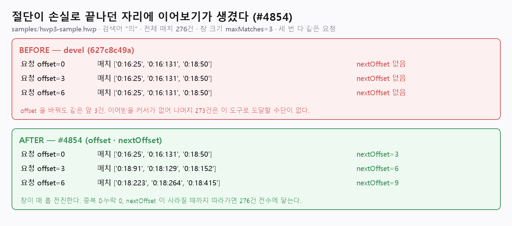

# [#4854] 세션 도구 결과 이어보기 — 처리 결과 보고서

- 일자: 2026-08-15
- 이슈: [#4854](https://github.com/edwardkim/rhwp/issues/4854)
- 기준: `upstream/devel` `627c8c49a`
- 변경 파일: `src/mcp_serve.rs`, `tests/mcp_result_cursor_contract.rs`

## 1. 문제

#3787 S7 이 넣은 자원 상한(`maxMatches`·`maxChars`)은 컨텍스트 범람을 막지만 **이어보기와
짝을 이루지 않는다**. 그래서 호출자는 둘 중 하나만 고를 수 있었다.

1. 상한을 켠다 → 컨텍스트는 지키지만 뒤쪽 정보가 **영구 소실**된다.
2. 상한을 끈다(생략=무제한) → 정보는 다 받지만 컨텍스트가 범람한다.

`hwp_doc_search` 가 특히 분명했다. 입력 스키마가 `docId`·`query`·`caseSensitive`·`maxMatches`
넷뿐이고 구현이 전수 grep 결과를 **앞에서부터** 잘라 냈다.

```rust
// devel 627c8c49a · src/mcp_serve.rs:1702-1707
let all = sd.doc.grep(query, case_sensitive, None);
let total = all.len();
let shown: Vec<_> = match max_matches {
    Some(n) => all.into_iter().take(n).collect(),
    None => all,
};
```

`take(n)` 은 항상 같은 앞 n 건이라 **n+1 번째 이후 매치는 이 도구로 도달할 수 없었다.**
봉투는 exit 0 · `truncated:true` 라 실패가 아니고, 잘린 뒤쪽에 정답이 있으면 작업은 조용히
틀린 결론으로 끝난다.

## 2. 실측 (전/후)

같은 문서·같은 검색어·같은 창 크기로 **똑같은 요청 3건**을 두 바이너리에 던졌다.
BEFORE 는 `rhwp/target/debug/rhwp.exe`(그 체크아웃의 `src/mcp_serve.rs`·`src/main.rs` 는
`git diff --stat upstream/devel...HEAD` 가 빈 결과 — devel 과 동일), AFTER 는 이 브랜치 빌드다.



```
문서: samples/hwp3-sample.hwp · 검색어 "의" · 전체 매치 276건 · maxMatches=3

[BEFORE (devel 627c8c49a)]
  요청 offset=0   → 매치 ['0:16:25', '0:16:131', '0:18:50']  nextOffset=없음
  요청 offset=3   → 매치 ['0:16:25', '0:16:131', '0:18:50']  nextOffset=없음
  요청 offset=6   → 매치 ['0:16:25', '0:16:131', '0:18:50']  nextOffset=없음
  판정: 창이 전진하지 않는다. 나머지 273건은 이 도구로 도달할 수단이 없다.

[AFTER (#4854)]
  요청 offset=0   → 매치 ['0:16:25', '0:16:131', '0:18:50']  nextOffset=3
  요청 offset=3   → 매치 ['0:18:91', '0:18:129', '0:18:152']  nextOffset=6
  요청 offset=6   → 매치 ['0:18:223', '0:18:264', '0:18:415']  nextOffset=9
  판정: 창이 매 홉 전진한다. 중복 0·누락 0, 전수 276건에 닿는다.
```

## 3. 변경

추가 전용(additive)이다. 인자를 생략하면 종전과 **바이트까지 같은 봉투**가 나간다.

| 축 | 추가 | 의미 |
|---|---|---|
| `hwp_doc_search` | 입력 `offset` (0 이상, 기본 0) | 창의 시작 매치 번호 |
| `hwp_doc_text` | 입력 `charOffset` (0 이상, 기본 0) | 선택 쪽 범위를 이어 붙인 좌표의 시작 문자 |
| 두 봉투 | `nextOffset` | **남은 분량이 있을 때만** 실린다 |
| 두 봉투 | `offset`·`charOffset` 에코 | 인자가 0 이 아닐 때만 실린다 |

설계에서 지킨 네 가지.

1. **`nextOffset` 의 있음/없음이 유일한 종료 신호다.** 호출자가 총량 산술로 끝을 추론하지
   않아도 된다. `truncated` 는 "이 응답이 전체가 아니다"라는 뜻이라 마지막 창에서도 true 일
   수 있어 종료 판정에 쓸 수 없다 — 스키마 설명에 이 구별을 명시했다.
2. **총량은 창과 무관하게 고정이다.** `totalMatchCount` 가 오프셋에 따라 흔들리면
   "몇 건 중 몇 건"이라는 계약이 무너진다.
3. **오프셋의 `0` 은 유효값이다.** 상한의 `0`("아무것도 주지 마라")과 달리 오프셋의 `0` 은
   "처음부터"라 `opt_limit` 이 아니라 별도 `opt_offset` 을 뒀다. `-1`·`2.5`·`"3"` 은 거부한다 —
   오타를 "생략"으로 뭉개면 창이 조용히 처음으로 되돌아가 같은 구간을 무한히 다시 읽는다.
4. **총량을 넘긴 오프셋은 오류가 아니다.** 빈 결과 + `nextOffset` 없음으로 성공 처리한다.
   여기서 오류를 내면 성실한 호출자의 **마지막 한 번이 항상 실패**한다.
5. **쪽 주소를 보존한다.** 다 건너뛴 쪽도 `pages[]` 에서 빼지 않는다 — 빼면 `pageCount` 가
   줄어 문서가 실제보다 짧아 보인다(#3787 S7 이 절단에서 지킨 규칙과 같은 이유).

## 4. 검증

| 게이트 | 결과 |
|---|---|
| `cargo test --test mcp_result_cursor_contract` | **8 passed** (신규) |
| `cargo test --test boundary_integrity_contract` | 20 passed |
| `cargo test --test mcp_session_query_contract` | 6 passed |
| `cargo test --test mcp_server_contract` | 25 passed |
| `cargo test --test mcp_spec_ledger_contract` | 4 passed |
| `cargo test --test mcp_arg_validation_contract` | 9 passed |
| `cargo test --test mcp_tool_annotations_contract` | 5 passed |
| `cargo test --test mcp_next_call_contract` | 3 passed |
| `cargo clippy --all-targets -- -D warnings` | 통과 (exit 0) |
| `rustfmt --check` (변경 파일) | 통과 |

신규 계약 8본이 못 박는 것.

- `search_offset_reaches_matches_beyond_max_matches` — `maxMatches:1` 로 276홉을 돌아 **전수
  도달**. 종전에는 존재할 수 없던 검사다.
- `search_window_partition_is_exact_for_larger_windows` — 창 2·3·7 에서 이어 붙인 결과가
  전수와 **정확히** 일치(중복 0·누락 0·순서 보존).
- `omitting_offset_keeps_legacy_envelope_byte_identical` — 인자 생략 = `offset:0`, 봉투 원문
  바이트 동일.
- `search_offset_past_total_is_success_not_error`, `text_char_offset_past_total_is_empty_success`
  — 마지막 창을 넘긴 호출은 성공.
- `text_char_offset_resumes_and_preserves_page_addresses` — 본문 창을 이어 붙이면 전문과 동일,
  `pageCount` 불변.
- `offset_arguments_are_declared_in_tool_schema` — 자기서술에 선언이 있고 `minimum` 이 0.
- `negative_and_malformed_offsets_are_rejected` — `-1`·`2.5`·`"3"` 거부.

## 5. 알려진 비용과 비목표

- **비용**: `page` 를 생략한 `hwp_doc_text` 호출은 매번 전 쪽을 추출하므로, 창을 잘게 쪼갤수록
  전체 훑기가 제곱으로 비싸진다. 이는 이 변경이 만든 비용이 아니라 종전부터 있던 호출 비용이
  홉 수만큼 곱해지는 것이다. 쪽을 아는 경우 `page` 로 좁히면 비용은 그 쪽에만 든다. 계약
  테스트도 이 성질 때문에 창을 800자로 잡았다(창 25자일 때 같은 검사가 125초, 800자에서 5초).
- **비목표**: 상한의 기본값을 바꾸지 않는다("생략=무제한"은 #3787 S7 의 의도된 계약이다).
  무상태 CLI 표면의 계약도 건드리지 않는다. 커서를 불투명 토큰으로 만들지 않는다 — 정수
  오프셋이 결정론적이고 제3자가 손으로 검증할 수 있다.
