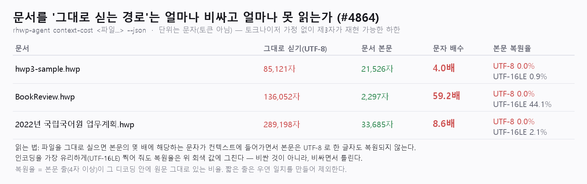

# [#4864] `context-cost` — 처리 결과 보고서

- 일자: 2026-08-15
- 이슈: [#4864](https://github.com/edwardkim/rhwp/issues/4864)
- 기준: `upstream/devel` `627c8c49a`
- 변경 파일: `src/bin/rhwp-agent/contextcost.rs`(신규), `src/bin/rhwp-agent/caps.rs`,
  `src/bin/rhwp-agent/main.rs`, `tests/agent_context_cost_contract.rs`(신규),
  `tests/agent_toolkit_contract.rs`, `mydocs/manual/agent_toolkit_cli.md`

## 1. 문제

이 저장소의 에이전트 표면은 "문서를 구조화해 주는 도구가 필요하다"는 전제 위에 서 있는데,
그 전제를 뒷받침하는 **숫자가 없었다.** 하네스 스코어카드(#4389)의 운영 규약이
"새 하네스 성질 주장은 실행 명령이 달려야 주장이 된다"인데, 정작 가장 근본적인 질문 —
"파일을 그대로 실으면 안 되는가, 안 된다면 얼마나?" — 에는 실행 명령이 없었다.

원리("바이너리라서")는 반박도 검증도 할 수 없다.

## 2. 변경 — `rhwp-agent context-cost <파일...> [--json]`

두 경로를 같은 문서에서 잰다.

- **그대로 싣기** — 파일 바이트를 텍스트로 디코딩해 모델에 넣는 경로.
- **문서-네이티브** — 파서를 거쳐 본문만 싣는 경로.

봉투 필드: `bytes` · `rawChars.utf8` · `rawChars.utf16le` · `nativeChars` ·
`charRatio` · `recoveryPercent.utf8` · `recoveryPercent.utf16le` · `sampledChars`.

`src/bin/rhwp-agent/` 안에서 끝나는 신규 명령이라 본 CLI 의 최고 경합 지점을 건드리지
않는다(#3918 무충돌 규약). 명령 테이블(`caps::COMMANDS`) 한 곳에만 등록하면 디스패치·
도움말·자기서술에 함께 실린다.

### 정직 규율 셋 (계약 테스트가 고정)

1. **가장 유리한 대안도 같이 잰다.** UTF-8 만 재면 허수아비다. 인코딩을 바꿔 볼 호출자를
   상정해 UTF-16LE 복원율을 같은 봉투에 싣는다 — 한글 문서의 여러 바이너리 포맷이
   UTF-16LE 로 문자열을 담아 실제로 이쪽이 더 유리하다.
2. **토큰이 아니라 문자를 센다.** 토크나이저는 모델마다 다르고 이 저장소는 모델을 부르지
   않는다. `unit`·`unitNote` 가 이 한계를 봉투 안에서 스스로 밝힌다.
3. **봉투에 문서 본문이 한 글자도 실리지 않는다.** 계측 결과를 그대로 이슈·로그에 붙여도
   문서가 새지 않는다(`untrustedContent: false`).

복원율은 **줄 단위**로 센다. 한두 글자가 우연히 맞는 것은 복원이 아니므로 4자 미만 줄은
표본에서 제외한다 — 이 필터가 없으면 짧은 목록 번호("1.", "가.")가 바이너리 어디에나
우연히 나타나 복원율을 부풀린다.

## 3. 실측 (이 브랜치 빌드)



```
$ rhwp-agent context-cost samples/hwp3-sample.hwp samples/basic/BookReview.hwp \
      "samples/2022년 국립국어원 업무계획.hwp"

문서                              그대로 싣기(UTF-8)   문서 본문   문자 배수   복원율 UTF-8 / UTF-16LE
hwp3-sample.hwp                   85,121자            21,526자    4.0배       0.0% / 0.9%
BookReview.hwp                    136,052자            2,297자   59.2배       0.0% / 44.1%
2022년 국립국어원 업무계획.hwp     289,198자           33,685자    8.6배       0.0% / 2.1%
```

읽는 법: `BookReview.hwp` 를 그대로 실으면 본문의 **59.2배**에 해당하는 문자가 컨텍스트에
들어가면서 본문은 UTF-8 로 **한 글자도** 복원되지 않는다. 인코딩을 가장 유리하게 찍어 줘도
0.9~44.1% 다. 즉 "그대로 싣기"는 비싸기만 한 게 아니라 **비싸면서 틀린다** — 컨텍스트는
가득 찼는데 본문은 없으므로.

> 이슈 본문의 표는 구현 전 파이썬 예비 계측이라 국립국어원 문서의 UTF-16LE 복원율이
> 2.0% 로 적혀 있다. 실제 명령은 문서화된 규칙(줄 트리밍 + 4자 하한)을 쓰므로 2.1% 이며,
> 이 보고서와 PR 은 **명령 출력을 권위로** 삼는다. 나머지 값은 두 계측이 일치한다.

## 4. 검증

| 게이트 | 결과 |
|---|---|
| `cargo test --test agent_context_cost_contract` | **8 passed** (신규) |
| `cargo test --test agent_toolkit_contract` | 13 passed |
| `cargo test --test agent_codex_contract` | 2 passed |
| `cargo test --test agent_profile_router_contract` | 8 passed |
| `cargo clippy --all-targets -- -D warnings` | 통과 (exit 0) |
| `rustfmt --check` (변경 파일) | 통과 |

신규 계약 8본이 못 박는 것.

- `measurement_is_deterministic` — 같은 입력에 **바이트까지 같은 봉투**(모델·시각·난수
  무개입). 제3자 재현의 전제다.
- `ratio_and_recovery_are_self_consistent` — `charRatio` 를 봉투 안의
  `rawChars.utf8`/`nativeChars` 로 **손으로 재계산**해 일치를 확인하고, 복원율이 0~100
  안이며 표본 문자 수가 본문을 넘지 않음을 확인한다. 재계산이 불가능한 수치는 검증할 수
  없고, 검증할 수 없는 수치는 주장이다.
- `envelope_contains_no_document_text` — 표본에서 **가장 긴 본문 줄을 실제로 뽑아** 봉투에
  없음을 확인한다(고정 문자열을 쓰면 표본이 바뀔 때 조용히 무의미해진다).
- `favorable_alternative_is_measured_too` — 유리한 대안 수치가 빠지면 실패. 허수아비 방지를
  검사로 고정한다.
- `usage_errors_exit_2_with_empty_stdout`·`missing_file_is_runtime_error_with_empty_stdout`
  — 실패 stdout 무오염(반쪽 JSON 금지).
- `command_is_self_described` — 자기서술 등재.

`agent_toolkit_contract` 의 명령 집합 목록에 `context-cost` 를 더했다. 그 목록은
"추가는 함께 늘리고 삭제·개명은 깨진다"는 의도된 계약이다.

## 5. 명명

이슈의 제안명 `harness-cost` 는 본 CLI 의 기존 `harness`(검증 작업장 — init/wrap, #4537)와
어휘가 겹쳐 읽는 쪽이 같은 축으로 오해할 여지가 있었다. 재는 대상이 **컨텍스트 비용**이라
`context-cost` 로 확정했다.

## 6. 비목표

- 특정 도구·제품과의 실명 성능 비교·서열 주장을 하지 않는다. 재는 것은 **경로**이지 남의
  이름이 아니다.
- 토큰 수·비용(달러) 추정을 하지 않는다. 모델·토크나이저 가정이 들어가는 순간 재현
  불가능한 숫자가 된다.
- 압축 해제 등 "더 똑똑한 그대로 싣기"를 대신 구현하지 않는다 — 그건 곧 파서다.
