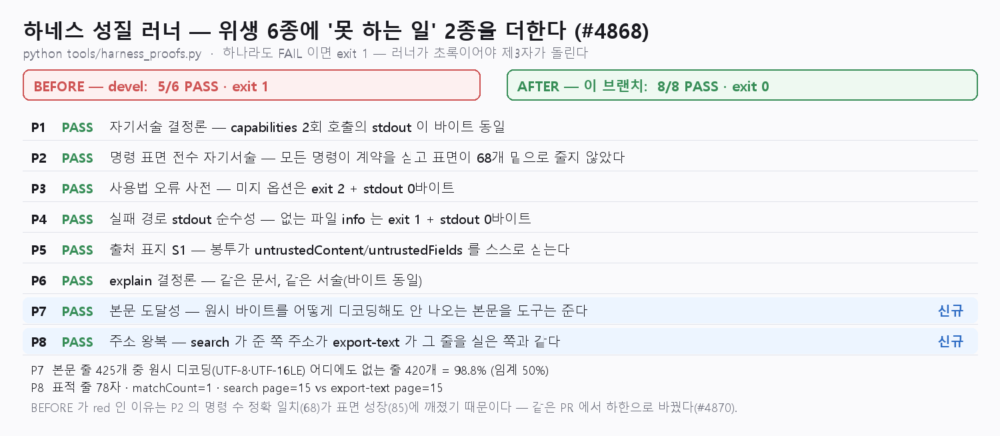

# [#4868] 하네스 성질 P7·P8 — 처리 결과 보고서

- 일자: 2026-08-15
- 이슈: [#4868](https://github.com/edwardkim/rhwp/issues/4868) (+ 같은 파일의
  [#4870](https://github.com/edwardkim/rhwp/issues/4870))
- 기준: `upstream/devel` `627c8c49a`
- 변경 파일: `tools/harness_proofs.py`,
  `mydocs/tech/agent_roadmap/harness_scorecard.md`,
  `mydocs/tech/agent_roadmap/trend_harness_2026w33.md`(신규)

## 1. 문제

`tools/harness_proofs.py` 의 6종(P1~P6)은 전부 **CLI 위생** 축이었다 — 결정론, 명령 표면
서술, 사용법 오류 사전, 실패 stdout 순수성, 출처 표지, explain 결정론. 전부 필요하지만
전부 "도구가 예의 바른가"를 묻는다.

정작 **"이 도구가 없으면 못 하는 일이 무엇인가"** 를 판정하는 행이 없어서, 러너를 다
통과해도 "파일을 읽고 셸로 다루면 왜 안 되는가"에는 원리로만 답해야 했다. 스코어카드
규약이 "새 하네스 성질 주장은 실행 명령이 달려야 주장이 된다"인데 이 축은 주장조차
없었다.

그리고 러너는 **devel 에서 이미 red 였다**(#4870): `EXPECTED_COMMAND_COUNT = 68` 이 정확
일치로 박혀 있는데 본 CLI 명령이 85 로 자라 P2 가 FAIL, 전체 exit 1.

## 2. 변경

### P7 — 본문 도달성

문서 본문 줄 중 **원시 바이트를 어떻게 디코딩해도(UTF-8·UTF-16LE) 나오지 않는 줄**이
과반이고 도구는 그 전부를 준다.

- 판정 임계는 **과반(50%)** 이다. 실측은 98.8% 지만 표본 하나의 수치를 성질로 굳히지
  않는다 — 표본이 바뀌어도 살아남는 것만 성질이다.
- 대조 대상에 **UTF-16LE 를 포함**한다. 한글 문서의 여러 바이너리 포맷이 UTF-16LE 로
  문자열을 담으므로, UTF-8 만 보면 허수아비를 세우는 것이 된다.
- 줄 길이 하한 8자. 짧은 줄("1.", "가.")은 바이너리 어디에나 우연히 나타나 "원시
  경로로도 읽힌다"는 **반대 결론**을 만든다.

### P8 — 주소 왕복

`search` 가 준 `page` 주소가 `export-text` 가 그 줄을 실은 쪽과 일치한다. 도구가 준
좌표를 다음 호출에 그대로 쓸 수 있다는 뜻이다. 표적 줄은 P7 이 찾은 **가장 긴 도달 불가
줄**을 그대로 물려받는다 — 우연 일치에 가장 강한 줄이다.

### P2 — 정확 일치를 하한으로 (#4870)

P2 가 지키려던 것은 (a) 모든 명령이 자기 계약을 싣는다 (b) 표면이 조용히 줄지 않는다
둘이다. (a)는 그대로 검사하고, (b)에는 정확 일치가 필요 없다.

상수를 85 로 올리기만 하면 다음 명령이 추가될 때 같은 자리에서 또 빨개진다. **상시 red 인
게이트는 게이트가 아니다** — 아무도 돌리지 않게 되고 그때부터 진짜 회귀도 같이 묻힌다.
그래서 하한(`EXPECTED_COMMAND_FLOOR = 68`)으로 바꿨다: 성장은 통과, 축소는 FAIL.

## 3. 실측 (전/후)



```
BEFORE — devel 627c8c49a 의 tools/harness_proofs.py
  판정: 5/6   exit 1     ([FAIL] P2  commands=85 (expected=68))

AFTER — 이 브랜치
  판정: 8/8   exit 0
  [PASS] P7  본문 줄 425개 중 원시 디코딩 어디에도 없는 줄 420개 = 98.8% (임계 50%)
  [PASS] P8  표적 줄 78자 · matchCount=1 · search page=15 vs export-text page=15
```

BEFORE 는 `git show upstream/devel:tools/harness_proofs.py` 를 그대로 실행한 결과이고,
증빙 이미지는 두 러너의 `--json` 출력에서 직접 그렸다(수치 하드코딩 없음).

## 4. 문서

- `harness_scorecard.md` — P7·P8 행 추가, 실검증 6종 → 8종, `last_verified` 갱신,
  운영 규약에 5항(임계는 성질이 살아남을 만큼 느슨하게) 추가.
- `trend_harness_2026w33.md`(신규) — 범용 하네스가 플러그인-우선으로 표준화되는 흐름을
  1차 출처·접속일과 함께 대사하고, 그 흐름이 도메인 도구에 남기는 자리를
  **머지 실물 / 검토 중 PR** 로 갈라 적었다. `trend_harness_2026w32.md` 의 서술 원칙을
  승계한다 — 실명 성능 비교·서열 주장은 하지 않고, open PR 을 머지 실물로 표현하지 않는다.

## 5. 검증

| 게이트 | 결과 |
|---|---|
| `python tools/harness_proofs.py` | **8/8 PASS · exit 0** |
| `python scripts/check_document_metadata.py` | 561개 문서 이상 없음 |
| `python scripts/check_markdown_links.py` | 566개 문서 내부 상대 링크 이상 없음 |

Rust 코드 변경이 없어 `cargo` 게이트는 이 PR 의 범위 밖이다.

## 6. 비목표

- 실명 성능 비교·서열 주장. 재는 것은 **경로**이지 남의 이름이 아니다.
- 미머지 기능으로 P행을 만들기. 러너는 devel 머지본만으로 돈다 — 검토 중인
  [#4863](https://github.com/edwardkim/rhwp/pull/4863)·[#4867](https://github.com/edwardkim/rhwp/pull/4867)
  은 동향 문서 대사표에서 **상태를 밝혀** 구분했고 P행으로 만들지 않았다.
- 표본 한 개의 수치를 임계로 박기(위 P7 임계 참조).
