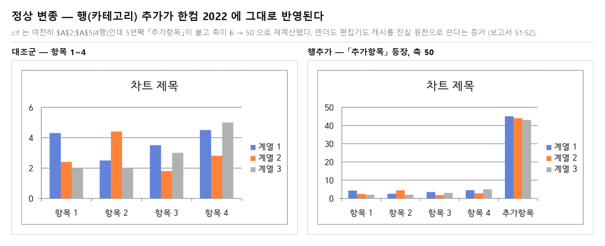
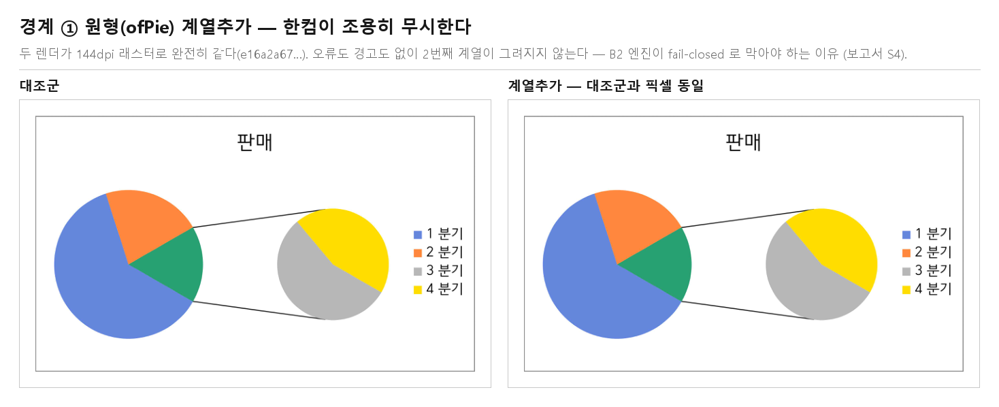
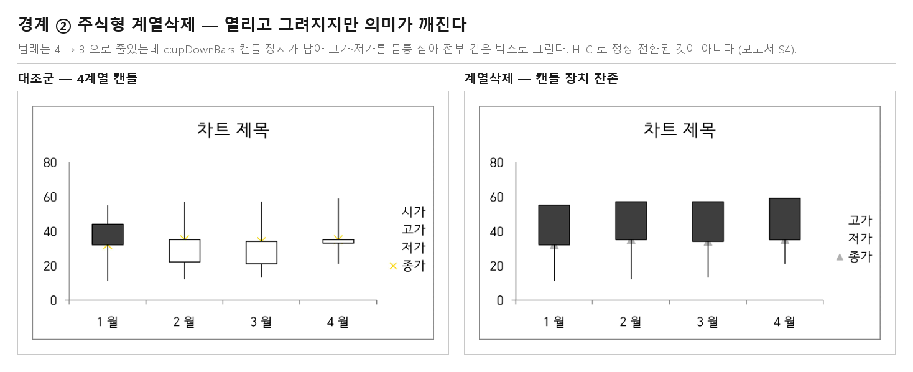

# #5447 보고서 — B2 스파이크: 구조 편집은 한컴에서 통한다

- **이슈**: [#5447](https://github.com/edwardkim/rhwp/issues/5447) — 부모
  [#3683](https://github.com/edwardkim/rhwp/issues/3683) Track B
- **계획서**: [`task_m100_5447.md`](../plans/task_m100_5447.md) · **Stage 1**:
  [`task_m100_5447_stage1.md`](../working/task_m100_5447_stage1.md) · **Stage 2**(증적 보존):
  [`task_m100_5447_stage2.md`](../working/task_m100_5447_stage2.md)
- **브랜치**: `task5447` (`upstream/devel` `e79f11308` 기준)
- **판정 원장**: [`samples/issue5447/MANIFEST.json`](../../samples/issue5447/MANIFEST.json)
  — 아래 모든 숫자와 해시의 정본. 재계산은 `python tools/hancom_chart_judgment_verify.py`

## 0. 결론

**정한 정책 3종이 그대로 통한다. `c:f` 를 갱신할 필요가 없다.**

| 정책 | 판정 |
|---|---|
| `c:f` **무갱신** | **통과** — 렌더도 편집기도 캐시를 읽는다. 범위 길이와 실제 개수가 어긋나도 무해하다 |
| `c:ptCount` **항상 재계산** | **통과** — 재계산한 값으로 개수가 정확히 반영된다 |
| `c:pt idx` **0..n-1 전수 재번호** | **통과** — 삭제 후 재번호한 문서가 정상 렌더된다 |

그리고 **막아야 할 경계 2종이 확정됐다** — 한컴은 둘 다 거부하지 않고, 하나는 조용히
무시하고 하나는 **조용히 틀리게 그린다.** B2 엔진이 막지 않으면 사용자가 알 수 없다.

## 1. 판정 방법과 증적

한컴 2022 로 38개 산출을 열어 PDF 로 저장한 변환본(작업지시자 제공)을 `pdftoppm -r 144`
로 1쪽 PPM(무압축 픽셀)으로 렌더해 SHA-256 으로 갈랐다. 전건 `1190x1682`.

PDF 안 스트림을 통째로 해시하지 않은 것은 #4100 보고서 §4-1 의 교훈이다 — 폰트·구조
스트림처럼 **문서 출처가 다른 데서 오는 차이**가 섞여 판정이 틀렸고, 래스터로 다시 재서
바로잡았다. 그리기 결과를 판정하려면 그리기 결과를 재야 한다.

### 1-1. 자산의 세 역할과 경로

판정에 쓰인 파일은 역할이 셋이고, 저장소 안에서 서로 다른 자리에 산다. **역할을 섞으면
"무엇이 무엇의 증거인지" 가 흐려지므로** 경로로 갈라 둔다.

| 역할 | 무엇 | 경로 | 수 · 용량 |
|---|---|---|---|
| **원본** — 판정 입력 | 우리가 만들어 한컴에 넣은 산출과, 함께 보낸 판정 지시표 | [`samples/issue5447/`](../../samples/issue5447/) | 38 + `PANJEONG.md`, 디렉터리 1.47 MB |
| **변환본** — 한컴의 답 | 그 38건을 한글 2022 가 PDF 로 저장한 것 | [`pdf/issue5447/`](../../pdf/issue5447/) | 38 PDF, 디렉터리 3.54 MB |
| **대표 asset** — 사람이 볼 그림 | 결론을 증명하는 대조군\|변종 좌우 대조 3장 | [`mydocs/pr/assets/pr_5647_issue5447_*.png`](../pr/assets/) | 3 PNG, 0.17 MB |

원장 [`samples/issue5447/MANIFEST.json`](../../samples/issue5447/MANIFEST.json) 이 38행 각각에
대해 **원본 경로·SHA-256, 변환본 경로·SHA-256, 래스터 해시 2축, 판정, 편집기 관측**을 적는다.
**파일별 전체 SHA-256 은 이 원장이 유일한 정본**이고 어느 문서에도 복사하지 않는다 — 두 곳에
적으면 한 곳이 조용히 늙는다.

용량은 합계 **5.18 MB**, 최대 단일 파일 113,064 B(110 KB)다. `.gitattributes` 의 LFS 추적은
`pdf-large/**/*.pdf` 뿐이고 임계는 50 MB 이므로 **이 자산은 LFS 대상이 아니다** — 일반 git 으로
보존한다.

### 1-2. 래스터 해시는 도구에 딸린 값이다

절대 해시는 렌더러와 그 버전마다 다르다. 그래서 원장은 축을 둘로 나눠 적고, **도구를 섞어
비교하지 않는다.**

| 축 | 도구 | 역할 |
|---|---|---|
| `pdftoppm_144dpi_ppm_sha256` | poppler `pdftoppm -r 144 -f 1 -l 1` | **§2 표의 축.** 2026-08-20 에 poppler 25.12.0 으로 38건을 다시 재서 15개 판정 단위 전건이 아래 값과 일치함을 확인했다 |
| `pymupdf_144dpi_rgb_sha256` | PyMuPDF 1쪽 144dpi RGB 픽스맵 | poppler 없이도 도는 기본 축. `pdf/task4097/` 선례와 같은 방식 |

**도구를 넘어 성립해야 하는 계약은 절대 해시가 아니라 관계다.** 원장 꼬리의 `invariants`
19건이 그것이다 — 포맷 쌍 동일 14건, 변환본 == 원본 hwp 행추가, 원형 계열추가 == 대조군,
주식형 계열삭제 != 대조군, 전건 1쪽 `1190x1682`, 판정 단위 15와 그 분포. 두 축 모두에서
성립한다.

### 1-3. 재현 절차

```bash
# 원장 전체 재계산 — 파일 SHA-256 + 래스터 + 판정 + 불변식
python tools/hancom_chart_judgment_verify.py
python tools/hancom_chart_judgment_verify.py --rasterizer pdftoppm   # §2 표의 축

# 산출을 다시 만든다 (gitignored output/ 에 쓴다)
cargo test --profile release-test --test issue_4100_chart_data_edit \
    generate_b2_structure_judgment_bundle -- --ignored --nocapture
```

한컴 변환만은 사람 손이 필요하다 — 절차는 [`pdf/README.md`](../../pdf/README.md) §4.
자산과 원장이 어긋나는 것은 CI 가 막는다
(`tests/issue_4100_chart_data_edit.rs::b2_judgment_assets_match_the_manifest`, 렌더러 의존성 0).

### 1-4. 판정 스크립트가 한 번 틀렸다

한컴을 거쳐 돌아온 파일명이 **NFD(자모 분해)** 라 (77건 중 76건) 한글 리터럴 비교가 전부
빗나가 대조군 매칭이 0건이 됐다. 표는 그럴듯하게 출력됐고 "대조군 없음"만 조용히 찍혔다.
`unicodedata.normalize("NFC", …)` 로 맞춘 뒤가 아래 결과다. 내보낼 때 만든 zip 은 NFC 였으므로
왕복 어딘가에서 바뀐 것이다 — **macOS↔Windows 를 오가는 판정 자산은 이름 정규화를 검사
항목에 넣어야 한다.**

이 사고가 `tools/hancom_chart_judgment_verify.py` 의 설계 이유다. 이름을 NFC 로 맞춘 뒤 맞추고,
**비었거나 못 찾은 값을 전부 즉시 실패로 낸다.** 조용한 통과가 없다. CI 쪽 트립와이어가
디렉터리를 거꾸로 훑을 때 이름이 아니라 **해시 집합**으로 맞추는 것도 같은 이유다.

## 2. 결과 — 15 판정 단위

38 산출은 **대조군 9 + 변종 14 × 2포맷 + 변환본 1** 이다. 같은 변종의 `.hwp` 와 `.hwpx` 는
한 단위로 묶어 보므로 **판정 단위는 14 + 1 = 15**다. 래스터 해시는 poppler 축(§1-2)의 앞
16자리이고, 전체 해시와 PyMuPDF 축은 원장에 있다.

| 기준 문서 | 변종 | 포맷 | 래스터 해시 (poppler) | 판정 |
|---|---|---|---|---|
| 묶은세로막대형 | 행추가 | hwp=hwpx | `af8236e85a654a49` | 반영 |
| 묶은세로막대형 | 행삭제 | hwp=hwpx | `0a6c40a14d1edf1e` | 반영 |
| 묶은세로막대형 | 계열추가 | hwp=hwpx | `eb201e18a4f1a534` | 반영 |
| 묶은세로막대형 | 계열삭제 | hwp=hwpx | `bcd3507a4f052dba` | 반영 |
| 묶은세로막대형 | 계열명변경 | hwp=hwpx | `638ba5f794bfb493` | 반영 |
| 묶은세로막대형 | 라벨변경 | hwp=hwpx | `2838421c5c530763` | 반영 |
| 묶은세로막대형 | 행추가(HWPX→HWP 변환) | hwp | `af8236e85a654a49` | 반영 — **원본 hwp 와 동일 해시** |
| 묶은가로막대형 | 행추가 | hwp=hwpx | `9358a1b1f7e3696c` | 반영 |
| 표식이있는꺽은선형 | 행추가 | hwp=hwpx | `8fbdfd74c389aef8` | 반영 |
| 3차원묶은세로막대형 | 행추가 | hwp=hwpx | `f55b62b1ee006add` | 반영 |
| 누적세로막대형 | 계열삭제 | hwp=hwpx | `a13f5e51f9d646e9` | 반영 |
| 직선및표식이있는분산형 | 점추가(xVal/yVal 동기) | hwp=hwpx | `d1fe4dbcd404e97b` | 반영 |
| 특이케이스(numLit) | 점추가 | hwp=hwpx | `f2faea678da92758` | 반영 |
| 시가고가저가종가 | 계열삭제 | hwp=hwpx | `829d22ea996d30a4` | **반영되나 의미가 깨짐** |
| 원형대원형 | 계열추가 | hwp=hwpx | `e16a2a6780289030` | **미반영 — 대조군과 바이트 동일** |

- **개봉 실패 0** — 38 산출 전건이 PDF 로 변환됐다(오류·복구 대화상자 없음).
- **렌더 반영 14 / 15** — 대조군 대비 그림이 바뀐 것이 14, 안 바뀐 것이 1(원형대원형 계열추가).
  반영 14 중 1건(시가고가저가종가 계열삭제)은 **바뀌었지만 의미가 깨졌다** — 래스터는
  "달라졌다"까지만 답한다.
- **포맷 간 렌더 동일 15/15** — 같은 변종의 `.hwp` / `.hwpx` 해시가 전건 일치. 변환본까지
  포함해 한쪽만 반영되는 사고가 없다.

> 초판은 이 절을 "18 변종 / 17-18 반영" 으로 적었다. 근거가 없는 숫자였다 —
> 변종은 14, 판정 단위는 15 다. 원장(`counts.judgment_units` · `counts.tally`)과
> `b2_judgment_assets_match_the_manifest` 가 이제 이 숫자를 강제한다.

## 3. 질문별 답

### S1 — `c:f` 무갱신 상태에서 개수가 바뀐 차트를 한컴이 정상 렌더하는가 → **예**

`묶은세로막대형-행추가`: 「추가항목」이 5번째 카테고리로 붙고 45/44/43 막대가 솟았으며
**축이 6 → 50 으로 재계산**됐다. 이때 `c:f` 는 여전히 `Sheet1!$A$2:$A$5`(4행)다.

`계열추가`는 더 강한 증거다. 복제 계열의 `c:f` 를 **일부러 원본 그대로** 둬서 두 계열이
같은 열(`$D$2:$D$5`)을 가리키게 했는데, 「추가계열」이 4번째 계열로 정상 표시됐다.
**낡은 참조도, 중복 참조도 렌더에 영향이 없다.**

`행삭제`는 「항목 2」가 사라지고 3카테고리로 줄었다 — `idx` 재번호가 통한다.



*대조군(항목 1~4, 축 6)과 행추가(「추가항목」 등장, 축 50). `pdf/issue5447/묶은세로막대형-대조군-hwpx-2022.pdf`
와 `…-행추가-hwpx-2022.pdf` 를 144dpi 로 렌더해 나란히 놓은 것이다.*

### S2 — 편집기가 `c:f` 를 재해석해 행을 잘라내지 않는가 → **자르지 않는다**

작업지시자 실측(2026-08-18): `묶은세로막대형-행추가` 를 한컴에서 열어 차트 데이터
편집기를 띄우면 **`.hwp`·`.hwpx` 둘 다 5행**이다.

이것이 `c:f` 무갱신 정책이 뒤집힐 유일한 지점이었다. **렌더러뿐 아니라 편집기도 캐시를
진실 원천으로 쓴다**는 것이 확인됐으므로, B2 는 A1 범위 파서와 열 문자 자리올림
(`$Z`→`$AA`)을 만들 필요가 없다. 한컴이 스스로 깨진 범위(`$B$2:$A$4`)를 쓰는 것과
정합하는 결과다.

### S3 — 계열 신설·삭제가 통하는가 → **통한다. 누적·3D 포함**

`c:ser` 통째 복제 + `c:idx`/`c:order` 채번으로 만든 계열이 범례와 플롯에 정상 등장한다.
삭제 후 잔여 재번호도 통한다. 누적(`grouping="stacked"`)에서 계열을 지우면 누적 합이
줄어든 대로 그려지고, 3D(`bar3DChart` + `c:view3D`)에서 행을 늘려도 정상이다.

### S4 — 거부해야 할 경계가 실제로 깨지는가 → **깨진다. 그런데 한컴은 막지 않는다**

**원형(ofPie) 계열추가 — 조용히 무시.** 렌더가 대조군과 **바이트 동일**이다. 한컴이
2번째 계열을 아예 그리지 않는다. 파일은 정상 개봉되고 오류도 없다.



**주식형 계열삭제 — 조용히 틀리게 그린다.** 이쪽이 더 나쁘다. 대조군은 시가·고가·저가·
종가 4계열 캔들(흰 몸통 = 상승, 검은 몸통 = 하락, 노란 × 종가)인데, 시가를 지운 변종은
범례가 3개로 줄었지만 **`c:upDownBars` 캔들 장치가 남아 고가·저가를 몸통 삼아 전부 검은
박스**로 그린다. HLC 차트로 정상 전환된 것이 아니라 **의미가 깨진 그림**이다.



> **판정**: "열리고 그려지지만 틀린" 것이 최악의 실패 모드라는 것이 실측으로 확인됐다.
> 한컴이 거르지 않으므로 **B2 엔진이 fail-closed 로 막아야 한다.**
>
> 위 두 장은 결론을 증명하는 **대표 asset** 이고, 그 원천인 변환본 PDF 4건은
> `pdf/issue5447/원형대원형-{대조군,계열추가}-hwpx-2022.pdf` ·
> `pdf/issue5447/시가고가저가종가-{대조군,계열삭제}-hwpx-2022.pdf` 에 그대로 있다.

## 4. B2 본구현 권고

### 4-1. 채택 확정

| 항목 | 결정 |
|---|---|
| `c:f` | **손대지 않는다.** 범위 파서·열 자리올림 불필요 |
| `c:ptCount` | 편집 후 항상 재계산 |
| `c:pt idx` | 삭제·삽입 후 `0..n-1` 전수 재번호 (rhwp 스캐너 자기정합 요구이기도 하다) |
| `c:ser` 신설 | 마지막 계열 복제 + `c:idx`/`c:order` 채번. `c:f` 는 복제분 그대로 두어도 무해 |
| 계열명·카테고리 라벨 | `c:tx`/`c:cat` **캐시 텍스트만** 바꾸면 반영된다 |
| ①② 동시 기록 | B1 계약 유지 — HWPX→HWP 변환본이 원본 hwp 와 해시 동일로 확인됨 |
| ③ 레거시·④ EMF | 계속 갱신하지 않는다 (전건 바이트 불변으로 산출) |

### 4-2. 종류별 가드 (신규 거부 사유)

한컴이 막지 않으므로 코어 `validate()` 가 막는다. §3-4 가 근거다.

- **원형·3D원형·ofPie** — 계열 수는 1 고정. 계열 추가 거부
- **주식형** — `stockChart` 는 계열 수가 차트 종류에 묶인다(HLC=3 / OHLC=4).
  계열 개수 변경 거부 (변경은 B3 종류 변환의 영역이다)
- 거부 사유는 기존 `reason` 코드 체계(`src/document_core/commands/object_ops/chart.rs:23-42`)에 추가

### 4-3. 삭제 하한

마지막 1점·1계열 삭제는 거부한다(#3683 §4 기본값). `특이케이스`(1계열 1점, `c:numLit`)가
그 경계이고 이번에 점추가 방향은 정상 동작을 확인했다.

## 5. 검증

Stage 1 게이트 실측은 [`task_m100_5447_stage1.md`](../working/task_m100_5447_stage1.md) §3.
요약하면 `cargo test --test issue_4100_chart_data_edit` 37 passed / 0 failed,
`clippy --all-targets -D warnings` exit 0, fmt·suite manifest·unit tiers 전건 통과,
`samples/chart/` 무변경, `src/`·렌더러·studio 무변경.

Stage 2(증적 보존) 실측은 [`task_m100_5447_stage2.md`](../working/task_m100_5447_stage2.md).
같은 타깃이 **38 passed / 0 failed / 2 ignored** 로 늘었고(트립와이어 1건 추가),
원장 재계산은 두 축 모두 통과했다. 커밋한 판정 자산은 `samples/chart/` 바깥
(`samples/issue5447/`)에 있어 기존 코퍼스 게이트에 잡히지 않는다 — 그 게이트들이 비재귀라는
사실을 전체 테스트로 실증했다.

## 6. 배운 것

### 6-1. 오라클 왕복이 데이터를 조용히 바꾼다

판정 자산이 macOS → Windows(한컴) → macOS 를 왕복하면서 파일명이 NFC → NFD 로 바뀌었다.
스크립트는 예외 없이 끝까지 돌았고 표도 나왔다 — 다만 전부 "대조군 없음"이었다.
**판정 파이프라인은 "값이 비었다"를 실패로 드러내야 한다.** 이번엔 대조군 해시가 `None`
인 채로 계속 진행한 것이 문제였다.

### 6-2. 낡은 참조를 일부러 남기는 변종이 답을 갈랐다

계열 복제 시 `c:f` 를 원본 그대로 둔 것은 게으름이 아니라 설계였다. 두 계열이 같은 열을
가리키는 상태에서도 정상 렌더된다는 것이 **`c:f` 무시 정책의 가장 강한 증거**가 됐다.
"낡게 남긴 것"을 변종마다 판정표에 명시해 둔 덕에 한컴 반응의 원인을 가릴 수 있었다.

### 6-3. 한컴이 열어준다고 통과가 아니다

주식형 계열삭제는 오류 없이 열리고 그려졌다. 해시만 보면 "반영"이다. 그림을 봐야
**캔들 장치가 남아 고가·저가를 몸통으로 그리는** 의미 파괴가 드러났다. 래스터 해시는
"같은가 다른가"만 답하고 "맞는가"는 답하지 않는다 — 경계 변종은 눈으로 봐야 한다.

### 6-4. 판정을 재계산할 수 없으면 판정이 아니다

초판은 결론을 해시 표로 적었지만 그 해시를 낳은 산출·변환본·스크립트가 저장소 밖
(gitignored `output/`)에 있었다. 표는 맞았는데도 **제3자가 확인할 방법이 없었다** — PR #5647
이 보류된 이유가 이것이다. 그리고 같은 결함이 숫자를 조용히 틀리게도 했다: 초판의
"18 변종 / 17-18 반영" 은 아무 데서도 나오지 않는 값이었고, 원장을 만들며 다시 세니
**15 판정 단위 / 반영 14 / 미반영 1** 이었다.

**원장이 없으면 보고서의 숫자는 검산되지 않는다.** 지금은 `MANIFEST.json` 이 정본이고,
CI 트립와이어가 자산과 원장의 어긋남을, 검증 스크립트가 원장과 실제 그림의 어긋남을 막는다.

### 6-5. 래스터 해시는 도구에 딸린 값이다 — 계약은 관계로 적는다

같은 PDF 를 PyMuPDF 와 poppler 로 재면 절대 해시가 다르다. 그래서 원장은 축을 나눠 적고,
**도구를 넘어 성립해야 하는 것은 `invariants` 의 동치 관계**로 따로 박았다 — "포맷 쌍이
같다", "원형 계열추가는 대조군과 같다", "주식형 계열삭제는 대조군과 다르다".

실제로 값이 있었다. poppler 를 못 쓰는 환경에서 PyMuPDF 로 재보니 절대 해시는 전부 달랐지만
관계는 전건 그대로였고, 뒤에 poppler 25.12.0 으로 다시 재니 **초판 표의 15개 해시가
접두사까지 일치**했다. 관계를 계약으로 잡아 둔 덕에 도구가 없는 동안에도 결론을 검증할 수
있었다.

## 7. 다음

B2 본구현(엔진 → UI) 서브이슈 등록. 이 보고서의 §4 가 그 설계 입력이다.
