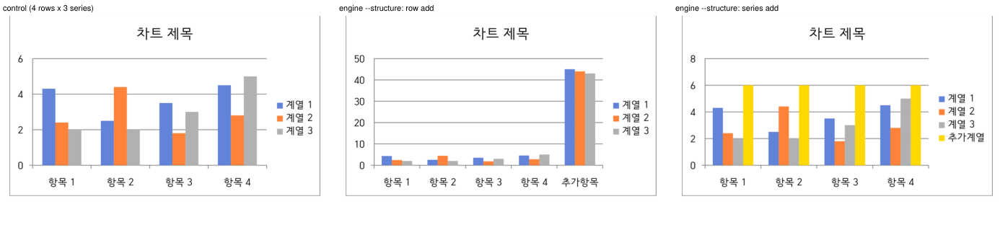
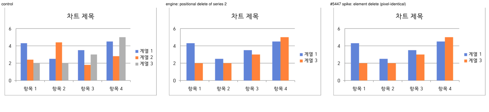

# #5652 보고서 — B2-엔진: 차트 행·열·라벨 구조 편집 본구현

- **Issue**: [#5652](https://github.com/edwardkim/rhwp/issues/5652) (#3683 Track B — B2-엔진)
- **브랜치**: `task5652` · **기준 커밋**: `upstream/devel = 87a8d3dca` (리베이스 후)
- **계획서**: [`task_m100_5652.md`](../plans/task_m100_5652.md) · **단계 보고서**:
  [stage1](../working/task_m100_5652_stage1.md) · [stage2](../working/task_m100_5652_stage2.md) ·
  [stage3](../working/task_m100_5652_stage3.md) · [stage4](../working/task_m100_5652_stage4.md) ·
  [stage5](../working/task_m100_5652_stage5.md)

## 결론 한 줄

**rhwp 안에서 차트의 행(카테고리)·열(계열)·계열명·라벨을 바꿀 수 있고, 그 편집이 ①② 두 표현에
함께 쓰이며, 한컴 2022 가 엔진 산출 13 판정 단위 전건을 편집대로 그린다.** 한컴이 막지 않는 잘못된
구조는 코어가 fail-closed 로 막는다. 엔진 산출은 #5447 스파이크 산출과 10변종 × 2포맷에서 **문서
바이트 동일**, 한컴 렌더는 **25/25 픽셀 동일**(위치 기반 계열삭제 2종 포함)이다.

## 1. 수용 기준

| # | 기준 | 판정 | 근거 |
|---|---|---|---|
| 1 | 행 추가·삭제, 계열 추가·삭제, 계열명·카테고리 라벨 변경이 ①② 동시 기록으로 반영되고, 실패 시 한 바이트도 쓰지 않는다 | **충족** | `structure_row_append_writes_both_representations_and_rereads`(hwpx ①②·hwp ②) · `structure_series_append_and_truncate_rename_relabel` · `structure_matrix_rules_are_enforced`·`every_refusal_writes_nothing`·가드 6건 — 전건 `wrote: []`·슬롯 바이트 불변 |
| 2 | 편집 후 `c:ptCount` == 실제 개수, `c:pt idx` 는 `0..n-1`, rhwp 가 자기 산출을 다시 읽는다 | **충족** | 꼬리 증감이라 idx 틈이 생기지 않음 + 코어 self-check(재스캔 + 목표 행렬 대조) + `b2_engine_output_passes_the_scanner_for_every_variant`(12변종 × 2포맷) + S1 코퍼스 스윕(선언 ptCount == 실제 56건) |
| 3 | `c:f`·③·④·모델 밖 요소(`c:extLst`·`ho:hncChartStyle`) 바이트 불변 | **충족** | `engine_patch_matches_the_spike_surgery_byte_for_byte`(스파이크 수술과 XML 동일 — `c:f` 잔존) · 모든 S3/S5 테스트의 ③④ 바이트 단언 · 재직렬화 0(splice 만) |
| 4 | 종류별 가드 4종이 fail-closed 로 거부하고 `invalid[]` + exit 2 | **충족** | `pie_series_count_is_fixed`(3종 × 2포맷) · `stock_series_count_is_fixed`(OHLC·HLC) · `last_point_and_last_series_cannot_be_deleted` · `scatter_rows_require_synchronized_x` · `multi_level_labels_refuse_structure_edits` · `guards_fire_in_dry_run_too` · CLI `pie_series_add_via_csv_exits_two_with_pie_guard`·`set_chart_data_dry_run_goes_through_core_validation` |
| 5 | 편집하지 않은 차트는 blob 원형 유지 | **충족** | `issue_3546_chart_preserved_on_save` 2 · `issue_3547_ole_size_prefix` 3 — 무수정 green |
| 6 | HWPX 편집분이 HWP 변환 후에도 유지 | **충족** | `issue_4099_hwpx_chart_to_hwp` 10 무수정 green · 판정 번들 변환본(`묶은세로막대형-행추가-HWPX에서변환.hwp`) 재독 |
| 7 | 한컴이 편집된 차트를 정상 개봉·렌더하고 편집기 행·열 수가 일치 | **충족(렌더)** · 편집기 행열은 사람 관측 칸 | §4 — 32 파일 전건 개봉, 13 판정 단위 전건 반영, HWP/HWPX 12/12 픽셀 동일, #5447 판정 PDF 와 25/25 픽셀 동일. 원장 `samples/issue5652/MANIFEST.json` + 트립와이어 `b2_engine_judgment_assets_match_the_manifest` |

## 2. 설계 — 왜 이렇게 만들었나

### 2-1. 행렬은 목표 상태, 치수 diff 는 위치 기반 꼬리 증감

`ChartEdits` 에 `structure: bool` 하나만 더하고 행렬 표현을 유지했다. 행이 늘면 각 블록 꼬리에
`c:pt` 가 붙고 줄면 꼬리가 지워진다; 계열은 마지막 `c:ser` 복제/꼬리 삭제. 그래서 `c:pt idx`·
`c:idx`/`c:order` 재번호가 생기지 않고(항상 `0..n-1`) `ptCount` 재계산만 남는다. CSV 한 장과
동형이 그대로 성립해 `csv-to-chart --structure` 가 같은 검증기를 쓴다. "중간 행 삭제"는 뒤 행을 앞으로
당겨 쓰고 꼬리를 지우는 것이고, 코퍼스의 `c:pt` 가 `idx`+`c:v` 만 가진 균일 요소라 스파이크의
"요소 제거 + 재번호"와 **바이트 동일**이다(§3-1). 중간 계열 삭제는 뒤 계열의 이름·값이 앞으로 당겨지고
마지막 `c:ser` 가 지워져 바이트는 다르되 논리 데이터는 같다 — 코퍼스는 계열별 `spPr` 이 거의 없어(주식형·
분산형 1건) 자동 색이 위치를 따르므로 시각 차이도 없다.

### 2-2. 스캐너가 구조 좌표를 한 번에, 패처는 splice 하나로

S1 은 같은 스캔에서 점·계열 요소 구간, `ptCount` 속성값 구간, 삽입 앵커, 계열명·`idx`·`order` 구간,
plot 종류를 기록한다(2패스 금지 — 두 좌표계가 어긋날 위험). S2 는 `Splice{span, bytes, seq}` 한
프리미티브로 치환·삽입(길이 0 구간)·삭제(빈 바이트)를 같은 단일 패스 복사로 돌린다. 계열 신설은 마지막
`c:ser` 조각을 **다시 스캔**해 같은 splice 를 상대 오프셋으로 적용한 복제본을 꼬리에 삽입한다 — 재직렬화
없이 `c:f`·`spPr`·확장이 그대로 살아남는다.

### 2-3. 코어는 의도가 있을 때만 구조를 바꾸고, 쓰기 전에 자기 산출을 다시 읽는다

`structure` 없는 입력은 B1 의 네 거부가 그대로 서고(메시지만 안내), 있으면 `validate_structure` 가
행렬 모양 → 삭제 하한 → 종류별 가드 → 라벨 규칙 → 값·이름 → 삽입 가능성 순으로 본다. 패치 직후 ①②
각각을 재스캔해 목표 행렬과 같을 때만 대입한다(`selfCheckFailed`). CLI 는 `--structure` 옵트인,
`edit set-chart-data --dry-run` 이 코어를 거치도록 고쳤다(가드가 dry-run 에서 침묵하던 현행 결함).

### 2-4. 한컴이 안 막으니 코어가 막는다

원형/ofPie 계열 1 고정(`pieSeriesCountFixed`), 주식형 계열 수 고정(`stockSeriesCountFixed`, 변경은
B3), 마지막 1점·1계열 삭제 거부, 분산형 X/Y 동기(`scatterXYMismatch`), 다층 카테고리 구조 편집 거부.
근거는 #5447 판정 원장(원형 계열추가 = 미반영, 주식형 계열삭제 = 반영_의미깨짐).

## 3. 실측이 설계를 바로잡은 것

### 3-1. 위치 기반 모델이 스파이크와 바이트 동일하다는 주장을 실측으로 바꿨다

`engine_patch_matches_the_spike_surgery_byte_for_byte`(XML 층 7종)와
`engine_documents_match_spike_documents_except_positional_series_delete`(문서 층 20건 동일 + 4건
논리 동일)가 계획서 §3-1 의 주장을 고정한다. 덕분에 idx 속성 span·재번호 splice 를 만들지 않았다.

### 3-2. 크레이트 단위 테스트를 늘릴 수 없었다

`unit-test-tier-policy.json` 상한(4225)이 현재값과 같아 `crates/*/src` 에 `#[test]` 를 하나도 더할 수
없다(로컬 `--check` 만으로는 통과해 늦게 발견된다). 합성 계약은 `tests/cases/`(공개 API) 에, 코퍼스·
오라클·판정 번들은 예외 타깃 `issue_4100` 에 뒀다. 기존 크레이트 테스트 1건은 의미를 바꿔 재작성했다.

### 3-3. `edit set-chart-data --dry-run` 이 코어를 건너뛰고 있었다

B1 에서 dry-run 은 코어를 부르지 않아 검증도 diff 도 없었다. B2 가드가 dry-run 에서 침묵하면 "먼저
dry-run" 안전 규약이 거짓이 되므로 `dryRun:true` 주입으로 고쳤고, 봉투에 `changedCount/changed/wrote`
를 실었다(출처 표지 `changed[].from` 추가).

### 3-4. CFB 라이터가 #5647 이후 바뀌어 있었다

현재 바이너리로 #5447 스파이크 번들을 재생성하면 커밋된 `samples/issue5447/` 자산과 중첩 CFB 의
디렉터리 red/black 플래그·FAT 꼬리가 다르다(차트 스트림은 동일). 이 브랜치와 무관한 devel 변화 —
엔진 번들과 재생성 스파이크 번들은 동일하다. 메인테이너 공유 대상(별도 이슈 여부는 사용자 판단).

### 3-5. codex 재생성이 이 브랜치 이전 drift 를 드러냈다

`tools/gen_agent_codex.py --check` 가 6장 drift 를 보고했다 — `10_조회`(#5935 `lastSavedWith`)·
`40_변환과_렌더`(Windows 경로 구분자)·`30`/`50`(`outputSha256` 비결정). 차트·출처 장(`20`·`70`)만
재생성해 커밋했다.

## 4. 한컴 판정 — 13 단위 전건 반영, #5447 과 픽셀 동일

번들: `output/issue_5652_b2_engine_judgment/`(생성기 `generate_b2_engine_judgment_bundle`) — 대조군 7 +
변종 12 × 2포맷 + 변환본 1 = 32 파일. 작업지시자가 2026-08-23 한글 2022 로 전건 열어 PDF 로 저장했다
(개봉 실패 0). 판정 원장 [`samples/issue5652/MANIFEST.json`](../../samples/issue5652/MANIFEST.json),
PDF [`pdf/issue5652/`](../../pdf/issue5652/), 재계산 `python tools/hancom_chart_judgment_verify.py
--manifest samples/issue5652/MANIFEST.json`(PyMuPDF 1.28.2 220건 · poppler 26.06 220건 · 해시만 156건
전건 일치).

| 판정 단위 | 변종 | 포맷 | 대조군 대비 | #5447 판정 PDF 대비 |
|---|---|---|---|---|
| 묶은세로막대형 행추가 · 행삭제 · 계열추가 · 계열삭제 · 계열명변경 · 라벨변경 | 6 | hwp=hwpx | 반영 | 픽셀 동일 |
| 묶은가로막대형 · 표식이있는꺽은선형 · 3차원묶은세로막대형 행추가 | 3 | hwp=hwpx | 반영 | 픽셀 동일 |
| 누적세로막대형 계열삭제 | 1 | hwp=hwpx | 반영 | 픽셀 동일 |
| 직선및표식이있는분산형 점추가 · 특이케이스 점추가 | 2 | hwp=hwpx | 반영 | 픽셀 동일 |
| 묶은세로막대형 행추가 HWPX→HWP 변환본 | 1 | hwp | 반영 — **원본 hwp 편집본과 픽셀 동일** | 픽셀 동일 |

- **개봉 실패 0 / 반영 13 / 13** — `counts.tally = {반영: 13}`.
- **포맷 간 렌더 동일 12/12**(invariants `raster_equal`), 변환본 == 원본 hwp 편집본.
- **#5447 교차 참조 25/25 픽셀 동일**(원장 `cross_reference_issue5447`) — 10변종은 엔진이 스파이크와
  같은 차트 XML 을 만들었으니 당연하고, **계열삭제 2종(위치 기반 — 뒤 계열을 앞으로 당겨 쓰고 꼬리
  삭제)도 한컴이 스파이크의 "요소 제거 + 재번호"와 같은 그림**으로 그린다. 계열 색이 자동(`c:idx` 순)
  이라 위치를 따른다는 설계 가정이 실측으로 닫혔다.
- 경계 2종(원형 계열추가·주식형 계열삭제)은 엔진 가드가 거부하므로 번들에 없다 — 한컴이 그것을 어떻게
  잘못 그리는지는 #5447 원장이 쥔다.
- 편집기 행·열 수(판정 지시표 (d))는 래스터로 잴 수 없어 원장 `editor_observation` 이 사람 관측 칸이다 —
  #5447 S2 가 같은 XML(행추가)에서 5행을 확인했고, 이번 산출 10변종의 XML 이 그것과 동일하다.

*대조군(4행 × 3계열) / 엔진 `--structure` 행추가(「추가항목」 45·44·43, 축 6→50) / 계열추가(「추가계열」 6).
`pdf/issue5652/묶은세로막대형-{대조군,행추가,계열추가}-hwpx-2022.pdf` 를 96dpi 로 잘라 나란히 놓았다.*

*대조군 / 엔진 위치 기반 계열삭제(계열 2 — 뒤 계열이 앞으로 당겨지고 꼬리 삭제) / #5447 스파이크의 요소 제거
+ 재번호. 가운데와 오른쪽은 래스터 해시까지 같다 — 자동 색이 `c:idx` 위치를 따른다.*

## 5. 알려진 한계

- **위치 기반** — 중간 계열 삭제 시 잔여 계열의 `c:spPr`(계열별 서식이 있다면)은 위치를 따른다. 정체성
  보존이 필요하면 후속 op 목록(additive).
- **이스케이프 미도입** — `<`·`>`·`&` 포함 이름·라벨은 `unsafeText` 로 거부(B1 최소 diff 계약 유지).
- **`c:tx` 없는 계열의 이름** — 넣을 자리가 없어 거부. 신설 계열도 템플릿에 `c:tx` 가 없으면 이름 불가.
- **다층 카테고리** — 값 편집만. **계열별 상이 길이** — CSV 가 직사각형이라 표현 수단 없음.
- `c:formatCode`·③ 레거시·④ EMF 는 B1 과 같이 갱신하지 않는다.

## 6. 검증

| 게이트 | 결과 |
|---|---|
| `cargo test -p rhwp-ooxml-chart --lib` | 165 (개수 불변) |
| `tests/cases/ooxml_chart_structure_contract.rs` | 33 |
| `tests/cases/csv_to_chart_structure_contract.rs` | 6 |
| `tests/issue_4100_chart_data_edit.rs` | 57 passed / 3 ignored (+18 — 판정 트립와이어 포함) |
| `issue_4099` 10 · `issue_4098` 9 · `issue_4055` 9 · `issue_4694` 5 · `issue_3546` 2 · `issue_3547` 3 · `chart_csv_contract` 17 · `set_chart_data_contract` 4 · `charts_contract` 3 · `agent_codex_contract` 2 · `agent_codex_skill_contract` 20 · `agent_provenance_skill_contract` 12 · `provenance_contract` 10 · `agent_profile_router_contract` 8 · `capabilities_schema_contract` 17 · `capabilities_subcommands_contract` 4 · `cli_catalog_contract` 19 · `cli_scoped_help_contract` 9 · `mcp_tool_annotations_contract` 5 · `agent_surface_skill_contract` 9 | 전건 passed |
| fmt `--all -- --check` · suite-manifest `--prepare`→`--check` · unit-tiers `--base-ref upstream/devel`(4225 불변) · clippy `--all-targets -D warnings` | 통과 |
| 전체 `cargo nextest run --locked --cargo-profile release-test --target-dir target/pr-review --tests --no-fail-fast` | 8230 run · 8229 passed · 40 skipped · 1 failed(`knowledge_map_field_dictionary_contract::dictionary_heading_count_matches_rows` — §2-2 표에 `changed[].op` 행을 더하며 헤딩 개수 333→334 를 안 올린 문서 결함, 수정 후 해당 모듈 2건 green) |

`samples/chart/`·`samples/issue5447/` 무변경. 렌더러·레이아웃·studio 무변경.

## 7. 배운 것

- **오라클이 먼저, 바이트 동일성으로** — 스파이크의 문자열 수술은 스캐너와 무관한 경로라 엔진의 독립
  오라클이 됐고, "위치 기반이면 재번호가 필요 없다"는 설계 결정을 바이트로 증명했다.
- **CI 상한은 로컬에서 안 보인다** — `--base-ref` 없는 `--check` 는 통과한다. 테스트 배치는 설계
  단계에서 정해야 한다.
- **dry-run 이 코어를 건너뛰면 가드는 없는 것과 같다** — 안전 규약은 경로 전체가 같은 검증기를 지날 때만
  성립한다.
