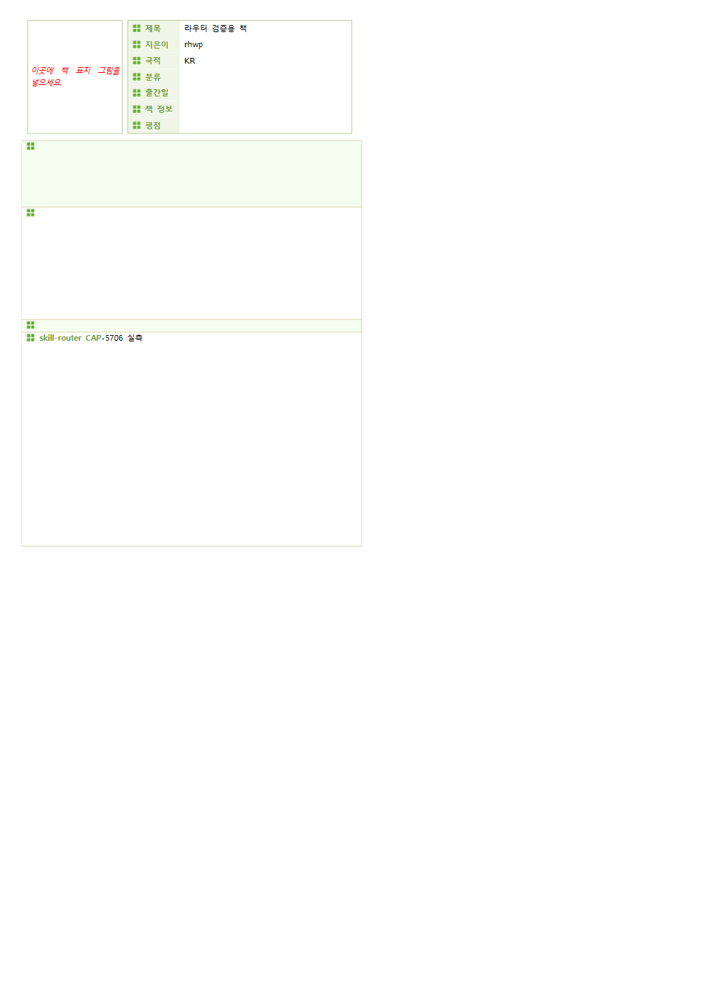

# form-fill evidence — rhwp-rendered PNGs

터미널 창이 아니다. `target/release/rhwp.exe` v0.8.4 가
`samples/basic/BlogForm_BookReview.hwp` 를 `fields` → `edit fill-fields`
(`fill-book.json` 4칸) → `export-svg -p 0 --profile print` 로 그린 쪽을
Edge headless 가 찍은 문서 페이지다.

폴더: [skills/rhwp-form-fill/](skills/rhwp-form-fill/)

| 파일 | 바이트 | WxH |
|---|---:|---|
| [skills/rhwp-form-fill/filled.png](skills/rhwp-form-fill/filled.png) | 20,849 | 1000×1400 |
| [skills/rhwp-form-fill/page.png](skills/rhwp-form-fill/page.png) | 20,849 | 1000×1400 |

채운 값: 제목=라우터 검증용 책, 지은이=rhwp, 국적=KR, 리뷰=skill-router CAP-5706 실측.

