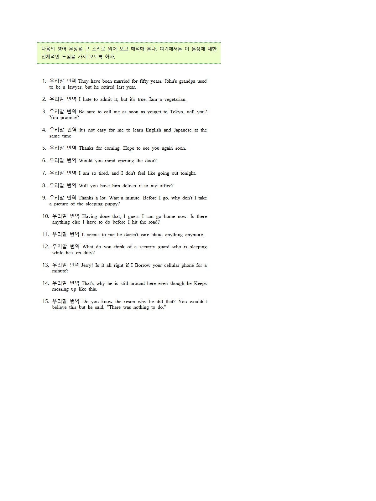
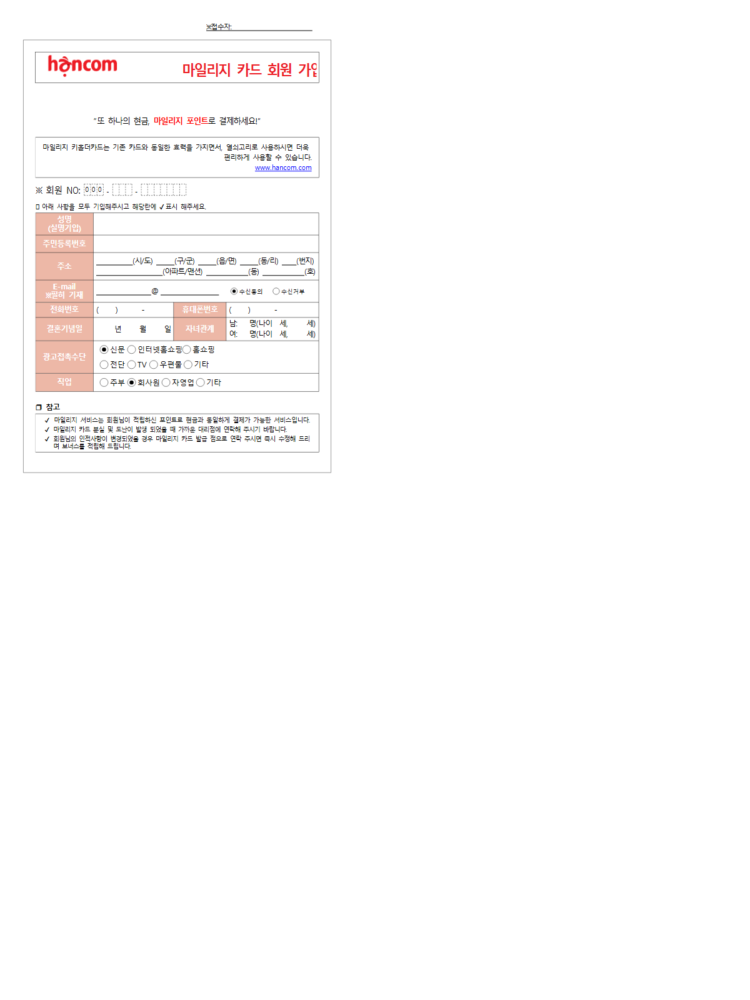

# rhwp-skill-author 실렌더

터미널 창은 증적이 아니다. 아래 PNG 는 `target/release/rhwp.exe`(v0.8.4) 가
`export-svg -p 0 --profile print` 로 그린 페이지를 Edge headless 로 찍은 것이다.

산출 폴더: [skills/rhwp-skill-author/](skills/rhwp-skill-author/)

## 명령

```text
rhwp info samples/basic/english.hwp --json
rhwp export-svg samples/basic/english.hwp -p 0 --profile print -o skills/rhwp-skill-author/english.svg
rhwp export-svg samples/basic/request.hwp -p 0 --profile print -o skills/rhwp-skill-author/page.svg
```

`-o` 는 디렉터리라서 중첩 `english.svg/english.svg`, `page.svg/request.svg` 를
허용 파일명으로 평탄화했다.

Edge:

```text
msedge.exe --headless=new --disable-gpu --screenshot=<png> --window-size=1200,1600 <file:///svg>
```

경로: `C:\Program Files (x86)\Microsoft\Edge\Application\msedge.exe`
Edge **성공**. PNG 는 둘 다 1200×1600 문서 페이지(터미널 아님).

## 파일

| 파일 | 원본 | 크기 |
|---|---|---:|
| [skills/rhwp-skill-author/english.svg](skills/rhwp-skill-author/english.svg) | `samples/basic/english.hwp` p0 print | 548,789 |
| [skills/rhwp-skill-author/english.png](skills/rhwp-skill-author/english.png) | 위 SVG → Edge | 59,145 |
| [skills/rhwp-skill-author/page.svg](skills/rhwp-skill-author/page.svg) | `samples/basic/request.hwp` p0 print | 263,162 |
| [skills/rhwp-skill-author/page.png](skills/rhwp-skill-author/page.png) | 위 SVG → Edge | 55,567 |
| [skills/rhwp-skill-author/info.json](skills/rhwp-skill-author/info.json) | `rhwp info english.hwp --json` | 740 |
| [skills/rhwp-skill-author/README.md](skills/rhwp-skill-author/README.md) | 실측 캡션 | — |

`info.json`: format=hwp5, pageCount=1, version=5.0.3.0, title 시작 =
「다음의 영어 문장을 큰 소리로 읽어 보고 해석해 본다.」

## 화면

영어 번역 학습지:



신청서(request.hwp):


