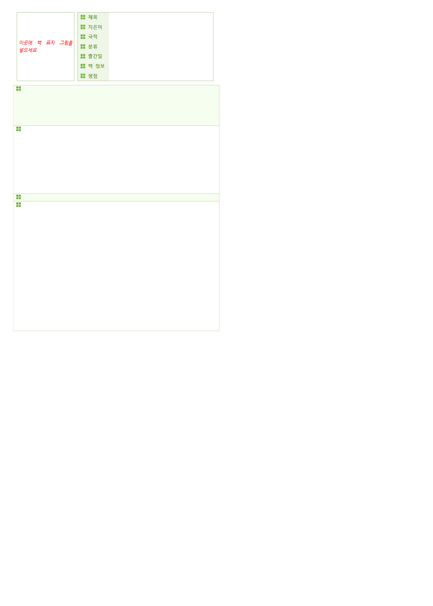

# rhwp-form-fill 실측 — rhwp 가 연 문서

터미널 캡처가 아니다.
hwp v0.8.4 release 가 샘플을 렌더한 페이지다.

- 명령: rhwp fields samples/basic/BlogForm_BookReview.hwp --json; rhwp edit fill-fields ... -o output/filled-book.hwp; rhwp export-svg output/filled-book.hwp -p 0 --profile print
- fields 12개 확인 후 제목/지은이/국적/리뷰 4칸을 채운 뒤 다시 렌더한 쪽. 빈 서식은 form.png, 채운 서식은 page.png.

채우기 전:

채운 뒤 (제목=라우터 검증용 책, 지은이=rhwp, 국적=KR, 리뷰=skill-router CAP-5706 실측):

