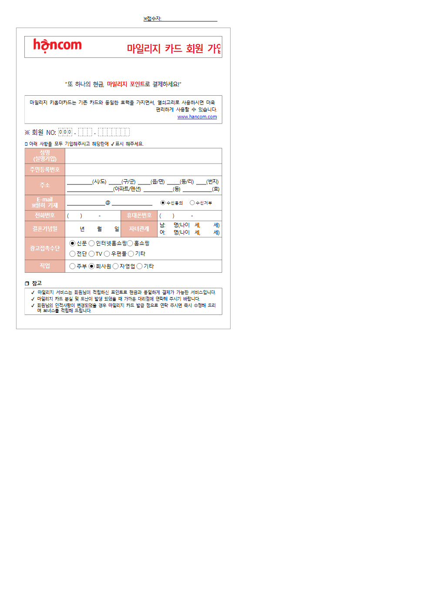

# rhwp-security-sweep 실측 — rhwp 가 연 문서

터미널 캡처가 아니다.
hwp v0.8.4 release 가 샘플을 렌더한 페이지다.

- 명령: rhwp export-svg samples/basic/request.hwp -p 0 --profile print
- 배포 전 점검 대상 서식(마일리지 카드 가입)을 rhwp 가 연 화면.

