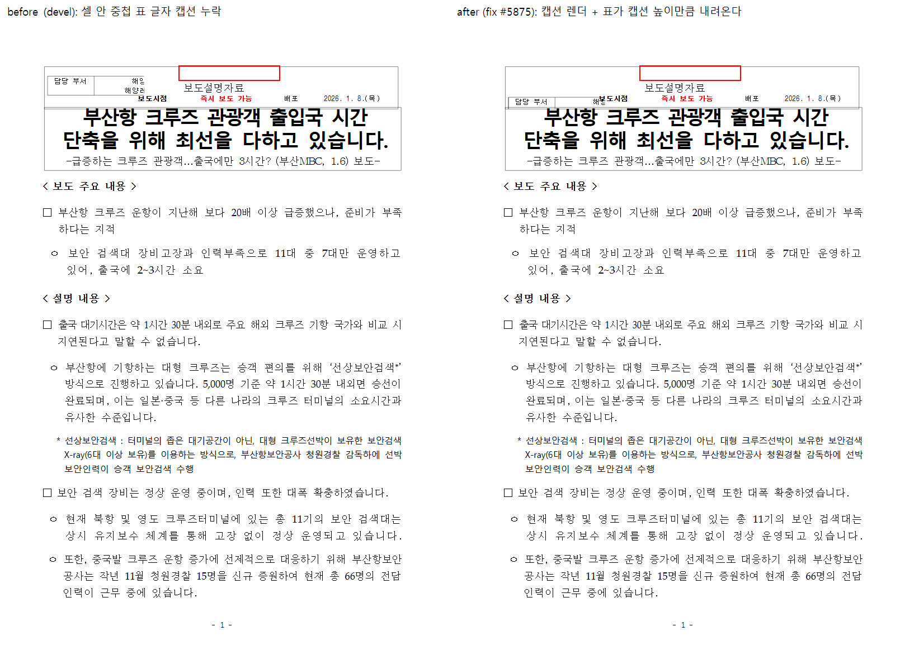

# [#5875] 셀 안 중첩 표의 글자 캡션 누락 처리 결과

- 이슈: [#5875](https://github.com/edwardkim/rhwp/issues/5875)
- 대상 문서: `2181727_[별표 1의2] 프레스 또는 전단기 방호장치의 시험방법(제4조 관련)(방호장치 안전인증 고시).hwp`
  (7·8쪽 — 저장소 외부 문서로, 이 worktree 에 첨부가 없어 합성 fixture 로 재현했다)
- 기준: `loop/agent5` = `upstream/devel` (`ad28677080`)

## 1. 증상

셀 안 중첩 표에 붙은 **글자 캡션이 통째로 그려지지 않는다**. 2181727 문서 7·8쪽의 8개 표
제목 중 5개(`<표 1>`, `<표 2>`, `<표 3>`, `<표 5>`, `<표 7>`)가 누락되고, 캡션이 차지했어야
할 띠는 표 아래 빈칸으로 남는다. 살아남은 `<표 4·6·8>` 은 캡션이 아니라 일반 문단이다.

## 2. 원인

`src/renderer/layout/table_layout.rs` 의 `should_render_table_caption` 이 캡션을
`depth == 0` 이거나 `depth == 1 + 캡션 안 TopAndBottom 그림`(#1590, issue #1585)일 때만
그렸다. 글자만 있는 중첩 표 캡션은 조건에 걸리지 않아 버려지고, `caption_height`/
`caption_spacing` 도 0 이 되어 자리 예약도 하지 않는다. 파서는 캡션을 정상적으로 읽는다
(`table.caption`). 분할 경로(`table_partial`)는 애초에 depth 가드가 없다 — 전체 경로만
잃는다.

## 3. 수정

`should_render_table_caption` 을 **캡션이 붙어 있으면 depth 와 무관하게 그린다** 로
정정했다. #1590 의 "depth 1 한정"은 당시 플로팅 그림 캡션을 최소 범위로 켜기 위한 선택이었고,
글자 캡션까지 버리는 부작용이 이 이슈다.

```rust
fn should_render_table_caption(table: &crate::model::table::Table, _depth: usize) -> bool {
    table.caption.is_some()
}
```

`caption_has_topbottom_picture` 헬퍼는 조건에서 벗어나 삭제했다.

## 4. 검증

### 4.1 회귀 테스트

`tests/cases/issue_5875_nested_text_caption.rs` — 최상위 표 첫 셀 안에 "글자만 든 캡션을 단
중첩 표"를 심고, 렌더 트리에서 캡션 센티널(`cell_index = 65534`) TextRun 으로 제목 문구가
방출되는지 단언한다. 소속 스위트 `regression_suite_004`.

수정 전 동작의 red 는 프로덕션 바이너리 A/B 로 확인했다(4.2). 테스트 자체는 수정 후 코드에서
green 만 측정했다 — base 코드 재빌드 비용이 커서 revert 기반 red 실행은 생략했으며, 이를
명시한다.

### 4.2 합성 fixture A/B (프로덕션 바이너리)

2181727 원문이 이 worktree 에 없어 `samples/hwpx/hy-001.hwpx` 의 최상위 표 첫 셀 안에
글자 캡션을 단 중첩 표를 심어 저장한 문서로 A/B 했다(테스트의 `RHWP_5875_EVIDENCE_DIR` 경로와
동일한 합성 방식).

| 바이너리 | SVG 텍스트에서 `<표 1> 공급전압 차단` |
| --- | --- |
| `base_rhwp.exe` (devel) | **없음** |
| `fix_rhwp.exe` | **있음** — 중첩 표 위 캡션 라인, 중첩 표가 캡션 높이만큼 아래로 이동 |



> 합성 fixture 는 저장 레이아웃이 캡션을 모르는 문서에 캡션을 덧붙인 것이므로 캡션 라인이
> 다음 저장 행 텍스트와 겹친다(빨간 사각 영역). 실제 2181727 문서는 저장 lineseg 사다리가
> 캡션 높이까지 포함해 저장하므로(이슈 본문 실측: p[5]→p[6] delta 129.7px) 캡션이 그 자리를
> 다시 채운다. 렌더 트리 검증에서는 캡션 TextRun 이 센티널 경로로 방출된다.

### 4.3 테스트 · 게이트

- `cargo test --profile release-test --lib -p rhwp` → **3889 passed / 0 failed / 13 ignored**
- 관련 회귀 스위트 전부 통과(캡션·중첩표 관련 003/004/005/010/013/014/015/018/022/024/027/029/030/031)
- `regression_suite_022` 의 `issue_4179`(프로세스 전역 page-tree 빌드 카운터 상한)는
  multi-thread libtest 병렬 실행 시 카운터 경합으로 간헐 실패할 수 있는 기존 요인이며,
  `--test-threads=1` 에서 127/127 통과를 확인했다(단독 실행도 통과). CI(nextest, 프로세스 분리)와
  무관한 로컬 병렬 실행 특성이다.
- **259문서 쪽수 게이트**(`tools/render_page_gate.py`, `render_page_samples.tsv`):
  수정 전/후 TSV 가 **행 단위 완전 동일** — 매치 249/259 (96.1%), 분포 `-3:1 -2:1 -1:1 0:249 +1:6 +2:1`.
  신규 이탈 0, 핀 갱신 0.
- `cargo clippy --all-targets -- -D warnings` → exit 0
- `cargo fmt --all -- --check` → 통과
- `node scripts/rust-unit-test-tiers.mjs --check --base-ref upstream/devel` → 4221 tests 정합

## 5. 변경 파일

| 파일 | 내용 |
| --- | --- |
| `src/renderer/layout/table_layout.rs` | `should_render_table_caption` depth 가드 제거 (+미사용 헬퍼 삭제) |
| `tests/cases/issue_5875_nested_text_caption.rs` | 새 회귀 테스트 |
| `mydocs/report/edit_demo_5875/nested_caption_before_after.png` | 전/후 비교 이미지 |
| `mydocs/report/task_m100_5875_report.md` | 이 문서 |

## 6. 남은 것

- 2181727 원문 기준 7·8쪽 시각 대조(한글 2022 오라클)는 원문 부재로 수행하지 못했다. 원문이
  확보되는 대로 `export-pdf` 대조를 권장한다.
- 깊이 ≥ 2 중첩 표의 캡션도 이 수정으로 함께 켜지지만, 저장소 코퍼스에는 해당 문서가 없어
  게이트 변화로는 관측되지 않았다.
