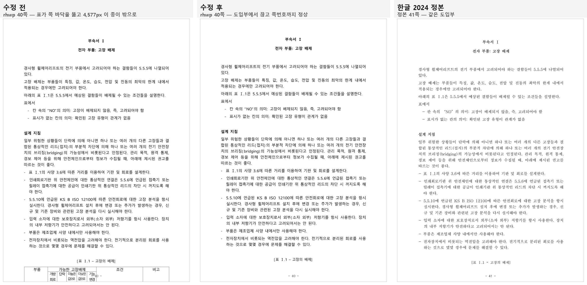
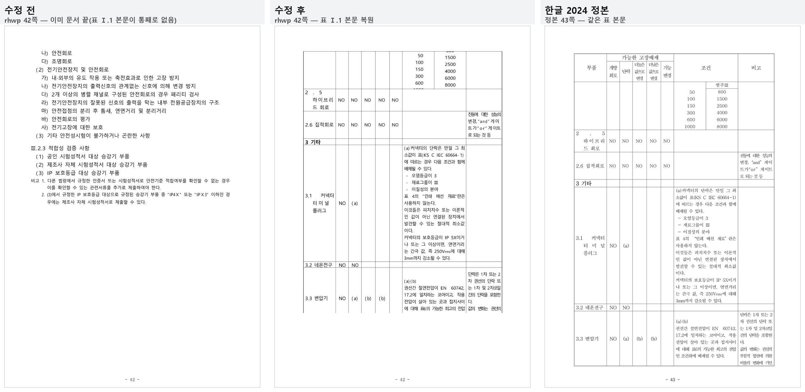

# [#5908] giant cell 마지막 조각의 0-전진 붕괴 처리 결과

- 이슈: [#5908](https://github.com/edwardkim/rhwp/issues/5908)
- 대상 문서: `samples/table_giant_cell_overfill.hwpx`
- 정본: `pdf/table_giant_cell_overfill-2024.pdf` (한글 2024, 48쪽)
- 기준 커밋: `origin/devel` = `72674c5653f09cb78b994dc4cd2dfd0a97ae6c8a`

## 1. 증상

이 문서는 저장소에서 쪽수 결손이 가장 큰 문서였다 — 정본 48쪽에 rhwp 42쪽(`delta -6`).

결손은 한 자리에 몰려 있었다. 정본 41–46쪽(부속서 Ⅰ 도입부 + 표 Ⅰ.1 네 쪽 + 부속서 Ⅱ)에
해당하는 내용이 rhwp 40쪽 **한 장에 통째로 겹쳐** 그려졌고, 그 다음 쪽은 곧바로 부속서 Ⅲ 였다.

`export-svg -p 39` 실측:

| 항목 | 값 |
| --- | --- |
| SVG 종이 높이 | 1,122.5px |
| 글자 `y` 최댓값 | **5,141.6px** |
| 종이 밖(`y > 1122.5`) 글줄 앵커 | **2,124 / 2,923개** |

조판 로그도 같은 값으로 끝났다.

```
LAYOUT_OVERFLOW: page=39 type=PartialTable first=true y=5662.5 bottom=1084.7 overflow=4577.7px
```

## 2. 문서 구조

본문 문단 0 이 5행 × 1열 표 하나를 담고, 그 표의 **4행 셀 하나에 654문단·40,824자**(문서 거의
전부)가 들어 있다. 40쪽 분량을 한 셀이 물고 있는 giant cell 이고, 렌더러는 이 행을 `PartialTable`
조각으로 40쪽에 걸쳐 나눈다. 39쪽까지는 정상으로 잘리다가 **마지막 조각에서만** 무너졌다.

무너지는 자리는 giant cell 안 문단 652 다. 이 문단은 1×1 중첩 표를 담고, 그 셀 안에 다시
26행 × 9열 표(표 Ⅰ.1)가 들어 있는 3중 중첩이다.

`RHWP_DIAG_CELL_UNITS` 로 확인한 결과 유닛 원장 자체는 정상이었다 — 4행 셀은 1,274개
`CellUnit` 으로, 표 Ⅰ.1 은 `nested_table_mixed_fragment_heights` 가 78개 fragment 로 이미
분해해 두고 있었다. 즉 **분할 재료는 있는데 소비 쪽에서 버렸다**.

## 3. 원인

`scan_block_table_split_rows`(`src/renderer/typeset.rs`)의 mixed-nested 재시도 경로가
**0-전진 컷**을 만들어 낸다. 임시 계측으로 잡은 마지막 조각의 실측값:

```
DBG_RETRY r=4 cursor=4 cont=true guard=true natsplit=false
          split_total=1495.5 avail=1009.1 over=486.4 painted_tail=506.1
          retry_budget=12.4
          res_end=[1227] res_h=985.6      <- 예산 컷: 유효한 전진
          res2_end=[1195] res2_h=0.0      <- 재시도 컷: 전진 0
```

1. 예산 컷 `res` 는 유닛 `1182 → 1227` 로 정상 전진했다 (`consumed_height = 985.6px`, 예산
   1,005.4px 안).
2. 그런데 이 컷의 **페인트 높이** `split_total` 은 1,495.5px 다 — `row_cut_content_height` 가
   `mixed_nested_flow_extra_from_cut` 로 물리 tail 506.1px 을 더하기 때문.
3. 초과분 `over = split_total − avail = 486.4px`. 재시도 예산을 잡을 때 `over` **와**
   `painted_tail` 을 **둘 다** 뺀다. `over` 는 이미 `painted_tail` 을 포함하므로 tail 이
   이중으로 빠져 `retry_budget = 1005.4 − 486.4 − 506.1 − 0.5 = 12.4px` 로 0 에 수렴한다.
4. 12.4px 예산으로는 아무 유닛도 못 담아 `res2.consumed_height = 0` → orphan(min-keep)
   판정 실패 → `retried = false` → `end_row = r`.

`end_row = r` 은 "이 행을 통째로 다음 쪽으로 이월" 이라는 뜻이라 **행 앞에 이미 배치된 행이
있을 때만** 성립한다. 그런데 여기서는 `r == cursor_row` 이고 이 조각은 이미 그 행 중간
(`row_start_cut = [1182]`)에서 시작한 continuation 이라 이월할 앞부분이 없다.

그래서 호출부(`typeset_block_table`)가

```rust
if end_row >= row_count && split_end_limit == 0.0 {
    // 나머지 전부가 현재 페이지에 들어감
```

를 만족한다고 보고, 남은 92개 유닛(4,577px ≈ 4.5쪽)을 `end_cut: Vec::new()` 인 **클립 없는
종결 조각**으로 한 쪽에 쏟았다.

## 4. 수정

`src/renderer/typeset.rs` 한 곳. 재시도가 실패했을 때 0-전진으로 무너지는 대신, 예산 컷 `res`
자체가 유효한 전진이면 그것을 쓴다.

```rust
let continuation_row_must_advance = r == cursor_row
    && is_continuation
    && !row_start_cut.is_empty()
    && !res.end_cut.is_empty()
    && res.consumed_height > 0.0
    && row_split_meets_min_top_keep(
        res.consumed_height,
        split_total,
        row_split_min_keep_uses_painted_height,
    );
if !retried && continuation_row_must_advance {
    end_row = r + 1;
    split_end_cut = res.end_cut.clone();
    split_end_limit = res.consumed_height;
    consumed += cs_before + split_total;
    retried = true;
}
```

조건 다섯 개가 모두 "이월이 물리적으로 불가능한 자리" 를 가리킨다 — 분할 대상 행이 이 조각의
시작 행이고(`r == cursor_row`), 이 조각이 continuation 이며(`is_continuation`), 이미 그 행
중간에서 시작했고(`!row_start_cut.is_empty()`), 예산 컷이 실제로 유닛을 소비하며
(`!res.end_cut.is_empty() && res.consumed_height > 0.0`), 그 컷이 기존 orphan 기준을
통과한다(`row_split_meets_min_top_keep`). 마지막 조건은 `else` 분기가 쓰는 것과 같은 판정
함수라 sliver 정책이 갈라지지 않는다.

재시도 예산 산식(`over` 와 `painted_tail` 의 이중 차감) 자체는 건드리지 않았다. 그 값은
mixed-nested 물리 tail 을 다음 쪽 시작점으로 예약하는 기존 계약이고, 이 결함은 그 예산이
0 에 수렴했을 때의 **낙하 처리**가 없던 것이기 때문이다.

## 5. 결과

| 항목 | 수정 전 | 수정 후 | 한글 2024 정본 |
| --- | --- | --- | --- |
| 쪽수 | 42 | **47** | 48 |
| `render_page_samples.tsv` delta | −6 (저장소 최대 결손) | **−1** | 0 |
| 40쪽(0기준 39) 글자 baseline 최댓값 | 5,141.6px | **1,103px** | — |
| 40쪽 종이(1,122.5px) 밖 글줄 앵커 | 2,124 / 2,923 | **0** | — |
| 표 Ⅰ.1 본문이 쪽으로 존재하는가 | 아니오 (겹쳐 소실) | **예 (41–44쪽)** | 42–45쪽 |
| 부속서 Ⅱ 제목이 있는 쪽(0기준) | 39 (겹침) | **44** | 45 |

정본 41–46쪽 여섯 쪽에 해당하는 내용이 수정 후 rhwp 40–45쪽 여섯 쪽으로 같은 순서·같은
경계에 배치된다. 남은 1쪽 차이는 이 자리가 아니라 문서 앞부분(0–38쪽)에서 나며, 별개 사안이다.

## 6. 전/후/정본 비교

### 6.1 붕괴 쪽 (rhwp 40쪽 = 정본 41쪽)



수정 전에는 표 머리가 쪽 바닥을 뚫고 시작해 쪽번호 `40` 이 표 칸 안에 겹쳐 찍혔고, 그 아래로
4,577px 이 종이 밖에 그려졌다. 수정 후에는 정본과 같이 `[표 Ⅰ.1 – 고장의 배제]` 캡션에서
끊고 쪽번호도 제자리에 있다.

### 6.2 표 Ⅰ.1 본문 복원 (rhwp 42쪽 = 정본 43쪽)



수정 전 42쪽은 이미 문서의 마지막 쪽(부속서 Ⅲ 꼬리)이었다 — 표 Ⅰ.1 본문이 쪽으로 존재하지
않았다. 수정 후 42쪽은 정본 43쪽과 같은 행(`2.5 하이브리드 회로` → `3.3 변압기`)을 같은
순서로 담는다.

> 수정 후 표 조각에 머리행(`부품 / 가능한 고장배제 / 조건 / 비고`)이 반복되지 않는 것은 이
> 결함과 별개다. 렌더러의 머리행 반복은 구현돼 있지만
> (`table_partial.rs:2978`, `pagination/engine.rs:2546`) `is_continuation && repeat_header
> && start_row > 0` 으로 걸려 있다. 이 문서의 표 Ⅰ.1 은 26행 표 자체의 행 경계로 갈리는
> 것이 아니라 그것을 감싼 1×1 표의 mixed-nested fragment 로 갈리므로 조각들의
> `start_row` 가 모두 0 이고, 그래서 반복 경로에 걸리지 않는다. 별도 사안이라 이 PR 에서는
> 손대지 않았다.

## 7. 검증

### 7.1 259문서 쪽수 게이트

`python tools/render_page_gate.py --root . --fixture tests/fixtures/render_page_samples.tsv`
를 수정 전/후 바이너리로 각각 돌려 TSV 를 대조했다.

| delta | 수정 전 | 수정 후 |
| --- | --- | --- |
| −6 | 1 | **0** |
| −3 | 1 | 1 |
| −2 | 2 | 2 |
| −1 | 0 | **1** |
| 0 (일치) | 245 | 245 |
| +1 | 8 | 8 |
| +2 | 2 | 2 |

**변한 행은 대상 문서 1건뿐이다.** 회귀 0.

```
changed rows: 1
  samples/table_giant_cell_overfill.hwpx  base 48/42/-6  →  fix 48/47/-1
```

`tests/fixtures/render_page_samples.tsv` 의 해당 행을 `48 47 -1` 로 갱신했다.

### 7.2 코퍼스 SVG self-diff

픽스처 259문서의 앞 2쪽을 수정 전/후 바이너리로 렌더해 SVG SHA-256 을 대조했다.

```
compared_pages 385
changed 0
```

의도한 문서 외 시각 변화 **0**.

### 7.3 테스트

- 새 테스트 `tests/cases/issue_5908_giant_cell_last_fragment_overfill.rs` (3건) — red→green 실증

  수정 전(`src/renderer/typeset.rs` 만 되돌림):

  ```
  test issue_5908_giant_cell_last_fragment_keeps_splitting ... FAILED
    assertion `left == right` failed  left: 42  right: 47
  test issue_5908_collapsed_page_stays_inside_the_paper ... FAILED
    39쪽 최대 글자 baseline(5141.6)이 종이(1122.5) 안이어야 한다
  test issue_5908_annex_two_moves_off_the_collapsed_page ... FAILED
    부속서 Ⅱ 제목이 39쪽에 겹쳐 있으면 안 된다
  test result: FAILED. 0 passed; 3 failed
  ```

  수정 후:

  ```
  test result: ok. 3 passed; 0 failed
  ```

- `cargo test --profile release-test --lib -p rhwp` 통과
- 새 테스트 소속 스위트 `regression_suite_022` 전체 통과
- `node scripts/rust-unit-test-tiers.mjs --check --base-ref origin/devel` — 4,225 유지
  (새 테스트는 `tests/cases/` 에 두었다)

### 7.4 CI 3종

- `rustfmt --edition 2021 --check src/renderer/typeset.rs` — 포맷 차이 없음
  (Windows CRLF 로 인한 `Incorrect newline style` 만 보고됨)
- `rustfmt --edition 2021 --check tests/cases/issue_5908_giant_cell_last_fragment_overfill.rs` — 통과
- `cargo clippy --all-targets -- -D warnings` — exit 0

## 8. 변경 파일

| 파일 | 내용 |
| --- | --- |
| `src/renderer/typeset.rs` | 0-전진 낙하 처리 (+31줄) |
| `tests/cases/issue_5908_giant_cell_last_fragment_overfill.rs` | 새 회귀 테스트 3건 |
| `tests/fixtures/render_page_samples.tsv` | 대상 문서 baseline `42/-6` → `47/-1` |
| `mydocs/report/edit_demo_5908/*.png` | 전/후/정본 3단 비교 2장 |
| `mydocs/report/task_m100_5908_report.md` | 이 문서 |
