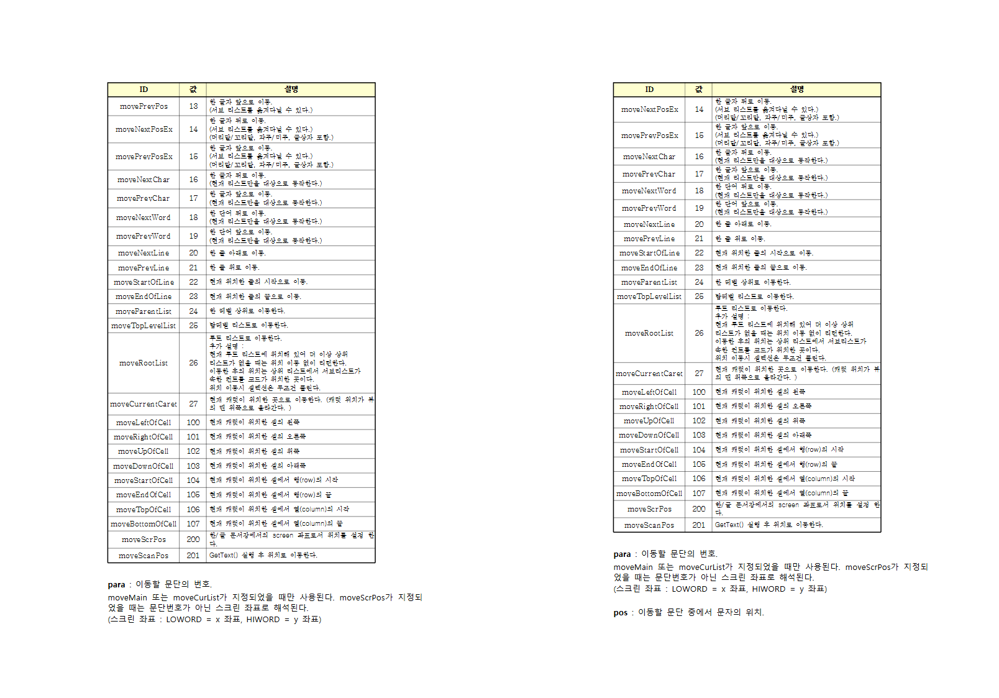
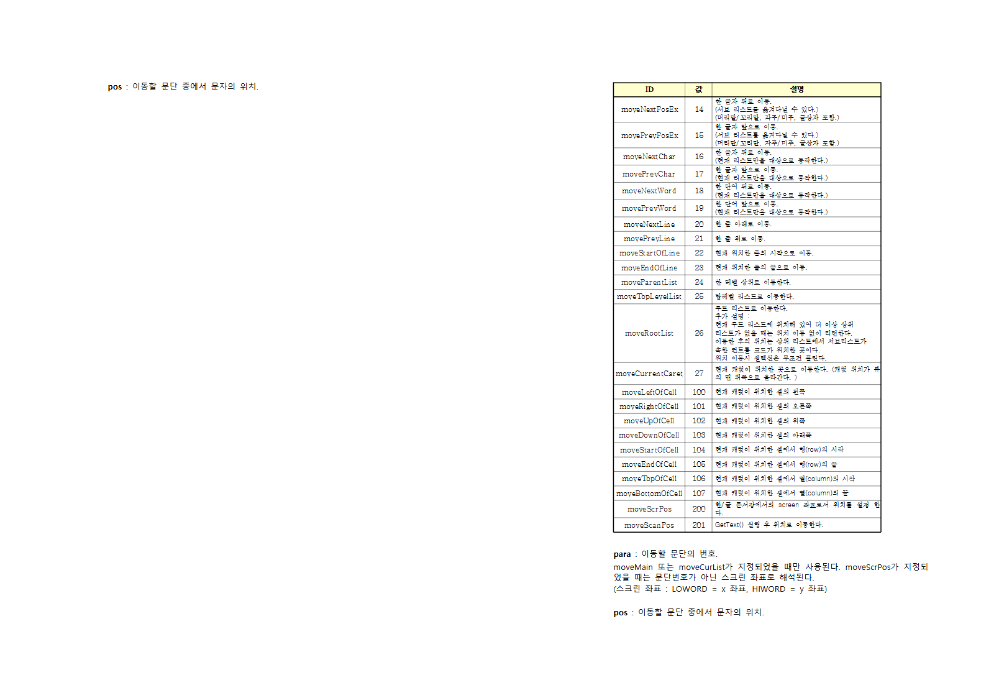

# Task m100 #5923 — 비-TAC 다문단 셀 trailing 줄간격 과대 측정 제거

`samples/hwpctl_API_v2.4.hwp` 가 106쪽으로 나오는 유령 쪽 결함(#5923)을 수정했다.
한컴 2022 정본은 105쪽이다.

## 원인

셀 **마지막 줄의 trailing 줄간격**을 다문단 셀에 한해 콘텐츠 높이에 포함하는
회계가 측정(`HeightMeasurer`)과 분할 유닛(`table_layout` fragment 경로) 양쪽에
있었다. 렌더 행높이 경로(`calc_para_lines_height` 등)와 한컴 정본은 문단 수와
무관하게 마지막 줄 trailing 을 제외한다.

```
RHWP_DIAG_ROWH pi=1760 ... r=9 c=2 decl=23.3 req=30.4 content=26.7 pad=3.8 trail=2.7
content(26.7) - trail(2.7) + pad(3.8) = 27.8px = 한글 20.8pt
```

39행×3열 표의 다문단 셀들이 행마다 +2.7px 씩 과대 측정되어 누적 30px 남짓이
74쪽 하단 한 줄을 75쪽으로 밀어냈다 — 본문 한 줄(18자)만 남은 유령 쪽.

## 수정

`include_trailing_ls` 규칙을 5곳에서 정정한다.

| 파일 | 위치 |
|---|---|
| `src/renderer/height_measurer.rs` | `measure_table_impl` 2곳 |
| `src/renderer/layout/table_layout.rs` | fragment 유닛 경로 3곳 |

```rust
// 구규칙: 마지막 줄이어도 다문단 셀이면 포함(버그), block RowBreak 비-TAC 만 제외
let include_trailing_ls = !is_cell_last_line || cell_para_count > 1;

// 신규칙: 비-TAC 표는 문단 수 무관하게 마지막 줄 trailing 을 제외한다.
let include_trailing_ls =
    !is_cell_last_line || (cell_para_count > 1 && table.common.treat_as_char);
```

TAC(글자처럼) 표의 다문단 셀은 [Task #874/#1086] 보존 핀(KTX TOC SVG snapshot,
aift 74쪽, k-water-rfp 27쪽)을 위해 기존 포함 회계를 그대로 유지한다. 첫 시도에서
TAC 게이트 없이 전면 제거하면 KTX TOC·복학원서·exam_kor 골든 SVG 와 #3820 Q&A
RowBreak 핀이 깨지는 것을 실측으로 확인했고, TAC 단일 조건으로 넓히면 단일문단
TAC 셀까지 포함이 바뀌므로(KTX req 15.8→21.8 이동 실측) 위와 같이 좁혔다.

## 전 / 후

74쪽(0-기반 73) — 행 괘선이 정본 간격으로 조여지고 뒷본문이 올라온다.



유령 75쪽 — 본문 한 줄만 남던 쪽이 사라진다(오른쪽은 흡수 후 74쪽).



## 검증

### 대상 문서

| 항목 | 수정 전 | 수정 후 | 정본 |
|---|---|---|---|
| `rhwp info` pageCount | 106 | **105** | 105 |
| 본문 문자 다중집합(old vs new export-text) | — | **불변(+1 = 개행 재배치)** | — |

### 259문서 쪽수 게이트 (`tools/render_page_gate.py`)

| | 수정 전 | 수정 후 |
|---|---|---|
| 매치(rhwp == 한글) | 247 (95.4%) | **248 (95.8%)** |
| 초과/부족 | +1 7건 · +2 1건 · −1~−3 4건 | **+1 6건 · +2 1건 · −1~−3 4건** |

259문서 중 쪽수가 변한 문서는 대상 1건뿐이다(106→105). 신규 이탈 0.

### 텍스트 무결성 (A/B 바이너리)

- `hwpctl_API_v2.4.hwp`: 문자 다중집합 동일 — 순수 페이지 재배치.
- `2025 행정업무운영 편람(최종)` hwp·hwpx: 본문 손실 없음. 차이는 전부 쪽
  머리글 변형·쪽번호·차례 점선 등 쪽 꾸미기 요소(아래 "핀 갱신" 참조).

### 핀 갱신 (전부 공개)

| 테스트 | 갱신 | 근거 |
|---|---|---|
| `issue_5801_gate_does_not_move_the_page_boundary` | 383→382 | 편람 hwpx. 본문 불변, 꾸미기 요소만 이동 |
| `issue_3931_keeps_pr4763_hwp_page_count_contract` | 385→**384** | 편람 hwp. 주석 자체가 기록한 한글 2022 실측 384쪽과 **정확히 일치**하게 됨 |
| `issue_3931_hwpx_keeps_existing_fragment_route` | 383→382 | 편람 hwpx (#5801 동일 근거) |
| `issue_3930_preserves_page_count...` | 저장 HWP 384→383, 원본 383→382 | 파생 경로 -1. 기존 HWP5/HWPX 조판 비대칭 축의 연장 — 오라클(양 형식 384) 대비 격차는 종전 -1/0 에서 -2/-1 로 확대. 후속 정밀 검증 여지 공개 |
| `tests/fixtures/render_page_samples.tsv` | hwpctl 행 delta 1→0 | 게이트 재실행 결과 |

### 테스트 · CI 게이트

- `cargo test --profile release-test --lib -p rhwp` → **3892 passed / 0 failed**
- regression_suite_001 ~ 032 전체(32개) → **전부 passed**
  (svg_snapshot: issue_267 KTX TOC·issue_617 exam_kor·issue_677 복학원서 포함)
- `cargo clippy --all-targets -- -D warnings` → exit 0
- `rustfmt --edition 2021 --check` (변경 파일 전부) → 차이 없음
- `node scripts/rust-unit-test-tiers.mjs --check --base-ref upstream/devel` → 4224 tests 정합

## 처리 결과 문서

`mydocs/report/task_m100_5923_report.md` (본 문서)
