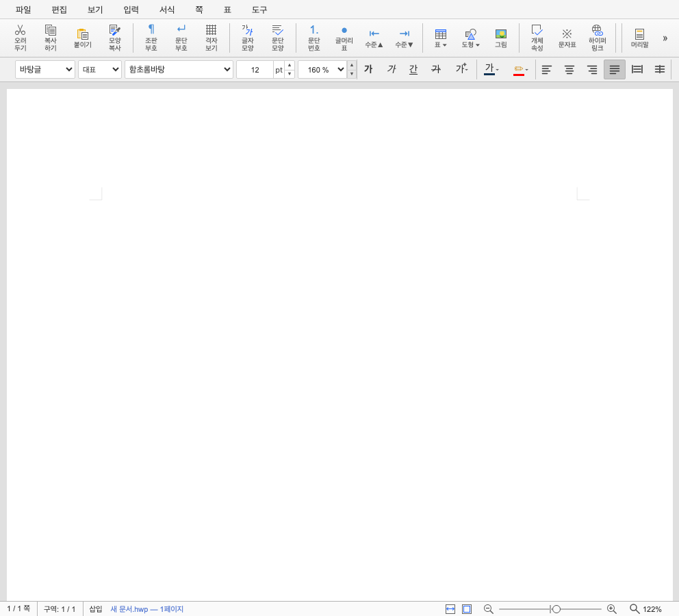
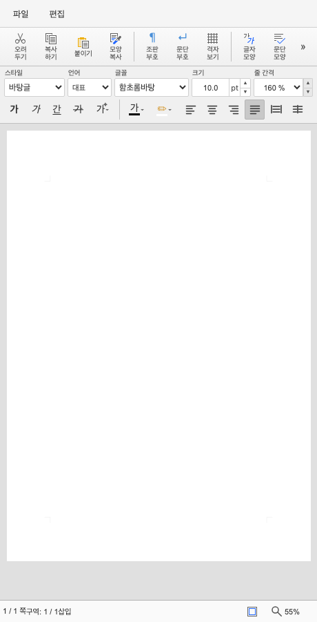

# 최종 보고서 — #6118 서식 도구 모음 1·2행 압축형

- **이슈**: [#6118](https://github.com/edwardkim/rhwp/issues/6118)
- **작업 브랜치**: `codex/issue-6118-responsive-style-bar`
- **기준**: `upstream/devel@6b5c4f871972380c0866e2a8d27ac2bc67d257e6`
- **완료일**: 2026-08-27 KST
- **판정**: #6118·#6138 통합 검증 완료, 통합 PR 승인 대기

## 1. 결과

기존 device breakpoint 중심의 1·2·3행 서식 바를 콘텐츠 폭 중심의 네 상태로 정리했다.

- 962px 이상: field와 모든 command를 높이 36px의 단일 행으로 표시
- 961~808px: 36px 단일 행을 유지하고 paragraph 정렬만 더보기 panel로 표시
- 807~460px: field 1행과 command 1행의 70px 압축 2행
- 459~375px: 같은 2행을 유지하고 paragraph 정렬만 더보기 panel로 표시
- 모든 구간에서 `#style-bar`와 page-level 가로 overflow 0
- 기존 field/command ID, 순서, listener, label, active/disabled authority 재사용
- 좁은 화면의 모호한 `⋯ + ▾`를 현재 문단 정렬 아이콘과 `▾` 조합으로 교체
- 글꼴 이름은 모든 구간에서 136px로 고정하고 375~459px에서는 나머지 field만 먼저 축소
- 첫 select의 option 텍스트 시작점을 상단 `파일` 텍스트의 시각축에 정렬

더보기는 paragraph command를 복제하지 않는다. 같은 DOM을 inline 또는 panel에 표시하므로 상태와
명령 wiring이 분기되지 않는다. click·ArrowDown·Escape·외부 pointer·명령 실행과 focus 복귀 계약도
고정했다. 활성 정렬에 맞춰 trigger 아이콘과 접근성 설명이 바뀌고 panel이 열린 동안에는 화살표와 버튼
표면이 열린 상태를 표시한다.

## 2. 단계별 산출물

| 단계 | 산출물 | 핵심 결정 |
| --- | --- | --- |
| 계획 | [수행계획](../plans/task_m100_6118.md), [구현계획](../plans/task_m100_6118_impl.md) | 최대 2행, paragraph만 동적 더보기 |
| Stage 1 | [경계 계측](../working/task_m100_6118_stage1.md) | 초기 계측 뒤 최종 962/961, 808/807, 460/459px 경계 확정 |
| Stage 2 | [구현 결과](../working/task_m100_6118_stage2.md) | 단일 DOM authority와 1·2행 CSS/controller |
| Stage 3 | [검증 결과](../working/task_m100_6118_stage3.md) | 14 viewport, 24 theme cases, 실제 상호작용 |

## 3. 시각 결과

| 992px 전체 1행 | 460px 2행 inline | 375px 2행 더보기 |
| --- | --- | --- |
|  |  |  |

default/flat/oldschool × light/dark의 24개 경계 화면도 같은 E2E가 생성하며, 배경·경계와 icon/panel
대비가 모두 3:1 이상이다. oldschool 상·하 베벨에서만 단일 행이 37px이던 문제를 발견해 36px로
보정했고 해당 스킨 계약 테스트를 추가했다.

## 4. 최종 검증

| 게이트 | 결과 |
| --- | --- |
| TypeScript | 통과 |
| Studio 전체 test | 1,181 passed, 0 failed, 1 skipped |
| Studio production build | 통과 |
| E2E manifest | 116 tracked, 116 manifest |
| responsive/theme browser E2E | 821 passed, 0 failed |
| 실제 인앱 브라우저 375px smoke | panel 열림·첫 명령 focus·overflow 0 |
| Markdown 상대 링크·diff whitespace | 603문서 이상 없음·통과 |

이 변경은 Studio chrome만 대상으로 하고 renderer 출력을 바꾸지 않으므로 PDF/SVG visual sweep 대상이
아니다. E2E manifest는 tracked 116개와 manifest 116개가 일치한다. source checkout의 generated Rust
suite 부재는 #6118 변경 밖의 저장소 상태로 분리한다. #6138 통합 Stage 3에서 review/CI 파생 suite를
준비한 별도 checkout의 Rust manifest와 필수 `cargo fmt --all`·`cargo fmt --all -- --check`까지 통과했다.

## 5. 통합 제출 전략

#6118과 #6138은 제품에서 서로 인접하지만 책임은 다르다.

- #6118: 아래쪽 `#style-bar`의 1·2행·더보기 정책
- #6138: 위쪽 `#icon-toolbar`의 한 줄 그룹 스크롤 정책

혼동을 줄이기 위해 이슈·계획·커밋·테스트는 분리하되 PR은 하나로 제출한다. #6138 구현 뒤 두 영역을
동시에 포함하는 14개 viewport·24개 theme 매트릭스를 다시 실행했고 최종 821개 판정이 통과했다. 상세 근거는
[#6138 통합 Stage 3](../working/task_m100_6138_stage3.md)에 있다. 현재 단계에서는 remote push와 PR 생성
모두 수행하지 않았다.
