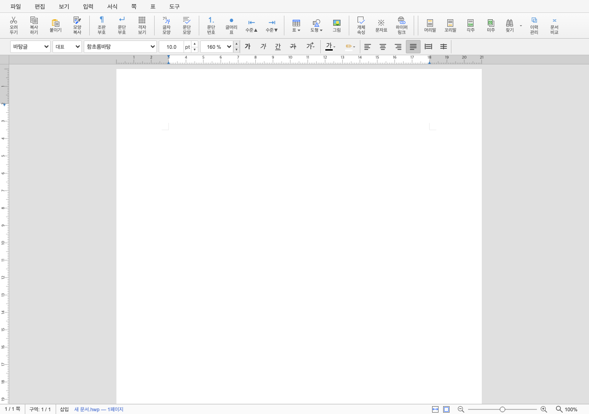
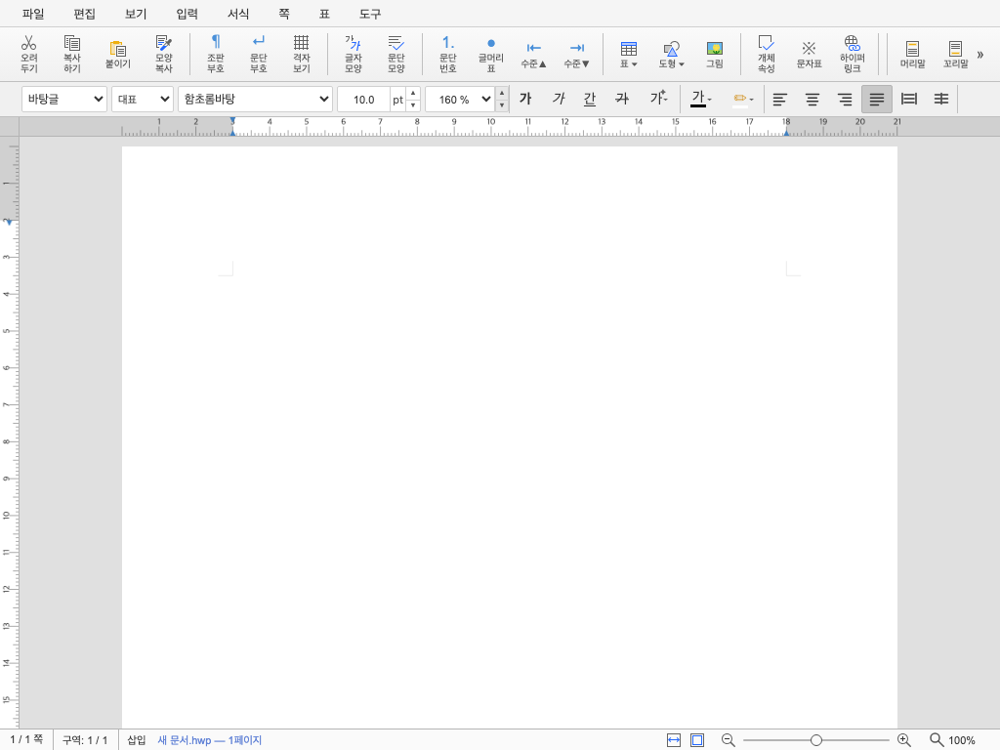
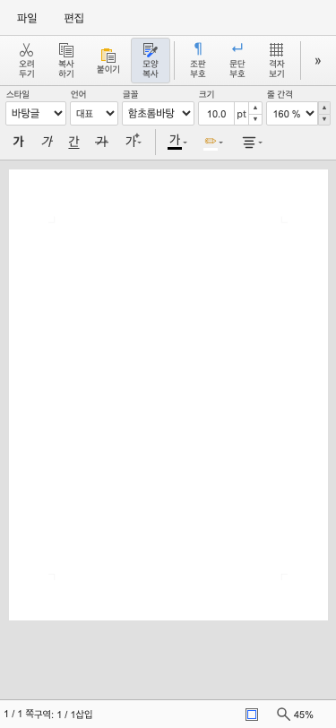

# 최종 보고서 — #6138 기본 도구 상자 한 줄 그룹 스크롤

- **이슈**: [#6138](https://github.com/edwardkim/rhwp/issues/6138)
- **작업 브랜치**: `codex/issue-6118-responsive-style-bar`
- **기준**: `upstream/devel@1011a8947`
- **완료일**: 2026-08-27 KST
- **판정**: #6138 로컬 완료, #6118 통합 PR 승인 대기

## 1. 결과

기본 도구 상자를 viewport에 따라 1~3행으로 접거나 label을 없애던 정책에서 56px 한 줄 group scroll
정책으로 전환했다.

- 1280px 이상처럼 track 전체가 들어가면 이동 버튼을 숨기고 모든 group을 그대로 표시
- track이 넘치면 양쪽 이중 꺾쇠와 native horizontal viewport를 표시
- 모든 지원 너비에서 label 포함 44px desktop button 밀도와 56px 높이 유지
- 다음/이전은 command 하나가 아니라 track의 가시 divider 경계와 nav 간격을 기준으로 이동
- 시작에서는 이전, 끝에서는 다음 버튼을 숨기되 absolute 24px 표면은 레이아웃을 밀지 않음
- 끝점 이동 시 240ms scroll과 같은 시점에 목적지 버튼의 opacity·3px 이동 애니메이션을 시작·종료
- wheel·touch·keyboard·focus와 mode·resize·toolbox visibility 변화 지원
- 기존 group·command DOM, 순서, ID, listener와 상태 authority 재사용

외부 `#icon-toolbar` ID를 유지해 #6115의 접기/펴기와 충돌하지 않는다. 새 controller는 레이아웃과 이동
상태만 소유하고 command를 복제하거나 실행하지 않는다.

## 2. 단계별 산출물

| 단계 | 산출물 | 핵심 결정 |
| --- | --- | --- |
| 계획 | [수행계획](../plans/task_m100_6138.md), [구현계획](../plans/task_m100_6138_impl.md) | 모든 너비 56px 한 줄·group scroll |
| Stage 1 | [기준선 계측](../working/task_m100_6138_stage1.md) | desktop track 1219px, 기존 1~3행 회귀 고정 |
| Stage 2 | [구현 결과](../working/task_m100_6138_stage2.md) | 단일 DOM track·동적 overflow controller |
| Stage 3 | [통합 검증](../working/task_m100_6138_stage3.md) | 14 viewport, 24 theme cases, #6118 동시 검증 |

## 3. 시각 결과

| 1280px 전체 표시 | 1024px group scroll | 375px group scroll |
| --- | --- | --- |
|  |  |  |

넓은 화면의 nav는 레이아웃과 접근성 트리에서 모두 사라진다. 좁은 화면에서는 한글 2024와 같은 이중
꺾쇠 의미를 사용하되, 명령을 메뉴로 옮기지 않고 기존 group 순서를 안정적으로 탐색한다. 버튼은 toolbar와
같은 배경으로 뒤 명령을 가리고, hover/focus일 때만 테두리와 강조 표면을 표시한다.

## 4. 최종 검증

| 게이트 | 결과 |
| --- | --- |
| TypeScript | 통과 |
| Studio 전체 test | 1,181 passed, 0 failed, 1 skipped |
| Studio production build | 통과 |
| E2E manifest | 116 tracked, 116 manifest |
| responsive/theme/#6118 통합 E2E | 821 passed, 0 failed |
| 대표 화면 육안 검토 | 1280·1024·375px 통과 |
| Markdown 상대 링크·diff whitespace | 603문서 이상 없음·통과 |
| review checkout Rust manifest·format | 942 sources·32 harnesses·9 exceptions, fmt 통과 |

이 변경은 Studio chrome만 대상으로 하므로 renderer PDF/SVG visual sweep 대상이 아니다. E2E manifest는
tracked 116개와 manifest 116개가 일치한다. Rust source 변경은 없으며 파생 suite를 준비한 별도 review
checkout에서 Rust manifest와 필수 format 게이트까지 통과했다.

## 5. 통합 제출 전략

#6118은 아래쪽 `#style-bar`의 1·2행·더보기 정책이고 #6138은 위쪽 `#icon-toolbar`의 한 줄 group scroll
정책이다. 두 이슈의 문서와 커밋은 분리했지만 사용자에게는 한 번에 보이는 인접 chrome 변경이므로
14개 viewport와 24개 theme 조합을 함께 검증했다. 원격 push와 PR 생성은 아직 수행하지 않았으며 사용자
승인 뒤 두 이슈를 연결한 PR 한 건으로 제출한다.

사용자 시각 검토에서 발견한 32px anchor 오차는 divider 좌표를 track 기준으로 정규화해 보정했다. 시작·
중간·끝의 방향 버튼 표시도 한글 2024 참고 동작과 맞췄다. nav는 track 위에 겹치는 24px 표면으로 두고
시작·끝 track을 root의 8px padding에 정렬했다. `ResizeObserver`와 divider 기준 anchor가 viewport 폭
변화를 다시 계산하므로 이동한 group이 잘리지 않는다.
