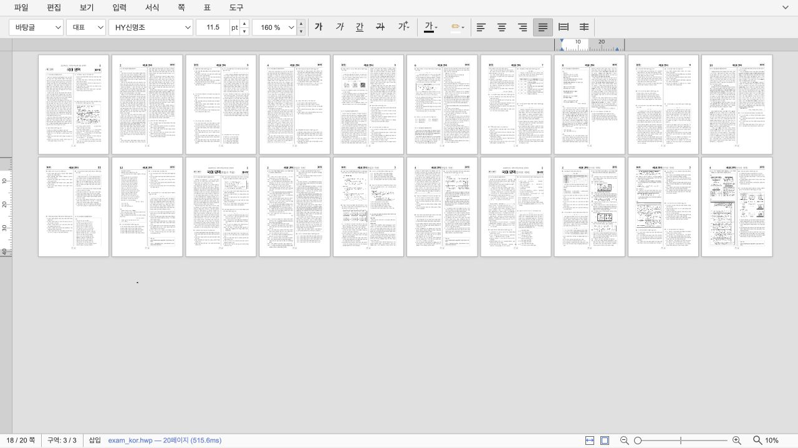
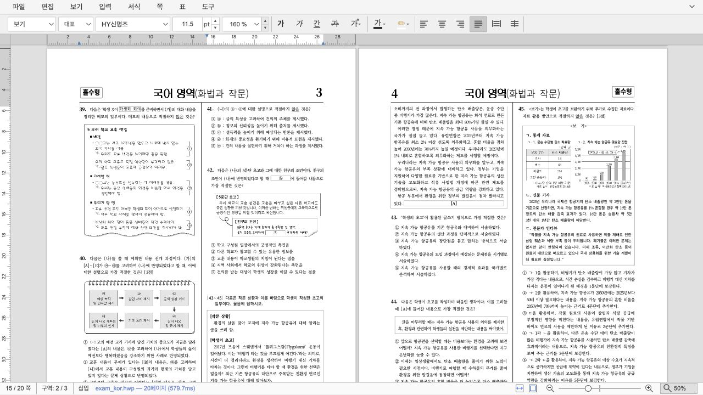

# Task M100 #6149 — 저배율 눈금자·페이지 경계 최종 검증 보고서

- **이슈**: [#6149](https://github.com/edwardkim/rhwp/issues/6149)
- **브랜치**: `codex/issue-6149-low-zoom-ruler`
- **기준 commit**: `upstream/devel` `1b91c2025` (PR #6176 병합)
- **최초 검증 기준**: `upstream/devel` `9be8b0562`
- **검증일**: 2026-08-27 KST
- **검증 서버**: `http://127.0.0.1:7720/`
- **절차 상태**: 정정 계획·Stage 1~3·PR #6176 반영 재검증 결과 승인 완료,
  후속 #6187 등록·PR #6188 Open·CI/리뷰 대기

> 이 문서는 최초에는 계획·단계 승인 없이 작성된 WIP 검증 증적이었다. 기존 이력을 보존한 채 정정
> 계획과 Stage 1~3, 통합 검증 범위·결과를 순서대로 재검증·승인받아 현재 최종 검증 보고서로
> 확정한다.

## 통합 검증 범위 승인

Stage 3 결과 승인 뒤 다음 범위를 제시했다.

- Studio TypeScript 검사, 전체 npm test, 프로덕션 build
- 실제 브라우저의 10/20/25/50/100/500% 배율
- 자동·한 쪽·두 쪽·맞쪽·여러 쪽·가로 이동 배치
- 밝은·어두운 테마의 페이지 경계
- 줌·순수 스크롤 뒤 마지막 편집 focus 눈금자 유지
- `cargo fmt --all`, `cargo fmt --all -- --check`, `git diff --check`

Studio 화면 변경 범위이므로 Rust/WASM 전체 테스트, integration manifest 생성, PDF/SVG sweep은
제외한다고 명시했다. 작업지시자는 다음과 같이 통합 검증 실행을 승인했다.

> 진행해줘.

이 승인은 위 범위의 실행만 허용하며 통합 결과 확정, commit, push·PR 승인은 포함하지 않는다.

## 승인 범위 통합 자동 재검증

- **검증 기준**: `9b6227346` (`docs(test): #6149 Stage 3 재검증 승인`, 최신 devel 재배치 후 SHA)
- **실행일**: 2026-08-27 KST
- **소스 변경**: 없음

```text
$ cd rhwp-studio && npx tsc --noEmit
exit 0

$ cd rhwp-studio && npm test
tests 1178, pass 1177, fail 0, skipped 1
duration_ms 2937.135333

$ cd rhwp-studio && npm run build
233 modules transformed, build success

$ cargo fmt --all
exit 0

$ cargo fmt --all -- --check
exit 0

$ git diff --check
exit 0
```

전체 test의 skip 1건은 기존 계약이며 실패는 없었다. build의 browser compatibility 및 500kB 초과
chunk 메시지는 기존 Vite 경고이고 산출물 생성은 성공했다. `cargo fmt --all` 뒤에도 Rust·Studio
소스 변경은 생기지 않았다.

## 승인 범위 실제 브라우저 재검증

- **환경**: macOS Codex in-app browser, 1280×720, `exam_kor.hwp` 20쪽
- **URL**: `http://127.0.0.1:7720/?url=%2Fsamples%2Fexam_kor.hwp&filename=exam_kor.hwp`

### 대표 배율 — 자동 배치

| 배율 | 열×렌더 행 | 실측 인접 gap | 페이지 경계 | 판정 |
| ---: | ---: | --- | --- | --- |
| 10% | 10×2 | 가로 `5.8516px`, 세로 `5.9375px` | 모든 루트 표시 | 통과 |
| 20% | 5×4 | 가로 `5.5px`, 세로 `5.9766~5.9844px` | 모든 루트 표시 | 통과 |
| 25% | 4×3 | 가로 `5.625px`, 세로 `5.8516px` | 모든 루트 표시 | 통과 |
| 50% | 2×4 | 가로 `5.75px`, 세로 `5.6953~5.7031px` | 모든 루트 표시 | 통과 |
| 100% | 1×3 | 세로 `9.8984px` | 모든 루트 표시 | 통과 |
| 500% | 1×3 | 세로 `49.8516px` | 모든 루트 표시 | 통과 |

10~50%는 `max(6px, 10px × zoom)`의 6px 하한과 페이지 폭·좌표의 서브픽셀 반올림 오차 안에서
일치했다. 100%와 500%는 각각 10px·50px 기준값과 같은 오차 안에서 일치했고 모든 좌표와 크기는
유한값이었다.

### 쪽 배치 — 10%

| 배치 | 관측 | 판정 |
| --- | --- | --- |
| 자동 | 10열×2행, 양축 약 6px | 통과 |
| 한 쪽 | 1열, 세로 `5.9375~5.9453px` | 통과 |
| 두 쪽 | 2열, 가로 `5.8516px`, 세로 `5.9375~5.9453px` | 통과 |
| 맞쪽 | 2열과 첫 빈 슬롯 보존, 양축 약 6px | 통과 |
| 여러 쪽 3×2 | 3열 유지, 양축 약 6px | 통과 |
| 가로 이동 | 1행, 모든 Y 동일, 가로 `5.8516px` | 통과 |

### 테마와 focus

- 밝은 테마는 `rgb(180, 180, 180)` 외곽선, 어두운 테마는 `rgb(104, 115, 132)` 외곽선과 더 진한
  그림자를 사용해 10%에서도 페이지 경계가 작업 영역과 구분됐다.
- 10%에서 1쪽을 클릭한 뒤 50%로 전환하면 viewport 상태는 15쪽으로 바뀌어도 가로 눈금자는 1쪽의
  왼쪽 열에 남았다.
- 350px 순수 스크롤 뒤 viewport 상태가 17쪽으로 바뀌어도 눈금자는 왼쪽 열에 유지됐다.
- 보이는 오른쪽 18쪽을 클릭한 뒤에만 상태가 18쪽으로 바뀌고 가로 눈금자는 오른쪽 열, 세로
  눈금자는 18쪽의 현재 범위로 이동했다.
- 검증 뒤 화면은 밝은 테마·10%·자동 배치로 복원했다.

## 공개 시각 증적

### 10% 자동 배치 — 페이지 간격·경계·눈금 LOD

20쪽 공개 샘플을 10% 자동 배치로 표시했다. 모든 페이지 사이에 약 6px 작업 영역이 남고 페이지
루트의 외곽선·그림자를 식별할 수 있다. 가로·세로 눈금은 숫자와 세부 눈금이 겹치지 않는 단계만
표시한다.



### 50% 순수 스크롤 — 마지막 편집 focus 눈금자 유지

10%에서 왼쪽 첫 페이지를 클릭한 뒤 상태바 배율 슬라이더의 사용자 키 입력으로 50%까지 확대하고,
문서 영역에서 PageDown 순수 스크롤을 수행했다. 보이는 페이지 행이 바뀐 뒤에도 가로 눈금자는 마지막
편집 focus인 왼쪽 열의 용지 폭과 일치한다. 오른쪽 페이지를 클릭하기 전에는 focus 눈금자가
스크롤만으로 이동하지 않는다.



### 50% 증빙 캡처 정정

PR 최초 증빙은 배율을 연속 변경한 직후 눈금자 `requestAnimationFrame`을 기다리지 않고 저장돼,
50% 페이지(`561.5px`) 위에 이전 25% 눈금자 폭(약 `281px`)이 남은 중간 프레임을 포함했다. 이는
브라우저가 사용자에게 표시한 안정 프레임의 제품 결함이 아니라 검증 도구의 비동기 캡처 오류였다.

같은 사용자 입력 경로를 8회 반복한 결과 최종 화면과 캡처가 모두 동일했고, 매회 눈금자 시작·끝이
50% 왼쪽 페이지의 용지 폭과 일치했다. 공개 증빙은 사용자 입력 완료 뒤의 안정 프레임으로 교체했다.
향후 zoom·scroll 시각 증빙은 semantic 입력 완료 뒤 캡처하고, 이전 배율의 눈금자 폭이 남지 않았는지
페이지 `getBoundingClientRect()`와 함께 확인한다.

## 작업지시자 최종 승인

통합 자동·브라우저 검증 결과와 남은 원격 작업 경계를 보고한 뒤 작업지시자가 다음과 같이 최종
결과와 보고서 확정을 승인했다.

> 진행해줘.

이 승인은 통합 검증 결과와 최종 보고서를 확정해 로컬 commit하라는 승인이다. push·PR 생성 등
원격 작업은 포함하지 않는다.

## PR #6176 병합 후 PR 전 재기준화

최초 통합 결과 승인 뒤 PR #6176이 `devel`에 병합됐다. 작업지시자는 #6149 PR 생성 전에 해당
변경을 반영하고 같은 범위를 다시 검증하라고 승인했다. 브랜치를 `upstream/devel@1b91c2025` 위로
재배치했으며 충돌이나 #6149 소스의 추가 보정은 없었다.

- **재검증 후보**: `1accaa446` (`docs(test): #6149 통합 검증 결과 승인`, 재배치 후 SHA)
- **실행일**: 2026-08-27 KST
- **원격 변경**: 없음

### 자동 검증

```text
$ cd rhwp-studio && npx tsc --noEmit
exit 0

$ cd rhwp-studio && npm test
tests 1190, pass 1189, fail 0, skipped 1
duration_ms 2983.505542

$ cd rhwp-studio && npm run build
236 modules transformed, build success

$ cd rhwp-studio && npm run e2e:manifest-check
tracked 116, MANIFEST 116, pass

$ cd rhwp-studio && \
  CHROME_PATH="/Applications/Google Chrome.app/Contents/MacOS/Google Chrome" \
  VITE_PORT=7722 npm run e2e:responsive
943 passed, 0 failed

$ cargo fmt --all
exit 0

$ cargo fmt --all -- --check
exit 0

$ git diff --check
exit 0
```

전체 test의 skip 1건과 build의 browser externalization·500kB 초과 chunk 메시지는 기존 계약·경고다.
반응형 E2E 최초 실행은 로컬 Chrome 경로가 설정되지 않아 테스트 시작 전에 종료됐고, 저장소가
요구하는 `CHROME_PATH`를 지정한 재실행에서 943건이 모두 통과했다.

### 실제 브라우저 결합 검증

- **환경**: macOS Codex in-app browser, `exam_kor.hwp` 20쪽, 10% 자동 배치
- 1024×768에서 가로 눈금자는 `1004×20px`, 세로 눈금자는 `20×662px`로 표시됐다.
- 같은 조건의 페이지는 `112.398×158.797px`, 인접 gap은 가로 `5.85px`, 세로 `5.93px`였고
  테마 외곽선·그림자가 유지됐다.
- 1023×768에서는 기존 반응형 정책대로 두 눈금자가 숨겨지고 editor가 flex 배치로 전환됐다.
  문서 canvas는 계속 표시됐으며 body `scrollWidth`와 viewport 폭이 같아 페이지 수준 가로
  오버플로가 없었다.
- 10%에서 1쪽을 클릭한 뒤 50%로 전환하고 350px 순수 스크롤해도 눈금자는 왼쪽 열에 유지됐다.
  보이는 오른쪽 18쪽을 클릭한 뒤에만 눈금자가 오른쪽 열로 이동했다.
- 검증 뒤 1280×720·밝은 테마·10%·자동 배치로 복원했고 브라우저 error log는 0건이었다.

PR #6176이 추가한 1024/1023px 반응형 경계와 #6149의 저배율 LOD·페이지 간격 계약이 함께
동작함을 확인했다. 반응형 너비에서 눈금자를 숨기는 정책 자체와 창 확대 중 깜빡임은 이 타스크의
범위 밖으로 유지한다.

## 최신 결과와 원격 작업 승인

PR #6176 반영 재검증 결과와 다음 원격 게이트를 보고한 뒤 작업지시자가 다음과 같이 승인했다.

> 진행해줘. 주석내용으로 후속 이슈도 등록하고 이 작업 merge 후 진행하는 게 좋을까?

이 승인으로 최신 재검증 결과를 확정하고 #6149 브랜치 push와 PR 생성을 진행한다. merge 승인은
포함하지 않는다. 좁은 데스크톱의 눈금자 표시 정책과 창 확대 중 깜빡임은 후속 #6187로 등록했고,
#6149 병합 뒤 최신 `devel`에서 독립 계획·브랜치로 진행한다. 승인된 브랜치를 push한 뒤
`devel` 대상 PR #6188을 생성했으며 CI와 리뷰를 기다린다.

## 결론

현재 WIP 후보에서는 저배율에서 가로·세로 눈금의 숫자와 세부 눈금이 뭉치던 문제를 화면 픽셀 기반
LOD로 바꿨다.
눈금자는 마지막 편집 focus 페이지의 전체 용지 범위와 일치하고, 보이는 모든 페이지의 세로 눈금을
중복해서 그리지 않는다.

페이지 간격은 10%에서도 최소 6 CSS px를 유지하고 100%의 기존 10px에서 고배율로 자연스럽게
늘어난다. 모든 배치가 같은 gap 계약을 공유하며 밝은·어두운 테마에서 페이지 루트 외곽선을 식별할
수 있다. 실제 브라우저 검증 중 발견한 Rust/Studio render scale 하한 불일치도 보정해, 저배율 canvas가
레이아웃 슬롯보다 넓어 페이지를 덮는 정확성 결함을 제거했다.

문서 용지 크기, 본문 여백, 편집 좌표, 인쇄·저장 좌표와 물리 bitmap 하한은 변경하지 않았다.

## 최종 동작 계약

### 눈금자

- 숫자 간격은 최소 30px, 세부 눈금 간격은 최소 3.5px다.
- 단계는 `1·2·5 × 10ⁿ mm`에서만 고른다.
- 10%에서는 불필요한 1mm 눈금을 숨기고, 배율이 커질수록 같은 규칙으로 더 촘촘해진다.
- 가로·세로 모두 마지막 편집 focus 페이지 한 장의 시작·끝 경계를 표시한다.

### 페이지 간격과 경계

- 화면 gap은 `max(6px, 10px × zoom)`이다.
- 자동·한 쪽·두 쪽·맞쪽·여러 쪽·가로 이동이 같은 값을 사용한다.
- 페이지 루트만 테마 기반 외곽선과 그림자를 가지며 overlay layer는 중복 경계를 만들지 않는다.
- renderer bitmap scale 하한과 DPR 계산이 일치해 canvas CSS 크기와 VirtualScroll 슬롯이 같다.

## 최초 WIP 자동 검증 기록

```text
$ cd rhwp-studio && npx tsc --noEmit
exit 0

$ cd rhwp-studio && npm test
tests 1178, pass 1177, fail 0, skipped 1

$ cd rhwp-studio && npm run build
233 modules transformed, build success

$ node --test \
    rhwp-studio/tests/ruler-scale.test.ts \
    rhwp-studio/tests/page-gap.test.ts \
    rhwp-studio/tests/render-backend.test.ts \
    rhwp-studio/tests/virtual-scroll-page-arrangement.test.ts \
    rhwp-studio/tests/virtual-scroll-horizontal-pan.test.ts \
    rhwp-studio/tests/virtual-scroll-grid-page.test.ts \
    rhwp-studio/tests/page-scroll-step.test.ts
tests 99, pass 99, fail 0

$ node scripts/rust-test-suite-manifest.mjs --prepare
32 harnesses, 9 exceptions 생성·확인 완료

$ cargo fmt --all
exit 0

$ cargo fmt --all -- --check
exit 0

$ git diff --check
exit 0
```

빌드의 500kB 초과 chunk 메시지는 기존 Vite 경고이며 빌드는 성공했다.

## 최초 WIP 실제 브라우저 검증 기록

macOS Codex in-app browser 1280×720에서 `samples/exam_kor.hwp` 20쪽을 URL 로드해 검증했다.

| 조건 | 관측 | 판정 |
| --- | --- | --- |
| 10% 자동, 어두운 테마 | 10열×2행, 가로 5.85px·세로 5.94px, focus 1쪽 눈금 경계 일치 | 통과 |
| 10% 자동, 밝은 테마 | 회색 작업 영역에서 각 페이지 1px 경계와 6px gap 식별 | 통과 |
| 10% 두 쪽 | 두 열과 다음 행 모두 약 6px 분리 | 통과 |
| 10% 여러 쪽 3×2 | 지정 열·행의 양축 gap 5.81~6.00px | 통과 |
| 10% 가로 이동 | 모든 쪽이 한 행, 인접 gap 5.85px, Y 정렬 동일 | 통과 |
| 100% 단일 열 | page CSS 폭 1123px, 세로 gap 9.90px | 통과 |
| 대표 10/20/25/50/100/500% | 단위 테스트에서 숫자·세부 눈금 최소 화면 간격과 gap 연속성 확인 | 통과 |

## 범위 밖

- 반응형 너비에서 눈금자를 숨기는 정책과 창 확대 중 깜빡임
- [#6040](https://github.com/edwardkim/rhwp/issues/6040) 줌 애니메이션·Canvas 토폴로지 성능
- [#6041](https://github.com/edwardkim/rhwp/issues/6041) 배율별 물리 픽셀 예산과 해상도 최적화
- [#6108](https://github.com/edwardkim/rhwp/issues/6108) 쪽 배치별 맞춤 배율 계산

## Hyper-Waterfall 절차 감사

- 당일 오늘할일과 수행·구현 계획 승인 전에 코드·테스트를 구현했다.
- Stage 1~3 사이 작업지시자 승인 없이 구현·검증을 연속 진행했다.
- 계획·Stage 보고·코드를 분리한 5개 로컬 커밋은 사후 정리된 WIP 이력이지 승인 게이트 증명이 아니다.
- 기존 이력을 삭제·amend·rebase하지 않고 절차 이탈과 기술 후보를 함께 보존한다.
- 상세 감사와 복구 순서는 `mydocs/feedback/task_m100_6149_hyper_waterfall_recovery.md`에 기록했다.

## 작업 상태

정정 수행·구현 계획, Stage 1~3 결과와 최초 통합 검증 범위 승인을 받은 뒤 Studio 전체
회귀·프로덕션 빌드·대표 배율·배치·테마·focus 브라우저 검증이 모두 통과했고 작업지시자가 최초
결과를 승인했다. 이어 PR #6176을 반영한 최신 `devel` 기준 자동·반응형 E2E·실브라우저 결합
검증도 통과했다. 작업지시자가 최신 결과와 원격 push·PR 생성을 승인했으며, 후속 반응형 결함은
#6187에 분리했다. #6149 merge는 PR CI와 리뷰 뒤 별도 게이트에서 판단한다.
