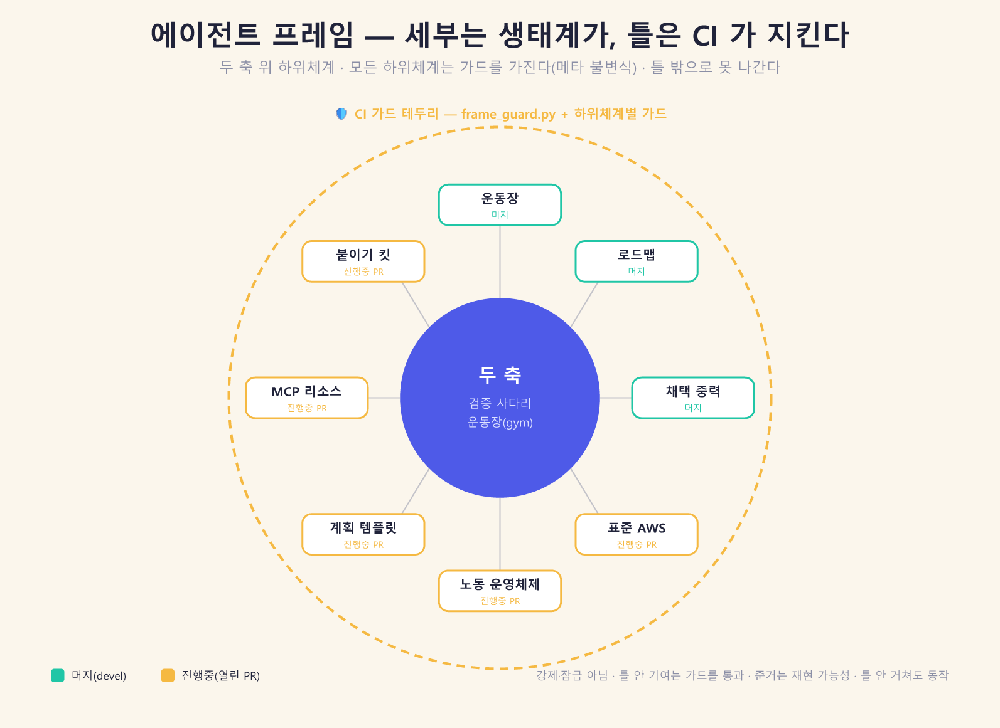

# rhwp 에이전트 프레임 헌장 (Agent Frame Charter)

> 기계 판독 레지스트리는 [`frame.json`](frame.json), 불변식 강제는 메타 가드
> [`tools/frame_guard.py`](../../../tools/frame_guard.py)다. 이 헌장은 방향을, 레지스트리는
> 무엇이, 메타 가드는 규칙을 담당한다.



## 한 문장

rhwp 의 엔드게임은 문서 편집기가 아니라 **증명 가능한 에이전트 노동의 레퍼런스
하네스**다(메인테이너 #60). 이 헌장은 그 하네스를 이루는 하위체계들을 **하나의
틀**로 묶고, 그 틀을 CI 가 강제하게 한다 — 세부는 생태계가 채우고, 방향은 프레임이
잡는다.

## 두 축과 그 위의 하위체계

모든 것은 두 축으로 이어진다:

- **검증 사다리** — 작업이 곧 증명(영수증→계보→서명→앵커→정산→감사). 규약은
  에이전트 작업 표준 **AWS/1.0**.
- **운동장(gym)** — 실력이 기록으로. 위조 불가능한 리더보드.

그 위에서 하위체계가 자란다(레지스트리가 전수): 운동장 · 로드맵 · 채택 중력 ·
표준 · **노동 운영체제(부서·자동 배치·승진)** · 계획 템플릿 · MCP 리소스 · 붙이기 킷 ·
**외부 현실 채점**.

## 틀의 불변식 — 벗어날 수 없는 이유

"벗어날 수 없다"는 **강제·잠금이 아니라 CI 가드로 강제되는 정합 계약**이다. 틀
안에서 무언가를 더하려면 다음을 반드시 통과한다 — 그래서 확장은 틀 안에서만 일어난다:

1. **풀 수 있음이 실측된다** — 새 gym 과제는 `reference/` 기준 풀이 왕복을 통과해야
   등재된다. 못 푸는 과제는 못 들어온다.
2. **판정은 재계산이지 신고가 아니다** — 기대값을 골든 파일로 박제하지 않고 채점
   시점에 재계산한다(라이브 오라클).
3. **표면은 표준을 가리킨다** — 새 채택 표면은 AWS 표준으로 이어져야 한다(척추 가드).
4. **조직은 실재에 매핑된다** — 부서는 실재 pack/트랙/과제에만 매핑된다(조직 가드).
5. **집계는 기계가 낸다** — 로드맵 진행률은 손집계가 아니라 파서가 낸다(결번·중복 0).
6. **모든 하위체계는 가드를 가진다** — 가드 없는 하위체계는 프레임에 못 들어온다
   (메타 가드). 이 여섯째가 나머지 다섯을 상시 강제한다.

이 불변식들이 CI 에 물려 있으므로, **누가 무엇을 더하든 틀의 모양을 벗어나지
못한다.** 강제해서가 아니라, 틀을 벗어난 기여는 가드가 red 로 막기 때문이다.

## 세부는 생태계가 채운다 — 열린 슬롯

우리는 방향과 틀을 설계하고, 세부는 열린 슬롯으로 남겨 다른 에이전트·사람이 채운다:

- 새 gym pack·과제(기준 풀이 왕복) · 새 로드맵 단계 · 새 채택 표면 · 부서 백로그와
  승진 · 새 계획 템플릿 · 새 MCP 리소스·프롬프트 · 새 호스트 붙이기 · 외부 준수자·참조·독립 재현.

각 슬롯을 채우는 기여는 그 하위체계의 가드를 통과해야 하므로, **채울수록 틀이 더
단단해진다.** 이것이 자기강화 프레임이다.

## 왜 강제가 아니라 틀인가 (전략)

강제·은닉·잠금은 오래 못 간다 — 발견되면 걷어내지고, 그 순간 채택은 0 이 된다.
반대로 **유용하고 투명하고 CI 로 강제되는 틀**은 걷어낼 수 없다: 그것을 지우면
검증·완결성·정합이 함께 무너지기 때문이다. 그래서 이 헌장은 헌법 4원칙을 지킨다 —
은닉 없음 · 유용성 우선 · 강요 없음(틀을 안 거쳐도 rhwp 는 동작) · 되돌릴 수 있음.
준거는 검증 사다리·재현 가능성이지 특정 기여자가 아니다. **정당함이 곧 지속이고,
지속이 곧 1등이다.**

## 프레임을 여는 법

```bash
python tools/frame_guard.py            # 틀의 불변식이 온전한지
python tools/agent_dispatch.py < 이력서  # 시스템이 자동으로 부서·과제 배정(운영체제)
```

레지스트리([`frame.json`](frame.json))가 하위체계·상태·가드·열린 슬롯의 단일
지도다. 하위체계를 더하려면 레지스트리에 등재하고 가드를 붙인다 — 그 순간 그것은
틀의 일부가 되고, 틀은 그것을 지킨다.
