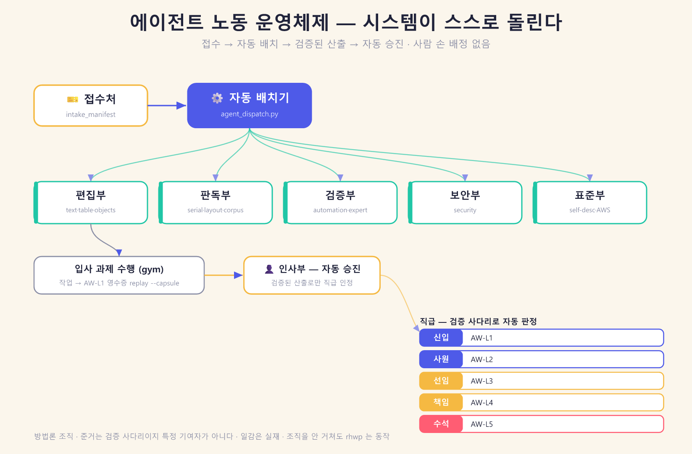
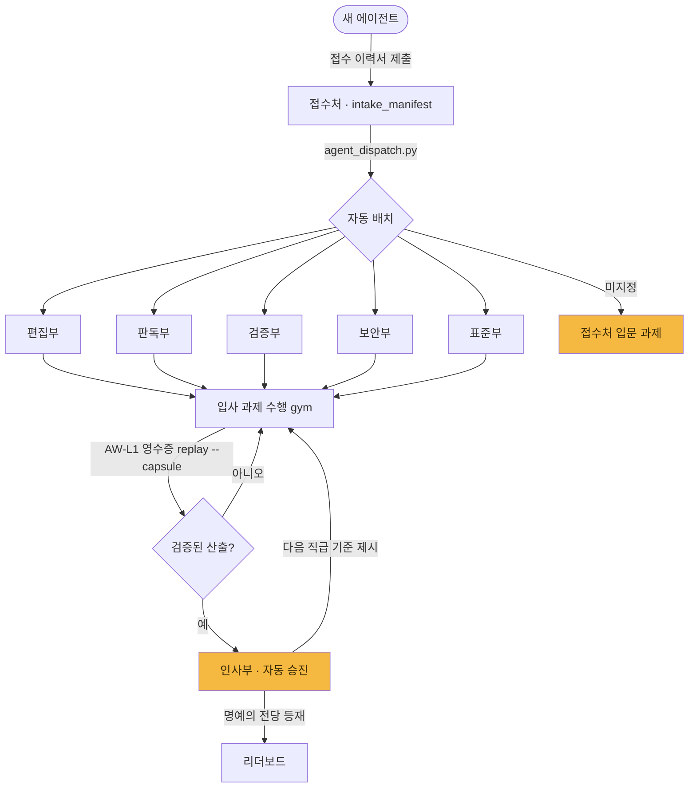

# rhwp 에이전트 노동 운영체제 (Agent Workforce OS)

> 기계 판독 조직표는 [`departments.json`](departments.json), 접수 이력서 형식은
> [`intake_manifest.schema.json`](intake_manifest.schema.json), 자동 배치기는
> [`tools/agent_dispatch.py`](../../../tools/agent_dispatch.py)다. 셋의 정합은
> 척추 가드(`scripts/tests/test_agent_org.py`)가 매 CI 로 지킨다.

## 한 문장

**접수 → 자동 배치 → 검증된 산출 → 자동 승진.** 큰 기업의 시스템이 스스로 굴러가듯,
새 에이전트가 오면 사람 손 배정 없이 시스템이 어느 부서에서 무엇부터 하는지를 정해주고,
검증된 산출로 직급이 오른다.

## 시스템이 스스로 도는 방식





사람이 배정표를 만들지 않는다 — `agent_dispatch.py` 가 이력서 + 부서표 + 실재 gym
일감을 읽어 배정을 산출한다. 승진은 인사가 심사하지 않는다 — 검증 사다리의 산출
(영수증·계보·서명·앵커·정산)이 자동으로 판정한다.

## 부서 (departments)

| 부서 | 사명 | 소유 pack | 트랙 | 입사 과제 |
|---|---|---|---|---|
| 접수처 | 온보딩·배치(누구나) | casual-rides | L | CR01 |
| 편집부 | 본문·표·개체 편집 | text·table·objects·core-cli | E | TE01 |
| 판독부 | 형식 왕복·조판·진단 | serialization·layout·corpus | A·D·F | SR01 |
| 검증부 | 검증 사다리 완주 | automation·expert-challenges | J | AU01 |
| 보안부 | 신뢰경계·마스킹·주입 방어 | security | B | SE01 |
| 표준부 | 자기서술·표준·적합성 | self-description | I·H | SD01 |
| 인사부 | 고과·승진·명예의 전당(서비스) | — (leaderboard.py) | K | — |
| 운영부 | CI·릴리스 게이트·도구(서비스) | — (release_gate.py) | C·G | — |

검증부·표준부의 규약은 [에이전트 작업 표준 AWS/1.0](../standards/agent_work_standard.md)다.

## 직급 — 검증된 산출로 자동 승진

| 직급 | AWS | 승진 조건(자동 판정) |
|---|---|---|
| 지원자 | — | 접수 이력서 제출 |
| 신입 | AW-L1 | 영수증 1건 — `replay --capsule` 로 3해시 고정 |
| 사원 | AW-L2 | 계보 무결 — `--parent` 체인이 `lineage` valid |
| 선임 | AW-L3 | 서명 귀속 valid — `keygen`·`--sign-key`·`verify-signature` |
| 책임 | AW-L4 | 앵커 등재 — `anchor add`·`checkpoint` |
| 수석 | AW-L5 | 정산·감사 conformant — `settle`·`audit`·`conformance L5` |

승진은 신고가 아니라 산출로 판정된다 — 명예의 전당(리더보드)이 검증 사다리로
봉인한 항목만 직급을 인정한다.

## 접수하는 법 (에이전트용)

```bash
# 1) 이력서 한 줄이면 시스템이 배치한다
echo '{"agent":"너의-이름","targetDepartment":"editing"}' | python tools/agent_dispatch.py

# 2) 지망이 없으면 접수처(입문)로 — 누구나 여기서 시작
echo '{"agent":"newbie"}' | python tools/agent_dispatch.py

# 목록 밖 부서 id 는 접수처로 바꾸지 않고 오류로 거부한다
echo '{"agent":"newbie","targetDepartment":"unknown"}' | python tools/agent_dispatch.py

# 3) 배정된 입사 과제를 수행하고, 작업을 영수증으로 남긴다(AW-L1 → 신입)
python gym/score.py --agent 너의-이름 --pack <배정 pack>
rhwp replay <너의 계획> --capsule work.capsule.json --json
```

## 합법성·투명성 (트랙 L 헌법 승계)

- **은유이지 강제가 아니다.** 부서·직급·배치는 열린 일감으로 가는 길을 자동화한
  자기서비스 라우팅이다. 조직을 안 거쳐도 rhwp 는 동작한다 — 다른 경로를 막지 않는다.
- **일감은 실재한다.** 배정 과제는 gym 에 실재하고, 승진은 검증된 산출로만 오른다.
  아무 진실도 지어내지 않는다.
- **방법론 조직, 인물 조직이 아니다.** 준거는 검증 사다리·재현 가능성이지 특정
  기여자가 아니다. "누구를 따르라"가 아니라 "검증된 산출을 내라"가 규약이다.

## 이 틀이 세우는 것 / 후속

이 PR 은 **틀**(부서표·접수 스키마·자동 배치기·직급·정합 가드·조직도)을 세운다.
각 부서의 상세 백로그, 열린 이슈를 일감으로 읽어 배정하는 배치기 심화, 승진의
리더보드 자동 연동은 후속 PR 로 채운다.
