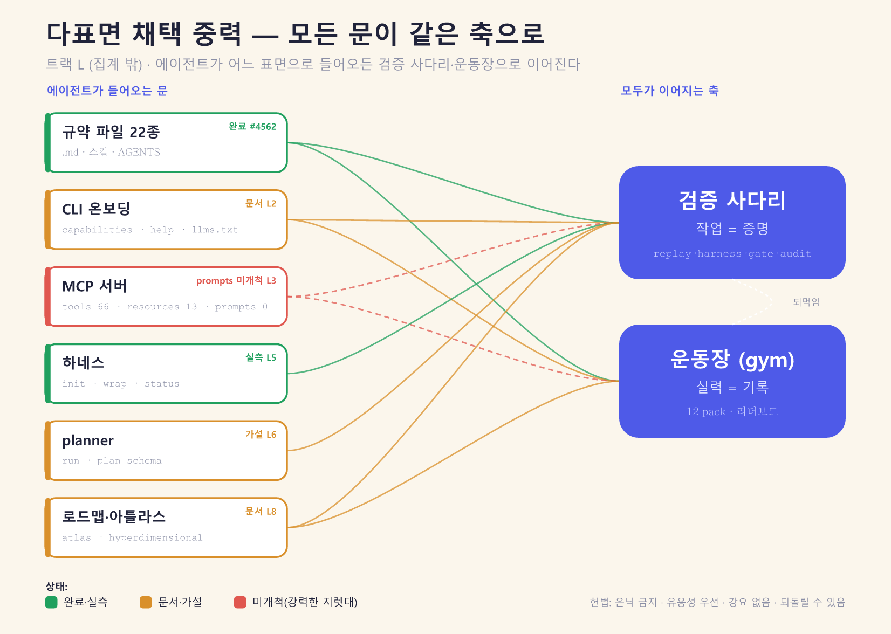
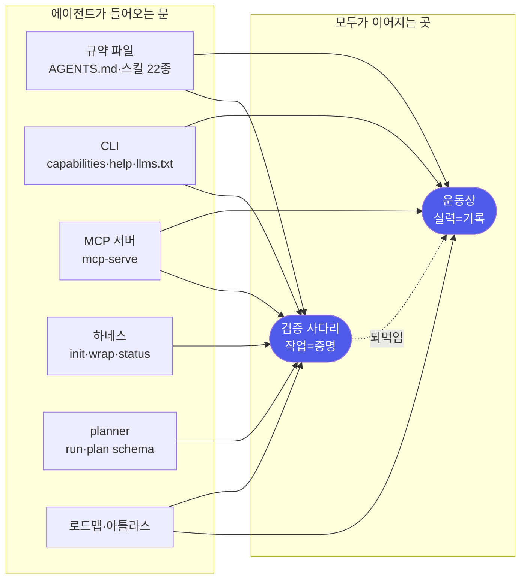

# 트랙 L — 다표면 채택 중력 (집계 밖)

> **집계 밖 트랙.** 트랙 K(스킬)와 같이 R1~R100 기계 집계(README의
> roadmap-progress 블록)에 포함되지 않는다. L 단계는 R번호를 쓰지 않고 L1~L8을
> 쓴다 — 채택은 새 능력(R축)이 아니라 **이미 있는 축을 모든 표면에서 만나게 하는
> 배치**의 문제이기 때문이다.

## 질문

**에이전트가 rhwp를 어느 문으로 들어오든, 같은 축으로 이어지는가?**

로드맵의 목표 문장은 "새로 온 에이전트가 매뉴얼 없이 30분 안에 첫 유효 기여"다
(#3907). 그리고 메인테이너의 원문(#60): "hwp 에디터 만들기는 일종의 부산물…
hwp 개발 전문 에이전트로 작업이 가능하게 하는 게 더 큰 목표." 즉 rhwp의 엔드게임은
문서 편집기가 아니라 **증명 가능한 에이전트 노동의 레퍼런스 하네스**다.

그 목표가 성립하려면, 에이전트가 rhwp를 만나는 **모든 표면**이 같은 두 축으로
자연히 이어져야 한다:

- **검증 사다리** — 작업이 곧 증명이 되는 축(영수증→감사→계보→서명→앵커→게이트
  →연합→선택공개→정산→표준). `replay`·`harness`·`gate`·`audit` 로 실체가 있다.
- **운동장(gym)** — 실력이 기록으로 남는 축. 12 pack·과제 100건·위조 불가능한
  리더보드.

이 트랙은 그 "이어짐"을 표면별로 정본화한다. 흩어진 조각(D 발견·H MCP·I 표준·K
스킬·R38/39/86/87 도달)을 **한 지도**로 모아, 어느 표면이 이미 축으로 잇고 어느
표면이 아직 끊겨 있는지를 정직하게 드러낸다.

## 채택 중력 지도

## 합법성·투명성 원칙 (이 트랙의 헌법)

채택 중력은 **조작이 아니라 배치**다. 다음을 위반하는 메커니즘은 이 트랙에
들어오지 못한다:

1. **은닉 금지.** 모든 깔때기는 공개·선언·옵트인이다. MCP 프롬프트/리소스는
   `capabilities --mcp`에 선언되고 클라이언트가 목록을 본다. 규약 파일은 저장소에
   평문으로 있다. 숨긴 지시·기만 유도는 없다(#4561 방침 승계).
2. **유용성이 먼저다.** 축(사다리·gym)은 그 자체로 에이전트에게 이득이다 —
   재현 가능한 작업 증명, 실력의 객관적 기록. 채택 중력은 그 이득을 **잘 보이는
   자리에 두는 것**이지, 없는 이득을 광고하는 것이 아니다.
3. **강요 없음.** 에이전트가 "따르는" 것은 가장 잘 지원되는 경로를 자연히 고르는
   것이다. 다른 경로를 막지 않는다 — 사다리를 안 타도 rhwp는 그냥 동작한다.
4. **되돌릴 수 있음.** 각 표면의 깔때기는 독립적이라, 하나가 오도되면 그것만
   끈다. 전 표면을 한 스위치로 잠그는 장치는 두지 않는다.

## 단계 (L1~L8)

각 단계는 여섯 항목(한 줄·지금·설계·착수 게이트·DoD·의존)으로 적는다.

### L1 — 규약 파일 깔때기 `[완료]`

- **한 줄** — LLM 도구가 자동 로딩하는 규약 파일이 작업 증빙 규약을 가리킨다.
- **지금** — #4562/#4574로 devel 착지. AGENTS.md "작업 증빙" 절을 단일 정본으로,
  22종 도구별 파일(copilot-instructions·cursor mdc·GEMINI·windsurf·cline·QWEN·
  CONVENTIONS·goosehints·roo·kilocode·junie·trae·amazonq·augment·continue·kiro
  등)이 얇은 포인터로 그곳을 가리킨다. `.claude/skills/` 13종.
- **설계** — (완료) 벤더 모델은 저장소 파일을 직접 안 읽으므로, 그 모델을 부리는
  CLI/IDE의 규약 파일을 깐다. 영상·미디어 생성형은 저장소를 안 읽어 범위 밖(정직).
- **DoD** — 22 표면이 AGENTS.md 단일 정본을 가리킴(#4562 diff). 통합 머지 확인.
- **의존** — 없음.

### L2 — CLI 온보딩 진입점 `[문서]`

- **한 줄** — 새 에이전트가 CLI를 처음 만졌을 때, 한 번의 조회로 "여기서
  시작하라(사다리·gym·로드맵)"가 보인다.
- **지금** — 재료는 있으나 **단일 진입점이 없다**. `capabilities --json`(명령
  표면), `--help`, 루트 `llms.txt`가 각각 존재하지만, "에이전트야 여기서 시작"을
  한 화면에 모은 자리는 없다. gym/README가 그 역할을 하나 CLI에서 안 보인다.
- **설계** — capabilities 봉투에 `agentStart`(또는 얇은 `onboarding` 명령)를 더해
  세 갈래(작업 증명=harness/replay, 실력=gym, 방향=로드맵)와 각 다음 명령을
  가리킨다. 새 표면이므로 7+1 등재 규약(capabilities·MCP·help·프로필·node 래퍼·
  지식지도·출처 MAP)을 따른다.
- **착수 게이트** — capabilities 봉투 확장 비용 대비 효과(L3 MCP 리소스와 중복
  아닌지) 판단. CLI 조회가 실제 에이전트 온보딩 경로인지 실측(스킬 로딩이 이미
  대다수를 덮는가).
- **DoD** — 한 명령/한 필드가 세 축을 가리키고, 각 링크가 실재 명령·문서로 해석됨.
  계약 테스트로 고정.
- **의존** — L1(정본 존재).

### L3 — MCP 프롬프트 깔때기 `[가설]`

- **한 줄** — rhwp를 MCP로 붙인 에이전트가 서버가 제공하는 **프롬프트**로 사다리를
  탄다("이 편집을 증명 가능하게 감싸라", "여기서 시작하라").
- **지금** — **미개척.** `mcp-serve`는 tools 66개·resources 13개를 노출하지만
  `prompts`가 **0개**다 — `initialize`가 `capabilities: {tools, resources}` 만
  광고하고(prompts 미선언), `prompts/list`·`prompts/get` 핸들러가 없다(실측).
  MCP 프롬프트는 서버가 클라이언트 에이전트에게 워크플로를 제안하는 1급 수단인데
  rhwp는 아직 안 쓴다 — 리소스·툴은 있는데 **프롬프트만 비어 있다.**
- **설계** — MCP `prompts/list`·`prompts/get` 구현. 후보: `prove-work`(편집→
  harness wrap→캡슐→status 안내), `start-here`(온보딩), `benchmark-me`(gym 진입).
  전부 공개 선언·옵트인. 프롬프트 정의의 단일 출처는 capabilities(계약 승계).
- **착수 게이트** — MCP 프로토콜의 prompts 능력 실측(스키마·버전), mcp-serve Rust
  구조 파악, 기존 tools 계약과의 정합. 프롬프트 문구가 규약(사다리)과 기계 대사
  되는지(스윕 가드 연계).
- **DoD** — `capabilities --mcp`에 prompts 선언, 실 MCP 클라이언트에서
  `prompts/list`→`prompts/get` 왕복, 계약 테스트, 7+1 등재.
- **의존** — 트랙 H(MCP 서버 성립), L1.

### L4 — MCP 축 리소스 깔때기 `[실측]`(인프라)·`[가설]`(축 리소스)

- **한 줄** — MCP 에이전트가 로드맵·gym·사다리 안내를 **리소스**로 읽는다(재파싱
  없이, 서버가 큐레이션).
- **지금** — 리소스 인프라는 **실재**한다(정정): `mcp-serve`의 `resources/list`·
  `resources/read`가 구현돼 있고 `initialize`가 `resources` 능력을 광고한다.
  실측 **13개** — `rhwp://capabilities/mcp`·스키마 3(ir·plan·capabilities)·문서 3
  (llms.txt·지식지도·문제해결)·레시피 6. **그러나 채택 축을 노출하는 리소스가
  없다** — `rhwp://roadmap`·`rhwp://gym`·`rhwp://ladder`가 부재해, 에이전트가
  "어디로 가는가·무엇으로 실력을 재는가"를 리소스로 못 읽는다.
- **설계** — 기존 `DOC_RESOURCES` 체계에 **축 리소스 3종 추가**: `rhwp://roadmap`
  (아틀라스), `rhwp://gym`(과제판·리더보드), `rhwp://ladder`(작업 증빙 규약). 전부
  커밋된 문서의 투영이라 새 진실 0. from-zero 가 아니라 확장이다.
- **착수 게이트** — 축 리소스가 tools/프로필/기존 doc 리소스와 중복 노출 아닌지.
  리소스 본문 생성기가 커밋 문서와 기계 대사되는지(스윕 가드).
- **DoD** — `resources/list`에 축 3리소스 추가, `resources/read` 왕복, 계약 테스트.
- **의존** — 트랙 H(리소스 인프라 실재), L8(아틀라스 정본).

### L5 — 하네스 기본 흐름 깔때기 `[실측]`

- **한 줄** — 에이전트가 `harness`로 작업하면, 그 자체가 사다리를 타는 것이다.
- **지금** — `harness init·wrap`·`harness-status`가 devel에 실재(#4538 등). wrap이
  실산출+영수증+캡슐 연번+직전 캡슐 자동 부모 연결+서명을 한 번에 하고, status가
  체인·서명·재현을 한 봉투로 판정. gym T13이 이 루프를 과제로 소비(폐루프 실증).
- **설계** — (실측) 남은 채택 배치: `harness init`이 만드는 작업장에 "다음 단계"
  안내(gym·gate)를 남기는가, wrap 성공 봉투가 사다리 다음 단(anchor·settle)을
  가리키는가 — 표면을 축으로 잇는 미세 배치.
- **착수 게이트** — 안내 주입이 봉투 계약을 깨지 않는지(출처 표지 유지).
- **DoD** — harness 봉투가 사다리 다음 단을 가리키고, 그 링크가 실 명령으로 해석됨.
- **의존** — 트랙 J(자율), 검증 사다리 4~5년 축.

### L6 — planner 템플릿 깔때기 `[가설]`

- **한 줄** — 에이전트가 계획(plan)을 짤 때 쓰는 템플릿이 검증 단계를 이미 품고
  있어, 계획을 세우면 자연히 증명이 남는다.
- **지금** — `run --plan-json`·`export-plan-schema`가 있으나, **검증을 품은 계획
  템플릿(recipe)이 없다.** 에이전트는 매번 맨 계획을 짠다.
- **설계** — `gym/` 또는 `mydocs/manual/recipes/`에 계획 템플릿 세트(편집→wrap→
  검증). `export-plan-schema` 옆에 템플릿 색인. 스킬 rhwp-work-receipt와 연결.
- **착수 게이트** — 템플릿이 실 계획으로 `run`/`replay`에 통과하는지(gym 기준
  풀이 왕복과 같은 실측 규율). 스키마 버전 정합.
- **DoD** — 템플릿 N종이 실행되어 영수증·캡슐을 남김(왕복 통과), 색인에서 발견됨.
- **의존** — L5(하네스), 검증 사다리.

### L7 — 운동장을 채택 계측기로 `[실측]`

- **한 줄** — gym은 실력을 재는 동시에, "이 에이전트가 축을 얼마나 탔는가"를 잰다.
- **지금** — automation·expert-challenges pack이 검증 사다리 전 단계를 과제로
  삼는다(사다리 완주=L5 conformant). 리더보드가 pack별 능력 격자로 강약을 드러냄.
  즉 gym 점수가 곧 축 채택도의 대리 지표다.
- **설계** — (실측) 채택 계측 관점의 명시적 프로파일(예: `ladder` 프로파일 =
  automation+expert-challenges만)로 "축 채택도"를 한 수치로. 이미 profiles 골격
  존재.
- **착수 게이트** — 프로파일 추가가 채점 논리 불변인지(장식 규율).
- **DoD** — 축 채택 프로파일로 채점 시 사다리 pack만 집계, 격자에 반영.
- **의존** — 운동장(#4653 이후), 검증 사다리.

### L8 — 로드맵·아틀라스를 읽히는 자리로 `[문서]`

- **한 줄** — 에이전트가 "이게 어디로 가는가"를 물으면 한 문서(아틀라스)로 답이
  되고, 그 답이 사다리·gym으로 되돌아온다.
- **지금** — `atlas_r1_r200.md`·`hyperdimensional_roadmap.md`가 정본. #4463이 좌표
  이슈. 다만 아틀라스가 채택 중력(이 트랙)을 아직 반영 안 함.
- **설계** — 이 트랙(L)을 아틀라스·hyperdimensional·README 트랙 지도에 등재(집계
  밖 표기). L 완료분은 머지 링크와 함께.
- **착수 게이트** — 없음(문서 정합).
- **DoD** — README 트랙 지도·아틀라스에 트랙 L 행, 집계 블록 무회귀(기계 산출
  100 유지).
- **의존** — L1~L7 서술.

### L9 — 축을 표준으로 (에이전트 작업 표준 AWS/1.0) `[실측]`

- **한 줄** — 축(검증 사다리)이 rhwp 안 관습이 아니라 **이름·버전 붙은 이식
  가능한 표준**이 되어, 어떤 에이전트 도구든 준수를 선언할 수 있다.
- **지금** — [에이전트 작업 표준](../standards/agent_work_standard.md)(사람용) +
  [`agent_work_standard.json`](../standards/agent_work_standard.json)(기계용) 정본화.
  AW-L1~L5(영수증·계보·서명·앵커·정산/감사)를 도구 무관하게 규정하고 rhwp 를
  레퍼런스 구현으로 명시. AGENTS.md 작업 증빙 절이 이 표준의 레퍼런스 구현임을
  가리킨다.
- **설계** — (실측) 표준은 도구 무관: 요구는 "제3자가 재현으로 검증 가능한가"
  하나이고, rhwp 명령은 예시. 사람용·기계용 두 정본이 같은 레벨·표면을 말한다.
- **착수 게이트** — 없음(사다리 실물이 이미 devel).
- **DoD** — 두 정본이 5레벨·표면 목록에 합의, 척추 가드가 정합 확인(L10).
- **의존** — 검증 사다리 1~10년 축, L1(규약 파일 뿌리).

### L10 — 척추 가드 (표면 정합의 기계 검증) `[실측]`

- **한 줄** — 표면이 늘어도 표준을 일관되게 가리키는지 **매 CI 마다 기계가**
  확인해, 파일 작업이 곧 척추 유지가 된다.
- **지금** — `tools/adoption_spine.py` + `scripts/tests/test_adoption_spine.py`.
  기계용 정본 스키마·사람↔기계 정합·선언 표면 실재·AGENTS.md 뿌리·트랙 L 정합을
  바이너리 없이 검사(커밋 문서만). 규약 파일 하나를 고치며 표준 링크를 빠뜨리면
  가드가 잡는다.
- **설계** — (실측) 능동 채택: 수동 문서가 아니라 검사되는 계약. 척추가 끊기면
  red.
- **착수 게이트** — 없음.
- **DoD** — 가드가 CI 계약 테스트로 상시 실행, 정합 위반 0.
- **의존** — L9(표준 정본 존재).

## 층 모델과의 관계

#3880의 4층에서 트랙 L은 **L3(도달)의 실행 도구**다 — D(발견)가 "길이 있는가"를
묻는다면, L은 "그 길이 모든 문에서 시작되는가"를 묻는다. 축 자체(사다리=L2 신뢰,
gym=능력 기둥)는 다른 트랙이 만들고, L은 그 축으로 **잇는 배치**만 맡는다.

## 이 트랙이 하지 않는 것

- 새 검증 능력 발명 — 축은 이미 있다. L은 배치만 한다.
- R1~R100 집계 변경 — 집계 밖(트랙 K 선례). 기계 산출 100은 그대로.
- 은닉·강요 — 헌법 4원칙을 위반하는 깔때기는 거부한다.
- 다른 경로 차단 — 사다리를 안 타도 rhwp는 동작한다.
