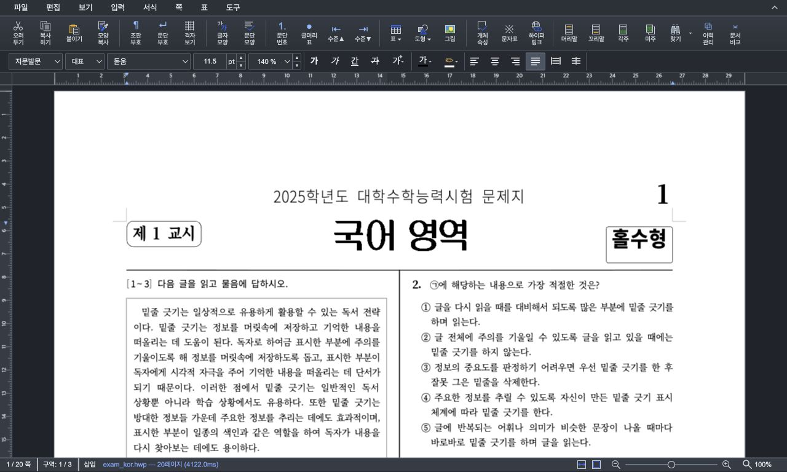

# Stage 3 검증 체크포인트 — Task M100 #6187

- Issue: [#6187](https://github.com/edwardkim/rhwp/issues/6187)
- 작성일: 2026-08-31 KST
- 상태: 사용자 실제 창 드래그 확인·Stage 3 결과 승인·최신 devel 통합 재검증 완료.
- 브랜치: `codex/issue-6187-always-visible-ruler`
- 검증 제품 소스: Stage 2 commit `35a1e4a63`. 이번 체크포인트에 제품 소스 변경 없음.
- 기준: `upstream/devel@e50792c6341a0b61afc3ffeb687a92fc6a807e69`
- 계획: [수행 계획](../plans/task_m100_6187.md), [구현 계획](../plans/task_m100_6187_impl.md)
- 앞 단계: [Stage 2 보고](task_m100_6187_stage2.md)

## 1. 승인과 작업 범위

Stage 2 보고 뒤 작업지시자의 “진행해줘. 나도 브라우저에서 열어서 드래그 테스트할 수 있게
로컬서버를 실행해줘.”를 Stage 3 전체 Studio 테스트·브라우저 검증·로컬 서버 제공 승인으로 기록했다.
독립 구현 방향은 유지했다. 원 PR #6432의 commit을 가져오거나 원 PR을 변경하지 않았다.

이번 단계에서는 snapshot E2E와 검사기 부정 대조 테스트, manifest·증적·문서만 추가했다.
`Ruler`, 전역 resize/anchor, Rust/WASM, 문서 fixture는 수정하지 않았다.

## 2. 로컬 서버와 실행 환경

- 사용자 URL: <http://127.0.0.1:7700/?url=/samples/exam_kor.hwp>
- 기본 URL: <http://127.0.0.1:7700/>
- 기존 Vite 서버 PID `8262`, cwd `rhwp-studio`, loopback `127.0.0.1:7700`을 재사용·유지했다.
- HTTP로 제공되는 `ruler.ts`가 resize 이벤트에서 예약만 하고 `update()`에서
  `syncCanvasSize(dpr)`를 호출하는 현재 후보인지 확인했다. 포트가 열렸다는 사실만으로 판정하지 않았다.
- 공개 sample `samples/exam_kor.hwp`, 20쪽을 사용했다. 원 사용자 영상은 공개 증적으로 복사하지 않았다.
- 기존 `pkg/rhwp_bg.wasm` 재사용: 2026-08-30 17:25 수정, 9,763,618 bytes,
  SHA-256 `9a18f5638bf3550a8ea148cd6d296d0d2fb3a6378e9982b680366f985e7f9a09`.
  Rust 변경이 없어 Cargo 및 WASM 재빌드는 실행하지 않았다.
- 실제 화면은 Codex in-app Browser의 viewport·screenshot·읽기 전용 DOM과 UI 조작으로 확인했다.
  별도 Puppeteer/CDP로 선택된 브라우저를 우회 제어하지 않았다.

## 3. 자동 검사

`rhwp-studio`에서 실행:

```sh
npm test
npx --no-install tsc --noEmit
node --test tests/ruler-resize-snapshot.test.ts
node --check e2e/ruler-resize.test.mjs
```

| 검사 | 결과 |
| --- | --- |
| 전체 npm, snapshot 검사 추가 전 | 1332 passed / 0 failed / 1 skipped |
| 전체 npm, snapshot 검사 4개 추가 후 | **1336 passed / 0 failed / 1 skipped** (총 1337) |
| 신규 snapshot 검사기 부정·정상 대조 | 4 passed / 0 failed / 0 skipped |
| TypeScript | 통과 |
| E2E JavaScript 문법 검사 | 통과 |
| `python3 scripts/check_e2e_manifest.py` | 추적 E2E 123개 / manifest 123행, 이상 없음 |
| `python3 scripts/check_markdown_links.py` — 수행·구현 계획, Stage 2·3 기록 | 문서 4개 내부 상대 링크 이상 없음 |
| `git diff --check`, `git diff --cached --check` | 통과 |

skip 1개는 기존 `pending-char-shape.test.ts`의 “굵게/색/캐럿 대기 서식이 실제 문서에 반영된다
(자식 프로세스 + wasm 왕복)”이며 `pkg-node/rhwp.js`가 없기 때문이다. 이 항목까지 통과했다고
세지 않았다. 자식 프로세스가 필요한 전체 테스트는 프로젝트 메모리 지침대로 sandbox 밖에서 실행했다.

새 `e2e/ruler-resize.test.mjs`는 driver를 받아 DOM 배치와 screenshot 내부를 검사한다.
이번 실제 Browser 검증은 이 공통 검사 함수를 지원되는 Browser API에 연결해 실행했다.
파일의 일반 Node/Puppeteer CLI 진입점은 실행하지 않았으며, 그 경로까지 검증됐다고 주장하지 않는다.
`e2e/MANIFEST.md`에 수동 실행 대상으로 등록했다.

`tests/ruler-resize-snapshot.test.ts`는 단색 빈 띠, 문서만 그려진 화면, 한 축만 그려진 화면,
숨김·grid 이탈·정렬·overflow 오류를 실패시키고 두 축의 정상 그림은 통과시키는 4개 검사다.
합성 PNG 부정 대조이며 실제 수정 전 브라우저의 깜빡임 검출 증거는 아니다.

## 4. 브라우저 resize 결과

가로·세로·코너 표시, 20px grid 슬롯, 스크롤 영역과 정렬(허용 오차 1px), 페이지 바깥 가로 overflow,
두 눈금자 내부 색 다양성을 함께 확인했다. 배율·쪽 이동은 실제 확대/축소 대화상자로 설정했다.

| 공개 sample 조합 | 1023↔1024px | 추가 너비 |
| --- | --- | --- |
| 세로 10% | 10회 왕복, 20 snapshot 통과 | 8개 통과 |
| 세로 50% | 10회 왕복, 20 snapshot 통과 | 8개 통과 |
| 세로 100% | 10회 왕복, 20 snapshot 통과 | 8개 통과 |
| 가로 10% | 10회 왕복, 20 snapshot 통과 | 첫 쪽 재이동 후 정적 8개 통과 |
| 가로 50% | 10회 왕복, 20 snapshot 통과 | 8개 통과 |
| 가로 100% | 10회 왕복, 20 snapshot 통과 | 8개 통과 |

추가 너비는 767, 768, 807, 808, 961, 962, 375, 1280px다. 가로 10%의 큰 너비 이동은 현재
anchor 동작으로 마지막 편집 focus 쪽이 화면 밖으로 나갈 수 있어 각 변경 뒤 첫 쪽으로 다시
이동했다. 이 8개는 **resize 중 focus 보존 검증이 아닌 정적 배치 검사**다.

- 위 표 168개 + 최초 10% 경계 스모크 2개 = sample matrix 170개.
- 낮은 높이 375×400, 767×500, 767×501에서 세로 10%, 첫 쪽 재이동 후 3개 통과.
- 새 빈 문서의 밝은 테마 767/768/1023/1024×900에서 4개 통과.
- 합계 **177개 통과 snapshot**. 각 색 개수·footer·배치는
  [원본 측정 JSON](../report/studio-ruler-6187/browser-snapshots.json)에 기록했다.

### 정상 빈 영역과 구분

초기 세로 50%·가로 10% 시도에서 한 축 색 개수 1이 관측되어 검사가 중단됐다. 화면과 footer를
확인하니 zoom anchor 이후 마지막 편집 focus의 첫 쪽이 화면 밖으로 이동한 상태였다. zoom 적용을
확인한 뒤 문서 처음으로 이동하자 두 눈금이 다시 나타났고 해당 matrix를 재실행했다.
이 실패를 resize 깜빡임으로 단정하지 않았으며, 위 177개는 전제 조건을 맞춘 통과 기록이다.
이 때문에 변경 전후 모든 focus 보존 조건까지 통과했다고 주장하지 않는다.

### 캡처의 한계

Browser screenshot은 JPEG로 반환됐다. JPEG를 decode한 뒤 PNG로 재인코딩해 같은 검사기에
전달했다. 색 개수는 **단색 띠 탐지를 돕는 보조 지표**이며 JPEG 압축 잡음, 눈금 좌표 오류나 짧은
공백 프레임을 완전하게 검출하지 못한다. 대표 화면은 사람이 확인했다.

viewport 변경과 screenshot 호출 사이의 모든 compositor frame을 관측한 것이 아니다.
지원 API에서 canvas context/pixel 직접 읽기와 native touch dispatch가 제공되지 않았다.
검증 전용 page global을 주입하거나 숨은 브라우저 API로 이 제약을 우회하지 않았다.
따라서 이 결과를 Stage 2의 reset→paint 동작 회귀와 함께 해석하며, 실제 창 드래그 최종 확인은 남겼다.

## 5. 실제 마우스·기존 편집 경로 스모크

공개 sample을 수정하지 않고 별도 탭의 새 빈 문서에서 수행했다. 기존 복구본 안내는 “나중에”로
닫아 보존했다. 아래 UI 수치를 대화상자에서 읽고, 실제 Browser 마우스 drag와 실행 취소를 사용했다.

| 경로 | 관측 |
| --- | --- |
| 767px, 100%, 왼쪽 쪽 여백 핀 drag | 편집 용지 30.0 → 39.8mm |
| 해당 drag 실행 취소 | 30.0mm 복원 |
| 767px, 첫 줄 들여쓰기 핀 drag | 문단 모양 0.0 → 29.8pt, 들여쓰기 선택 |
| 해당 drag 실행 취소 | 0.0pt 복원 |
| 편집 용지 수치 입력 | 왼쪽 여백 32.0mm 설정 후 재열어 확인 |
| 문단 모양 수치 입력·실행 취소 | 왼쪽 문단 여백 8.0pt 적용, undo 후 0.0pt 확인 |
| 파일 → 새로 만들기 | 새 문서 1쪽, 두 눈금자·grid 정상; 새 문서 밝은 테마 4개 snapshot 통과 |

검증용 임시 문서는 저장하지 않았고 탭을 닫았다. 테마는 원래 “시스템 설정”으로 복원했다.
sample 탭은 세로·100%·첫 쪽으로 돌린 뒤 임시 viewport 설정을 해제해 사용자 확인용으로 남겼다.

sample 탭의 조회된 warning/error 로그는 0건이었다. 새 빈 문서 탭에서는
`[CanvasView] 페이지 0 정보가 없습니다` 오류 1건(2026-08-31T09:53:52.976Z)을 조회했다.
오류가 발생한 정확한 UI 단계와 baseline 재현 여부는 확정하지 못했다. 새 문서·drag·undo·수치 입력은
이후 정상 완료했지만, 해당 로그까지 무회귀 확인이 끝났다고 쓰지 않는다. CanvasView는 이번에
수정하지 않았으며 이 오류의 관련성 판정은 PR 준비 전 잔여 항목이다.

## 6. 대표 화면

원 영상의 개인 창·탭 정보 대신 공개 sample과 새 빈 문서로 남긴 화면이다.

- [1280px / 세로 / 100%](../report/studio-ruler-6187/desktop-1280-100.jpg)
- [375px / 세로 / 10%](../report/studio-ruler-6187/mobile-375-10.jpg)
- [1280px / 가로 / 10%](../report/studio-ruler-6187/horizontal-10-1280.jpg)
- [새 문서 / 밝은 테마](../report/studio-ruler-6187/new-document-light.jpg)



## 7. 사용자 확인과 승인

2026-09-01 작업지시자가 실제 OS 브라우저 창을 드래그해 이번 작업의 resize 깜빡임 제거와 눈금자
상시 표시를 확인한 뒤 “이번 작업에서의 수정은 테스트해본 결과 만족스러워.”와 “현재 작업의 Stage 3은
통과인 것 같아.”로 결과를 승인했다. 다음 사용자 메시지에서 Stage 3 승인 기록과 PR 준비를 명시적으로
지시했다.

아래 한계는 승인 뒤에도 검증 기록에서 삭제하거나 통과로 바꾸지 않는다.

1. 실제 touch/pen의 무변경·undo 항목 유지와 같은 세션 mouse 전환. Node 입력 계약 23개는 통과했지만
   실제 모바일/에뮬레이션 입력 검증은 실행하지 못했다.
2. 기존 `responsive.test.mjs`·문서 전환 E2E의 원본 자동 실행. 기존 스크립트의 page global 조작을
   Browser 도구에서 재현하지 않았다. 이번 배치 matrix·새 문서 스모크를 원본 suite 통과로 대신하지 않는다.
3. 수정 전 브라우저 후보에서 새 screenshot 검사기의 실제 실패 검출. Stage 2의 수정 전 Node 실패와
   합성 PNG 부정 대조는 있지만, 브라우저 red-baseline 실행은 없다.
4. 넓은 resize의 모든 focus·쪽 기준 보존 조건과 위 CanvasView 로그의 baseline 비교.

사용자 확인 방법:

1. [sample 열기](http://127.0.0.1:7700/?url=/samples/exam_kor.hwp), 이미 열려 있으면 새로고침.
2. 우측 아래 배율 버튼에서 10/50/100%와 세로·가로 쪽 이동을 선택하고 첫 쪽을 화면 안에 둔다.
3. 창 오른쪽/왼쪽 모서리를 천천히 또는 빠르게 드래그해 넓힘·줄임을 반복한다.
   약 1024px 및 모바일 너비를 오가며 눈금자가 사라지거나 순간 빈 띠가 되는지 본다.
4. 좁은 창에서도 마우스 여백/들여쓰기 핀을 움직이고 실행 취소가 되는지 확인한다.
5. 재현되면 배율, 쪽 이동 방향, 대략적인 창 크기와 영상 구간을 알려준다.

로컬 서버와 사용자 검증 탭은 유지한다. remote push·새 PR·원 PR 종료·이슈 종료·댓글은 수행하지 않았다.

### 사용자 확인에서 분리한 후속 결함

- 세로 눈금자의 마지막 번호 `42`: 가로 마지막 번호를 숨기는 기존 정책과 대칭이어야 한다. 이 정책을
  이미 다루는 PR #6458의 보정 commit으로 처리하고 #6187 diff에는 섞지 않는다.
- macOS Firefox의 10%·13%·14% 트랙패드 축소가 브라우저 native zoom으로 이탈: #6187은
  `viewport-manager.ts`, `index.html` 및 wheel listener 소유 범위를 변경하지 않았다. 초기
  `ViewportManager`의 `#scroll-container` 한정 listener가 가진 잠재 범위 공백을 저배율 UI가 노출한
  별도 결함으로 분류하며, 실제 Firefox event trace 뒤 독립 이슈·PR로 처리한다.

두 결함은 사용자와 함께 #6187 회귀가 아니라고 판정했다. #6187의 Stage 3 승인과 별도 추적한다.

## 8. 최신 devel 통합과 PR 준비 재검증

2026-09-01 PR 준비 승인 뒤 `upstream/devel`을 `0d1540931`까지 갱신했다. 최초 기준 이후 94 commit이
전진했으며 #6187과 같은 제품 파일인 `ruler.ts`·`responsive.css`는 바뀌지 않았다. E2E manifest의
서로 다른 행 추가만 자동 병합됐고 merge commit은 `7d4f4a18f`다.

| 검사 | 최신 통합 head 결과 |
| --- | --- |
| `npm test` | 1350 passed / 0 failed / 1 skipped (총 1351) |
| `npx --no-install tsc --noEmit` | 통과 |
| 인앱 브라우저 767px | 두 눈금자·교차 코너 visible, `20px + content` grid 유지 |
| 인앱 브라우저 1024px | 두 눈금자·교차 코너 visible, `20px + content` grid 유지 |
| 브라우저 warning/error | 0건 |

실제 브라우저는 최신 head로 reload한 뒤 확인했고 임시 viewport override는 해제했다. 사용자의 native 창
드래그 승인은 통합 전 code candidate에 대한 것이지만, 통합에서 #6187 제품 파일이 바뀌지 않았고 최신
head의 정적·자동 게이트를 다시 통과했으므로 승인 결과를 유지한다. Rust 변경은 현재 PR diff에 없어
Rust·WASM 게이트는 적용하지 않는다.
